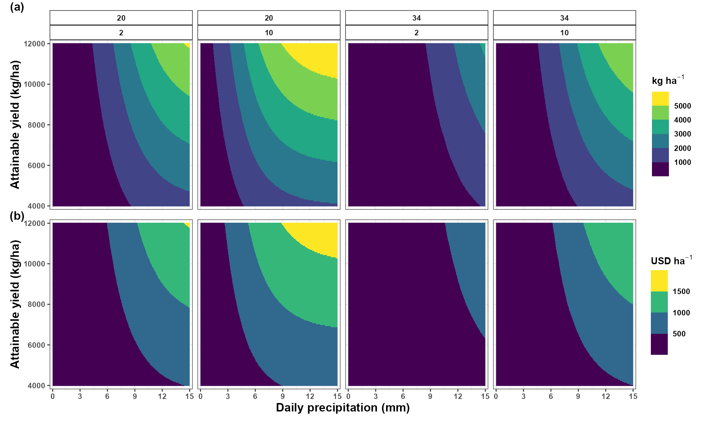
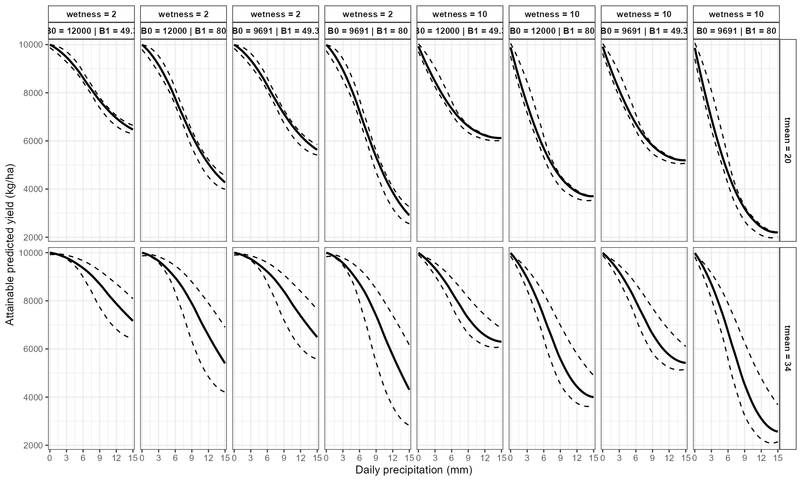

# Yield and Economic Losses

## Introduction

Predicted disease intensity alone does not fully describe the potential
agronomic consequences of an epidemic.

In many pathosystems, researchers also want to estimate how the
predicted disease response may translate into reduced crop yield and
economic losses.

`EpiExposure` connects three modeling stages:

1.  environmental exposure profiles;
2.  expected disease outcomes from the fitted DLNM;
3.  user-defined disease-yield and economic relationships.

This section demonstrates how scenario predictions can be translated
into:

- expected remaining yield;
- yield loss;
- proportional yield loss;
- economic loss;
- comparisons across production scenarios.

**What you will learn.** This tutorial shows how to convert predicted
disease outcomes into yield and economic losses, evaluate sensitivity to
attainable yield, and compare the agronomic consequences of alternative
environmental scenarios.

Yield and economic losses are not estimated by the DLNM alone. They
depend on additional assumptions supplied by the user, including the
disease-yield relationship, attainable yield, commodity price, and unit
conversions.

The resulting quantities are model-based projections under those
assumptions. They should not automatically be interpreted as observed
losses or causal effects.

## Preparing the epidemiological model

This section uses the same example dataset and DLNM specification
introduced in the previous tutorials.

``` r

library(EpiExposure)
library(ggplot2)
```

``` r

data("epi_data")
```

Define the exposure-lag structures:

``` r

cb <- define_exposures(
  data = epi_data,
  vars = c(
    "tmean",
    "rain",
    "wetness"
  ),
  max_lag = 85,
  df_var = 3,
  df_lag = 2
)
```

Build the epidemic-level design:

``` r

dat <- build_design(
  data = epi_data,
  cb_templates = cb
)
```

Prepare the disease response:

``` r

dat <- prepare_response(
  data = dat,
  response = "y",
  family = "beta"
)
```

Fit the DLNM:

``` r

fit <- fit_epidlnm(
  data = dat,
  model_engine = "glmmTMB",
  family = "beta",
  random_effect = NULL,
  epiexposure_spec = attr(
    cb,
    "spec"
  )
)
```

The fitted model is now used to predict disease responses across
environmental scenarios and translate those predictions into agronomic
and economic quantities.

## Translating disease predictions into losses

### Disease and yield scales

The fitted Beta model returns predicted disease outcomes on a proportion
scale between 0 and 1. However, the damage function used in this example
was defined using disease severity in percentage points.

Therefore, predictions and uncertainty limits are converted from
proportions to percentages before the yield-loss relationship is
applied:

``` math
D_{\%} = 100D_{\mathrm{proportion}}
```

This conversion is specific to the damage function used in the example.
Users must verify the disease scale associated with their own slope and
intercept parameters.

## Generating disease scenarios

Define biologically meaningful lag periods:

``` r

periods <- define_periods(
  max_lag = 85,
  cuts = c(
    20,
    40,
    60
  ),
  prefix = "Period"
)
```

Generate a scenario grid in which rainfall varies continuously across
selected temperature and leaf wetness conditions:

``` r

range_losses <- simulate_ranges(
  periods = periods,
  vary = list(
    tmean = c(
      20,
      34
    ),
    rain = seq(
      0,
      15,
      by = 1
    ),
    wetness = c(
      2,
      10
    )
  ),
  scenario_type = "grid",
  scenario_var = "rain"
)
```

The fine rainfall sequence provides a smooth grid for visualizing the
modeled disease and loss relationships. It should not be interpreted as
additional observed information.

Predict expected disease outcomes and propagate coefficient uncertainty:

``` r

scenarios_losses <- simulate_scenarios(
  fit = fit,
  scenarios = range_losses,
  data = epi_data,
  uncertainty = TRUE,
  output = "summary",
  n_samples = 5,
  seed = 123
)
```

The Beta-model predictions are proportions. Convert the central
estimates and interval limits to percentage points because the damage
coefficient used below was defined for percentage disease severity:

``` r

scenarios_losses$prediction <- (
  scenarios_losses$prediction * 100
)

scenarios_losses$prediction_lower <- (
  scenarios_losses$prediction_lower * 100
)

scenarios_losses$prediction_upper <- (
  scenarios_losses$prediction_upper * 100
)
```

**Match the damage-function scale.** Multiplication by 100 is
appropriate only because this example applies a damage coefficient
defined per percentage point of disease severity. Do not perform this
conversion when the damage function was estimated directly from
proportions.

## Simulating yield and economic losses

### A single damage function

Suppose expected yield under disease is described by the linear
relationship:

``` math
Y_{\mathrm{disease}} = a - bD
```

where:

- $`Y_{\mathrm{disease}}`$ is expected yield under disease;
- $`D`$ is disease severity in percentage points;
- $`a`$ is the intercept of the damage function;
- $`b`$ is the yield reduction per percentage point of disease severity.

For this example:

``` text
intercept = 9691.0
slope = 49.3
```

Thus, each additional percentage point of predicted severity is
associated with 49.3 kilograms per percentage point (kg/p.p) under the
specified damage relationship.

Estimate yield and economic losses over attainable yields ranging from
4,000 to 12,000:

``` r

losses <- simulate_losses(
  data = scenarios_losses,
  lower = "prediction_lower",
  upper = "prediction_upper",
  y = "prediction",
  slope = 49.3,
  parameter_mode = "values",
  intercept = 9691.0,
  attainable_yield = seq(
    4000,
    10000,
    by = 50
  ),
  price = 300
)
```

In this example, `price = 300` represents a commodity price of 300 USD
per metric ton. Because yield loss is expressed in kg ha⁻¹,
[`simulate_losses()`](https://tomazrg.github.io/EpiExposure/reference/simulate_losses.md)
internally converts yield loss from kilograms to metric tons before
calculating economic loss:

``` math
L_{\mathrm{economic}}
=
\left(
\frac{L_{\mathrm{yield}}}{1000}
\right)
P
```

where $`L_{\mathrm{yield}}`$ is yield loss in kg ha⁻¹, $`P`$ is
commodity price in USD t⁻¹, and $`L_{\mathrm{economic}}`$ is economic
loss in USD ha⁻¹.

Inspect the resulting columns:

``` r

names(
  losses
)
#>  [1] "scenario"          "scenario_point"    "tmean"            
#>  [4] "rain"              "wetness"           "prediction"       
#>  [7] "prediction_sd"     "prediction_lower"  "prediction_upper" 
#> [10] ".loss_row_id"      ".sim"              "slope_sim"        
#> [13] "intercept_sim"     "rand_eff"          "ref_yield"        
#> [16] "att_yield"         "price"             "y_used"           
#> [19] "y_lower"           "y_upper"           "yl_prop_raw"      
#> [22] "yl_capped"         "pred_yield"        "rl_prop"          
#> [25] "rl_pct"            "yl_prop"           "yl_pct"           
#> [28] "ap_yield"          "yield_loss"        "econ_loss"        
#> [31] "yl_prop_raw_lower" "yl_prop_raw_upper" "pred_yield_lower" 
#> [34] "pred_yield_upper"  "rl_prop_lower"     "rl_prop_upper"    
#> [37] "rl_pct_lower"      "rl_pct_upper"      "yl_prop_lower"    
#> [40] "yl_prop_upper"     "yl_pct_lower"      "yl_pct_upper"     
#> [43] "ap_yield_lower"    "ap_yield_upper"    "yield_loss_lower" 
#> [46] "yield_loss_upper"  "econ_loss_lower"   "econ_loss_upper"  
#> [49] "yl_capped_lower"   "yl_capped_upper"
```

| scenario | scenario_point | tmean | rain | wetness | prediction | prediction_sd | prediction_lower | prediction_upper | .loss_row_id | .sim | slope_sim | intercept_sim | rand_eff | ref_yield | att_yield | price | y_used | y_lower | y_upper | yl_prop_raw | yl_capped | pred_yield | rl_prop | rl_pct | yl_prop | yl_pct | ap_yield | yield_loss | econ_loss | yl_prop_raw_lower | yl_prop_raw_upper | pred_yield_lower | pred_yield_upper | rl_prop_lower | rl_prop_upper | rl_pct_lower | rl_pct_upper | yl_prop_lower | yl_prop_upper | yl_pct_lower | yl_pct_upper | ap_yield_lower | ap_yield_upper | yield_loss_lower | yield_loss_upper | econ_loss_lower | econ_loss_upper | yl_capped_lower | yl_capped_upper |
|:--:|:--:|:--:|:--:|:--:|:--:|:--:|:--:|:--:|:--:|:--:|:--:|:--:|:--:|:--:|:--:|:--:|:--:|:--:|:--:|:--:|:--:|:--:|:--:|:--:|:--:|:--:|:--:|:--:|:--:|:--:|:--:|:--:|:--:|:--:|:--:|:--:|:--:|:--:|:--:|:--:|:--:|:--:|:--:|:--:|:--:|:--:|:--:|:--:|:--:|
| RAIN_s1 | 1 | 20 | 0 | 2 | 0.628 | 0.002 | 0.61 | 1.107 | 1 | 1 | 49.3 | 9691 | 0 | 9691 | 4000 | 300 | 0.628 | 0.61 | 1.107 | 0.003 | FALSE | 9660.016 | 0.997 | 99.68 | 0.003 | 0.32 | 3987.211 | 12.789 | 3.837 | 0.003 | 0.006 | 9636.405 | 9660.944 | 0.994 | 0.997 | 99.437 | 99.69 | 0.003 | 0.006 | 0.31 | 0.563 | 3977.466 | 3987.594 | 12.406 | 22.534 | 3.722 | 6.760 | FALSE | FALSE |
| RAIN_s1 | 1 | 20 | 0 | 2 | 0.628 | 0.002 | 0.61 | 1.107 | 1 | 1 | 49.3 | 9691 | 0 | 9691 | 4050 | 300 | 0.628 | 0.61 | 1.107 | 0.003 | FALSE | 9660.016 | 0.997 | 99.68 | 0.003 | 0.32 | 4037.051 | 12.949 | 3.885 | 0.003 | 0.006 | 9636.405 | 9660.944 | 0.994 | 0.997 | 99.437 | 99.69 | 0.003 | 0.006 | 0.31 | 0.563 | 4027.184 | 4037.439 | 12.561 | 22.816 | 3.768 | 6.845 | FALSE | FALSE |
| RAIN_s1 | 1 | 20 | 0 | 2 | 0.628 | 0.002 | 0.61 | 1.107 | 1 | 1 | 49.3 | 9691 | 0 | 9691 | 4100 | 300 | 0.628 | 0.61 | 1.107 | 0.003 | FALSE | 9660.016 | 0.997 | 99.68 | 0.003 | 0.32 | 4086.891 | 13.109 | 3.933 | 0.003 | 0.006 | 9636.405 | 9660.944 | 0.994 | 0.997 | 99.437 | 99.69 | 0.003 | 0.006 | 0.31 | 0.563 | 4076.902 | 4087.284 | 12.716 | 23.098 | 3.815 | 6.929 | FALSE | FALSE |
| RAIN_s1 | 1 | 20 | 0 | 2 | 0.628 | 0.002 | 0.61 | 1.107 | 1 | 1 | 49.3 | 9691 | 0 | 9691 | 4150 | 300 | 0.628 | 0.61 | 1.107 | 0.003 | FALSE | 9660.016 | 0.997 | 99.68 | 0.003 | 0.32 | 4136.731 | 13.269 | 3.981 | 0.003 | 0.006 | 9636.405 | 9660.944 | 0.994 | 0.997 | 99.437 | 99.69 | 0.003 | 0.006 | 0.31 | 0.563 | 4126.621 | 4137.129 | 12.871 | 23.379 | 3.861 | 7.014 | FALSE | FALSE |
| RAIN_s1 | 1 | 20 | 0 | 2 | 0.628 | 0.002 | 0.61 | 1.107 | 1 | 1 | 49.3 | 9691 | 0 | 9691 | 4200 | 300 | 0.628 | 0.61 | 1.107 | 0.003 | FALSE | 9660.016 | 0.997 | 99.68 | 0.003 | 0.32 | 4186.572 | 13.428 | 4.029 | 0.003 | 0.006 | 9636.405 | 9660.944 | 0.994 | 0.997 | 99.437 | 99.69 | 0.003 | 0.006 | 0.31 | 0.563 | 4176.339 | 4186.974 | 13.026 | 23.661 | 3.908 | 7.098 | FALSE | FALSE |
| RAIN_s1 | 1 | 20 | 0 | 2 | 0.628 | 0.002 | 0.61 | 1.107 | 1 | 1 | 49.3 | 9691 | 0 | 9691 | 4250 | 300 | 0.628 | 0.61 | 1.107 | 0.003 | FALSE | 9660.016 | 0.997 | 99.68 | 0.003 | 0.32 | 4236.412 | 13.588 | 4.076 | 0.003 | 0.006 | 9636.405 | 9660.944 | 0.994 | 0.997 | 99.437 | 99.69 | 0.003 | 0.006 | 0.31 | 0.563 | 4226.057 | 4236.819 | 13.181 | 23.943 | 3.954 | 7.183 | FALSE | FALSE |
| RAIN_s1 | 1 | 20 | 0 | 2 | 0.628 | 0.002 | 0.61 | 1.107 | 1 | 1 | 49.3 | 9691 | 0 | 9691 | 4300 | 300 | 0.628 | 0.61 | 1.107 | 0.003 | FALSE | 9660.016 | 0.997 | 99.68 | 0.003 | 0.32 | 4286.252 | 13.748 | 4.124 | 0.003 | 0.006 | 9636.405 | 9660.944 | 0.994 | 0.997 | 99.437 | 99.69 | 0.003 | 0.006 | 0.31 | 0.563 | 4275.776 | 4286.664 | 13.336 | 24.224 | 4.001 | 7.267 | FALSE | FALSE |
| RAIN_s1 | 1 | 20 | 0 | 2 | 0.628 | 0.002 | 0.61 | 1.107 | 1 | 1 | 49.3 | 9691 | 0 | 9691 | 4350 | 300 | 0.628 | 0.61 | 1.107 | 0.003 | FALSE | 9660.016 | 0.997 | 99.68 | 0.003 | 0.32 | 4336.092 | 13.908 | 4.172 | 0.003 | 0.006 | 9636.405 | 9660.944 | 0.994 | 0.997 | 99.437 | 99.69 | 0.003 | 0.006 | 0.31 | 0.563 | 4325.494 | 4336.509 | 13.491 | 24.506 | 4.047 | 7.352 | FALSE | FALSE |
| RAIN_s1 | 1 | 20 | 0 | 2 | 0.628 | 0.002 | 0.61 | 1.107 | 1 | 1 | 49.3 | 9691 | 0 | 9691 | 4400 | 300 | 0.628 | 0.61 | 1.107 | 0.003 | FALSE | 9660.016 | 0.997 | 99.68 | 0.003 | 0.32 | 4385.932 | 14.068 | 4.220 | 0.003 | 0.006 | 9636.405 | 9660.944 | 0.994 | 0.997 | 99.437 | 99.69 | 0.003 | 0.006 | 0.31 | 0.563 | 4375.212 | 4386.354 | 13.646 | 24.788 | 4.094 | 7.436 | FALSE | FALSE |
| RAIN_s1 | 1 | 20 | 0 | 2 | 0.628 | 0.002 | 0.61 | 1.107 | 1 | 1 | 49.3 | 9691 | 0 | 9691 | 4450 | 300 | 0.628 | 0.61 | 1.107 | 0.003 | FALSE | 9660.016 | 0.997 | 99.68 | 0.003 | 0.32 | 4435.772 | 14.228 | 4.268 | 0.003 | 0.006 | 9636.405 | 9660.944 | 0.994 | 0.997 | 99.437 | 99.69 | 0.003 | 0.006 | 0.31 | 0.563 | 4424.931 | 4436.199 | 13.801 | 25.069 | 4.140 | 7.521 | FALSE | FALSE |

## Visualizing the loss scenarios

[`plot_losses()`](https://tomazrg.github.io/EpiExposure/reference/plot_losses.md)
can display the yield and economic consequences across the environmental
scenario grid.

``` r

losses_plot <- plot_losses(
  data = losses,
  x = "rain",
  y = "att_yield",
  facet = c(
    "tmean",
    "wetness"
  ),
  type = "heatmap",
  x_breaks = seq(
    0,
    15,
    by = 3
  ),
  y_breaks = seq(
    4000,
    10000,
    by = 2000
  ),
  x_label = "Daily precipitation (mm)",
  nrow = 2,
  facet_ncol = 4
)

losses_plot
```



The heatmap summarizes the complete modeling chain:

``` text
rainfall, temperature, and leaf wetness scenarios
                         ↓
predicted disease severity
                         ↓
linear damage relationship
                         ↓
estimated yield and economic losses
```

Rainfall should not be interpreted in isolation because the panels also
represent different temperature and leaf wetness conditions.

## Sensitivity to damage-function parameters

Damage-function parameters may vary among studies, cultivars, production
systems, or experimental conditions.
[`simulate_losses()`](https://tomazrg.github.io/EpiExposure/reference/simulate_losses.md)
can evaluate multiple parameter values to show how agronomic conclusions
depend on the selected disease-yield relationship.

The following example compares two parameter combinations:

``` text
Damage relationship 1: intercept = 9691.0, slope = 49.3
Damage relationship 2: intercept = 12000, slope = 80
```

``` r

losses_sensitivity <- simulate_losses(
  data = scenarios_losses,
  lower = "prediction_lower",
  upper = "prediction_upper",
  y = "prediction",
  slope = c(
    49.3,
    80
  ),
  parameter_mode = "values",
  intercept = c(
    9691.0,
    12000
  ),
  attainable_yield = seq(
    4000,
    10000,
    by = 50
  ),
  price = 300
)
```

The parameter combinations represent alternative damage relationships
rather than uncertainty intervals around one damage function. Their
scientific source and interpretation should be stated explicitly in a
real analysis.

Visualize the modeled relationship between rainfall and predicted yield
for a selected attainable yield:

``` r

plot_losses(
  data = losses_sensitivity,
  x = "rain",
  y = "att_yield",
  facet = c(
    "tmean",
    "wetness"
  ),
  type = "regression",
  reg_y = "ap_yield",
  att_yield = 10000,
  x_breaks = seq(
    0,
    15,
    by = 3
  ),
  x_label = "Daily precipitation (mm)"
)
```



This sensitivity analysis helps determine whether the agronomic
conclusions remain similar across plausible disease-yield relationships.

## Interpreting the loss results

The outputs combine assumptions from several stages:

1.  the fitted exposure-lag-response model;
2.  the simulated environmental scenarios;
3.  the conversion of disease predictions into percentage severity;
4.  the selected slope and intercept;
5.  the attainable-yield range;
6.  the commodity price.

The `lower` and `upper` disease-prediction limits are transformed
through the damage relationship to obtain corresponding loss limits.
This interval transformation does not automatically represent full
draw-by-draw propagation of every source of uncertainty.

The resulting limits do not automatically include uncertainty in:

- slope;
- intercept;
- attainable yield;
- commodity price;
- environmental scenario assumptions.

The second analysis varies slope and intercept explicitly, but these
values are alternative parameter combinations rather than random draws
from an estimated joint parameter distribution.

## Practical applications

When supported by appropriate data and assumptions, yield and economic
loss simulations can help researchers:

- translate disease predictions into agronomic units;
- compare hypothetical environmental scenarios;
- examine sensitivity to attainable yield;
- evaluate sensitivity to commodity price;
- identify scenarios associated with larger modeled losses;
- connect disease forecasting with production consequences;
- explore assumptions used in management or climate scenarios.

These applications remain conditional on the fitted epidemiological
model and the disease-yield relationship supplied by the user.

## Reporting checklist

When reporting loss estimates, specify:

1.  the response family and disease scale;
2.  the fitted DLNM specification;
3.  the environmental profiles or scenarios;
4.  the disease-yield equation;
5.  the source and units of the slope and intercept;
6.  the range and units of attainable yield;
7.  the commodity price and price unit;
8.  any conversion between kilograms and metric tons;
9.  the uncertainty sources that were propagated;
10. whether the results are associational projections or causal
    estimates.

## Summary

This section demonstrated how `EpiExposure` connects
exposure-lag-response modeling with agronomic and economic outcomes.

The workflow is:

``` text
complete exposure profiles
            ↓
fitted DLNM
            ↓
expected disease response
            ↓
user-supplied disease-yield relationship
            ↓
expected remaining yield
            ↓
yield loss
            ↓
economic loss
```

The DLNM describes the modeled association between environmental
profiles and disease. The damage function translates predicted disease
into expected yield, and commodity price translates yield loss into
economic units.

Each stage introduces assumptions that should be documented and
evaluated through sensitivity analysis.

## Next steps

The next section focuses on model selection and ensemble prediction.

Topics include:

- [`find_bestfit()`](https://tomazrg.github.io/EpiExposure/reference/find_bestfit.md);
- model ranking;
- cross-validation;
- [`ensemble_bestfit()`](https://tomazrg.github.io/EpiExposure/reference/ensemble_bestfit.md).

These tools help compare candidate exposure-lag specifications and
evaluate their predictive performance.
