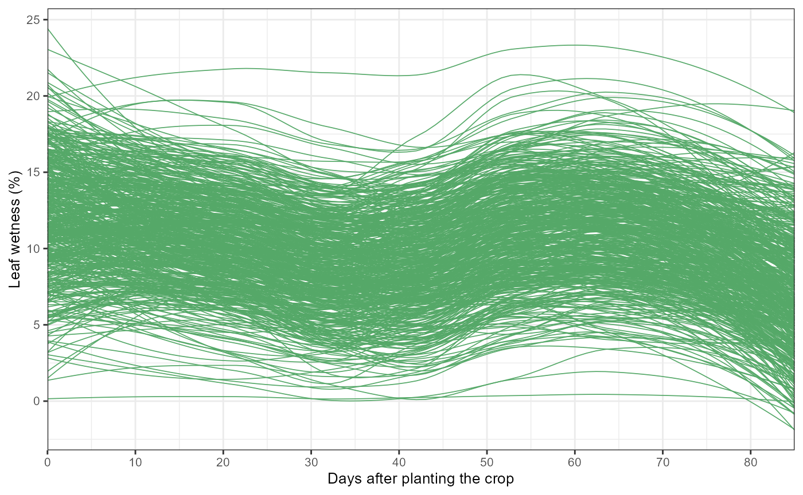
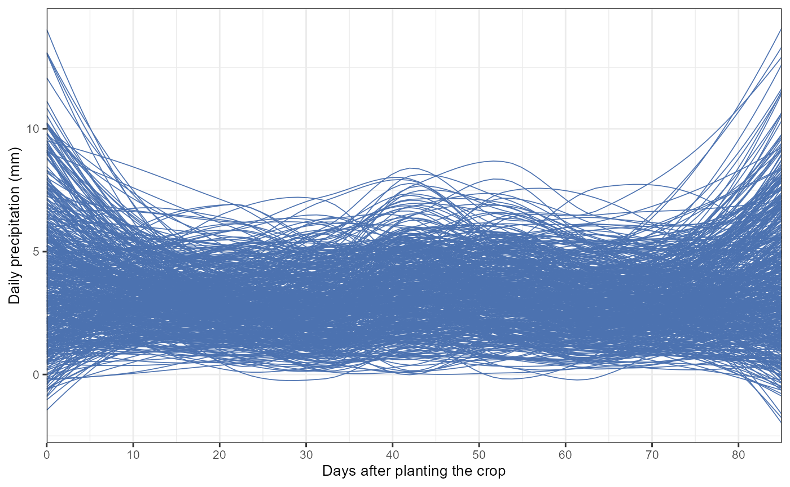
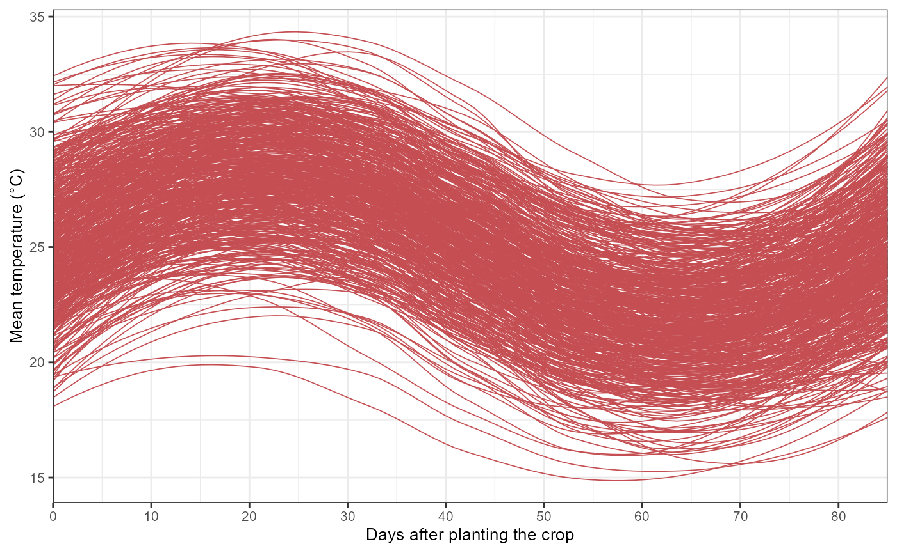

# Get started with EpiExposure

## What does `EpiExposure` do?

`EpiExposure` provides a standardized workflow for constructing,
fitting, interpreting, and simulating distributed exposure-lag models in
plant disease epidemiology.

The package helps users:

- define non-linear exposure-lag structures;
- fit distributed lag non-linear models;
- quantify lag-specific, period-specific, and cumulative effects;
- evaluate complete exposure histories;
- predict expected disease outcomes;
- simulate alternative exposure scenarios;
- estimate yield and economic losses.

Unlike conventional window-based approaches, `EpiExposure` treats the
complete environmental history preceding disease assessment as the
epidemiological exposure unit.

**What you will learn.** This tutorial shows how to organize
longitudinal epidemiological data, define and diagnose an exposure–lag
structure, fit a first DLNM, and predict an expected disease outcome
from a complete exposure history.

## The EpiExposure workflow

A basic analysis follows six stages:

1.  organize and inspect complete exposure histories;
2.  define the exposure-response and lag-response basis functions;
3.  evaluate the proposed structure for identifiability and numerical
    stability;
4.  collapse each history into one epidemic-level design row;
5.  prepare the response and fit the model;
6.  use the fitted model for interpretation, prediction, or simulation.

This section introduces the basic workflow but stops before detailed
effect interpretation. Lag-specific, period-specific, and cumulative
effects are covered in the *Understanding Effects* section

## Organizing exposure histories

`EpiExposure` expects longitudinal data in which each row represents one
observation within an epidemic history.

At minimum, the dataset must contain:

1.  an epidemic identifier, such as `epi_id`;
2.  a numeric temporal index, such as `time`;
3.  one or more exposure variables;
4.  one final response associated with each epidemic.

In the example dataset:

- `epi_id` identifies independent epidemic histories;
- `time` orders observations chronologically;
- `tmean`, `rain`, and `wetness` are environmental exposures;
- `y` is the final disease response.

The temporal index begins at the earliest observation and ends at the
disease assessment:

``` text
time 0  → earliest exposure observation → maximum lag
time 85 → disease assessment            → lag 0
```

Every epidemic must contain the same complete and regularly spaced
exposure history. With `max_lag = 85`, each epidemic requires:

``` math
85 + 1 = 86
```

observations for every fitted exposure.

``` r

library(EpiExposure)
library(ggplot2)
```

``` r

data("epi_data")
```

## Inspecting the example dataset

The example contains complete environmental histories for multiple
epidemics.

| epi_id | time | tmean | rain  | wetness |  y   |
|:------:|:----:|:-----:|:-----:|:-------:|:----:|
|   1    |  0   | 21.96 | 0.00  |  8.83   | 0.33 |
|   1    |  1   | 21.47 | 0.00  |  11.86  | 0.33 |
|   1    |  2   | 21.53 | 5.38  |  12.49  | 0.33 |
|   1    |  3   | 21.76 | 14.59 |  12.30  | 0.33 |
|   1    |  4   | 20.83 | 0.00  |  11.41  | 0.33 |
|   1    |  5   | 23.03 | 8.24  |  7.98   | 0.33 |
|   1    |  6   | 23.89 | 4.69  |  10.84  | 0.33 |
|   1    |  7   | 23.14 | 12.30 |  8.58   | 0.33 |
|   1    |  8   | 25.32 | 4.14  |  10.61  | 0.33 |
|   1    |  9   | 25.99 | 1.91  |  14.10  | 0.33 |

Before modeling, verify that every epidemic contains the required number
of observations:

``` r

table(
  table(
    epi_data$epi_id
  )
)
#> 
#>  86 
#> 520
```

For `max_lag = 85`, the expected result is 86 observations per `epi_id`.

## Visualizing exposure histories

Visual inspection can reveal temporal trends, unusual exposure profiles,
limited variation, and missing observations.

``` r

wetness_plot = epi_data |>  
  ggplot(aes(time,wetness, group = epi_id))+
  geom_smooth(se = F, color = "#55A868",linewidth = 0.3)+
  theme_bw()+
  labs(x = "Days after planting the crop",
       y = "Leaf wetness (%)")+
  scale_x_continuous(limits = c(0,85), expand = c(0,0),
                     breaks = pretty(epi_data$time, n = 8))+
  theme(text = element_text(size = 10))


wetness_plot
```



``` r

rain_plot = epi_data  |>  
  ggplot(aes(time,rain, group = epi_id))+
  geom_smooth(se = F, color = "#4C72B0",linewidth = 0.3)+
  theme_bw()+
  labs(x = "Days after planting the crop",
       y = "Daily precipitation (mm)")+
  scale_x_continuous(limits = c(0,85), expand = c(0,0),
                     breaks = pretty(epi_data$time, n = 8))+
  theme(text = element_text(size = 10))


rain_plot
```



``` r

tmean_plot = epi_data |> 
  ggplot(aes(time,tmean, group = epi_id))+
  geom_smooth(se = F, color = "#C44E52",linewidth = 0.3)+
  theme_bw()+
  labs(x = "Days after planting the crop",
       y = "Mean temperature (°C)")+
  scale_x_continuous(limits = c(0,85), expand = c(0,0),
                     breaks = pretty(epi_data$time, n = 8))+
  theme(text = element_text(size = 10))


tmean_plot
```

 The objective is
not to identify exposure effects visually. These plots only describe the
observed histories. Effect estimation requires the DLNM model.

## Defining exposure-lag structures

The first modeling step is to define the non-linear exposure-response
and lag-response basis functions.

``` r

cb <- define_exposures(
  data = epi_data,
  vars = c(
    "tmean",
    "rain",
    "wetness"
  ),
  max_lag = 85,
  df_var = 3,
  df_lag = 2
)
```

Here:

- `vars` identifies the exposures included in the DLNM;
- `max_lag = 85` defines the retrospective lag window;
- `df_var = 3` controls exposure-response flexibility;
- `df_lag = 2` controls lag-response flexibility.

The resulting object stores the fitted basis definitions required for
model construction and downstream prediction.

**Exposure variables only.** Coordinates, treatment groups, blocks,
years, and other identifiers should not be included in `vars`. They can
be preserved separately by
[`build_design()`](https://tomazrg.github.io/EpiExposure/reference/build_design.md)
when needed for random or spatial effects.

## Checking identifiability and numerical stability

Before fitting the model, the proposed exposure–lag structure should be
evaluated for identifiability and numerical stability. Increasing the
number of exposures or the flexibility of the exposure and lag bases
increases the number of cross-basis predictors and may produce
redundant, rank-deficient, or poorly conditioned designs.

[`check_identifiability()`](https://tomazrg.github.io/EpiExposure/reference/check_identifiability.md)
reconstructs the same epidemic-level cross-basis design used by the
EpiExposure fitting workflow. The function evaluates the combined
numerical rank, scaled condition number, near-zero-variance columns,
between-exposure cross-basis correlations, supplementary variance
inflation factors, and the number of epidemics relative to design
complexity.

``` r

identifiability <- check_identifiability(
  data = epi_data,
  vars = c(
    "tmean",
    "rain",
    "wetness"
  ),
  max_lag = 85,
  df_var = 3,
  df_lag = 2
)
```

``` r

knitr::kable(
  utils::head(
    identifiability,
    10L
  ),
  digits = 4,
  align = "c"
)
```

[TABLE]

The printed output classifies the proposed design as `"ok"`,
`"warning"`, or `"problem"`. The `identifiable` field indicates whether
the combined epidemic-level design has full numerical rank, whereas
`numerically_stable` additionally considers severe conditioning,
near-zero-variance columns, and whether the available epidemics can
support the number of design columns.

``` r

knitr::kable(
  utils::head(
    identifiability$overall,
    10L
  ),
  digits = 4,
  align = "c"
)
```

| n_epidemics_total | n_epidemics_complete | n_epidemics_excluded | n_exposures | max_lag | history_length | crossbasis_columns | design_columns | rank | full_rank | rank_ratio | design_residual_df_proxy | condition_number_scaled | min_singular_value_scaled | max_singular_value_scaled | max_abs_crossbasis_correlation | median_abs_crossbasis_correlation | max_vif | median_vif | near_zero_variance_columns | epidemics_per_design_column | time_step |
|:--:|:--:|:--:|:--:|:--:|:--:|:--:|:--:|:--:|:--:|:--:|:--:|:--:|:--:|:--:|:--:|:--:|:--:|:--:|:--:|:--:|:--:|
| 520 | 520 | 0 | 3 | 85 | 86 | 18 | 19 | 19 | TRUE | 1 | 501 | 18.8499 | 2.3269 | 43.8625 | 0.9177 | 0.0444 | 42.7938 | 5.2346 | 0 | 27.3684 | 1 |

``` r

knitr::kable(
  utils::head(
    identifiability$by_variable,
    10L
  ),
  digits = 4,
  align = "c"
)
```

| variable | n_unique_exposure | exposure_missing_n | exposure_missing_percent | history_length | max_lag | basis_columns | rank | full_rank | rank_ratio | condition_number_scaled | max_abs_within_basis_correlation | near_zero_variance_columns |
|:--:|:--:|:--:|:--:|:--:|:--:|:--:|:--:|:--:|:--:|:--:|:--:|:--:|
| tmean | 44611 | 0 | 0 | 86 | 85 | 6 | 6 | TRUE | 1 | 18.4765 | 0.8936 | 0 |
| rain | 15907 | 0 | 0 | 86 | 85 | 6 | 6 | TRUE | 1 | 7.2265 | 0.9177 | 0 |
| wetness | 44319 | 0 | 0 | 86 | 85 | 6 | 6 | TRUE | 1 | 4.7469 | 0.8108 | 0 |

``` r

knitr::kable(
  utils::head(
    identifiability$recommendations,
    10L
  ),
  digits = 4,
  align = "c"
)
```

| x |
|:--:|
| 6 cross-basis column(s) have VIF \>= 10. Treat this as supplementary because spline-basis columns are correlated by construction. High VIF alone does not change `status`; prioritize the combined rank and scaled condition number. |

A `"warning"` does not automatically invalidate the proposed structure.
It indicates that the reported diagnostics should be examined before
model fitting. A `"problem"` indicates rank deficiency or severe
numerical instability and generally supports simplifying the candidate
structure, for example by reducing `df_var` or `df_lag`, reconsidering
redundant exposures, or increasing the number of independent epidemics.

The diagnostic thresholds are interpretive heuristics rather than
universal inferential rules. In particular, high correlations or VIFs
among individual spline columns may arise from the basis construction
itself. The combined numerical rank and scaled condition number should
therefore receive greater emphasis than any isolated column-level
diagnostic.

## Building the epidemic-level design

[`build_design()`](https://tomazrg.github.io/EpiExposure/reference/build_design.md)
transforms each complete longitudinal history into one epidemic-level
row containing the cross-basis predictors.

``` r

dat <- build_design(
  data = epi_data,
  cb_templates = cb)
```

The original exposure columns are represented by canonical cross-basis
columns such as:

``` text
cb_tmean_1, cb_tmean_2, ...
cb_rain_1, cb_rain_2, ...
cb_wetness_1, cb_wetness_2, ...
```

The coefficients of these columns should not be interpreted
individually. Together, they reconstruct the non-linear
exposure-lag-response association.

Inspect the resulting design:

| epi_id | cb_tmean_1 | cb_tmean_2 | cb_tmean_3 | cb_tmean_4 | cb_tmean_5 | cb_tmean_6 | cb_rain_1 | cb_rain_2 | cb_rain_3 | cb_rain_4 | cb_rain_5 | cb_rain_6 | cb_wetness_1 | cb_wetness_2 | cb_wetness_3 | cb_wetness_4 | cb_wetness_5 | cb_wetness_6 | y |
|:--:|:--:|:--:|:--:|:--:|:--:|:--:|:--:|:--:|:--:|:--:|:--:|:--:|:--:|:--:|:--:|:--:|:--:|:--:|:--:|
| 1 | 5.765 | 5.545 | 21.801 | 0.515 | -11.524 | 0.481 | 0.657 | -0.839 | 16.376 | 2.138 | -6.935 | -1.236 | 4.869 | 0.929 | 23.264 | 1.555 | -12.855 | -0.774 | 0.330 |
| 2 | 5.838 | 7.070 | 20.565 | 0.978 | -10.660 | 0.423 | 1.974 | 0.311 | 14.655 | 1.071 | -4.947 | 0.128 | -2.937 | 0.300 | 21.177 | 2.585 | -12.003 | -1.463 | 0.071 |
| 3 | 6.950 | 4.678 | 21.307 | 1.259 | -10.660 | 0.061 | 1.180 | 0.384 | 5.205 | 0.195 | -1.241 | 0.248 | 12.899 | 1.294 | 20.370 | 1.219 | -8.147 | 0.539 | 0.190 |
| 4 | 7.156 | 8.038 | 20.828 | 0.221 | -10.864 | 0.944 | 1.550 | -0.018 | 7.855 | -1.201 | -2.977 | 0.685 | -1.550 | 1.641 | 17.718 | 2.848 | -9.977 | -1.521 | 0.036 |
| 5 | 6.736 | 6.837 | 20.943 | -0.178 | -10.292 | 1.655 | 0.911 | -0.435 | 7.176 | -1.187 | -2.442 | 0.382 | 1.169 | -0.367 | 21.088 | 1.808 | -11.570 | -0.933 | 0.117 |
| 6 | 6.861 | 5.114 | 21.562 | 1.274 | -11.556 | -0.268 | 1.562 | 0.105 | 10.663 | 1.816 | -3.284 | -0.974 | 3.093 | 4.926 | 21.770 | 1.654 | -11.816 | -0.419 | 0.126 |

First six rows of the epidemic-level DLNM design. {.table
style="width:100%;"}

## Preparing the disease response

The response must be prepared for the distribution used in the model.

``` r

dat <- prepare_response(
  data = dat,
  response = "y",
  family = "beta"
)
```

The Beta family is appropriate when the response is a continuous
proportion strictly between 0 and 1.

Other supported families should be selected according to the response
scale, for example:

- `binomial` for a Bernoulli response coded as 0 or 1;
- `poisson` for non-negative counts;
- `negative_binomial` for overdispersed counts;
- `gamma` for positive continuous responses;
- `gaussian` for approximately continuous, unbounded responses.

For details on available modeling engines, supported response
distributions, engine-specific requirements, and Bayesian and
frequentist workflows, see the *Advanced Topics* section.

## Fitting the first DLNM

The prepared design can now be fitted with one of the supported modeling
engines.

``` r

fit <- fit_epidlnm(
  data = dat,
  model_engine = "glmmTMB",
  family = "beta",
  random_effect = NULL,
  epiexposure_spec = attr(
    cb,
    "spec"
  )
)
```

This model estimates a population-level association between the complete
histories of temperature, rainfall, and leaf wetness and the final
disease response.

``` r

summary(fit)
#>  Family: beta  ( logit )
#> Formula:          
#> y_model ~ 1 + cb_tmean_1 + cb_tmean_2 + cb_tmean_3 + cb_tmean_4 +  
#>     cb_tmean_5 + cb_tmean_6 + cb_rain_1 + cb_rain_2 + cb_rain_3 +  
#>     cb_rain_4 + cb_rain_5 + cb_rain_6 + cb_wetness_1 + cb_wetness_2 +  
#>     cb_wetness_3 + cb_wetness_4 + cb_wetness_5 + cb_wetness_6
#> Data: dat
#> 
#>       AIC       BIC    logLik -2*log(L)  df.resid 
#>   -1375.4   -1290.4     707.7   -1415.4       500 
#> 
#> 
#> Dispersion parameter for beta family (): 29.7 
#> 
#> Conditional model:
#>               Estimate Std. Error z value Pr(>|z|)    
#> (Intercept)  -3.475218   0.947903  -3.666 0.000246 ***
#> cb_tmean_1    0.118230   0.014595   8.101 5.46e-16 ***
#> cb_tmean_2   -0.207029   0.027422  -7.550 4.36e-14 ***
#> cb_tmean_3   -0.062001   0.039492  -1.570 0.116421    
#> cb_tmean_4   -0.324065   0.100821  -3.214 0.001308 ** 
#> cb_tmean_5   -0.091731   0.031843  -2.881 0.003968 ** 
#> cb_tmean_6    0.016912   0.054302   0.311 0.755467    
#> cb_rain_1     0.217255   0.039357   5.520 3.39e-08 ***
#> cb_rain_2    -0.357518   0.050983  -7.013 2.34e-12 ***
#> cb_rain_3     0.239871   0.025436   9.431  < 2e-16 ***
#> cb_rain_4    -0.273807   0.039372  -6.954 3.54e-12 ***
#> cb_rain_5     0.160458   0.057216   2.804 0.005041 ** 
#> cb_rain_6    -0.034856   0.080037  -0.435 0.663201    
#> cb_wetness_1  0.110230   0.004315  25.545  < 2e-16 ***
#> cb_wetness_2 -0.037250   0.016298  -2.285 0.022284 *  
#> cb_wetness_3  0.074292   0.015282   4.861 1.17e-06 ***
#> cb_wetness_4 -0.039607   0.048578  -0.815 0.414877    
#> cb_wetness_5  0.090457   0.009308   9.718  < 2e-16 ***
#> cb_wetness_6 -0.055629   0.029369  -1.894 0.058207 .  
#> ---
#> Signif. codes:  0 '***' 0.001 '**' 0.01 '*' 0.05 '.' 0.1 ' ' 1
```

The individual `cb_*` coefficients are components of the cross-basis
expansion. Their signs and $`p`$-values should not be interpreted as
isolated epidemiological effects.

The fitted exposure-lag surface must instead be reconstructed into
quantities such as lag-specific, period-specific, and cumulative
effects. That process is introduced in the *Understanding Effects*
section

## Predicting one complete exposure history

A fitted model can also estimate the expected disease outcome associated
with a complete hypothetical exposure history.

In this example, a constant environmental scenario is evaluated over an
86-day exposure window. Daily mean temperature (`tmean`) is fixed at
25°C, daily rainfall (`rain`) at 5 mm, and daily leaf wetness duration
(`wetness`) at 15 hours. The model combines the lagged contributions of
all daily exposures to estimate the expected disease outcome for this
exposure history.

``` r

prediction <- predict_outcomes(
  fit = fit,
  profiles = list(
    tmean = rep(
      25,
      86
    ),
    rain = rep(
      5,
      86
    ),
    wetness = rep(
      15,
      86
    )
  )
)
```

``` r

prediction
#>   prediction
#> 1  0.9777891
```

Each exposure profile contains exactly 86 chronologically ordered
observations, matching:

``` text
max_lag + 1
```

The resulting prediction represents the expected population-level
disease response for the complete exposure history. It is not a newly
simulated observation.

## Where to go next

You have now completed the basic `EpiExposure` workflow:

1.  loaded longitudinal epidemic data;
2.  inspected complete exposure histories;
3.  defined the exposure–lag basis;
4.  evaluated its identifiability and numerical stability;
5.  constructed the epidemic-level design;
6.  prepared the response;
7.  fitted a DLNM;
8.  predicted an expected disease outcome.

Continue with the *Understanding Effects* section to learn how to:

- interpret lag-specific effects;
- define epidemiological periods;
- calculate cumulative effects;
- select meaningful reference exposures;
- visualize uncertainty across the exposure-lag surface.

More advanced topics, including alternative modeling engines, random
effects, spatial Matérn structures, and Bayesian estimation, are covered
in the *Advanced Topics* section. Additional comparisons among candidate
exposure–lag structures are discussed in the *Sensitivity and Decision*
section.
