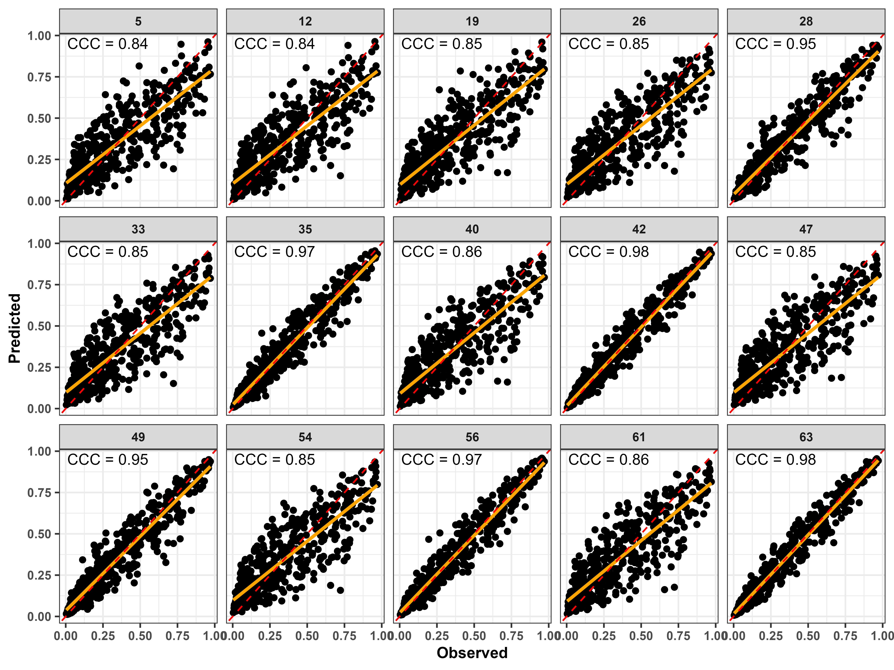
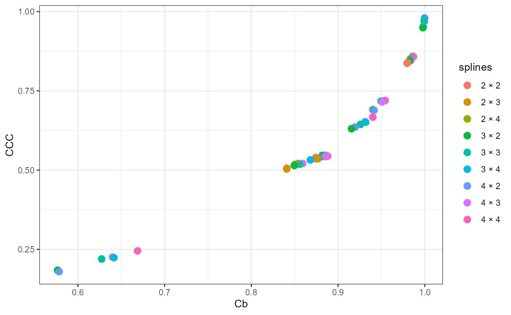
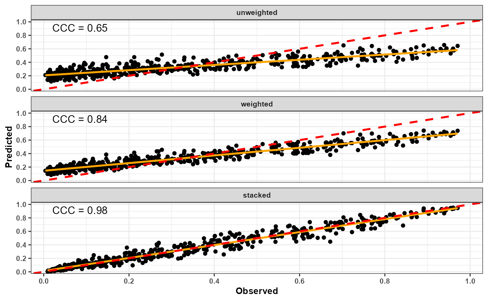
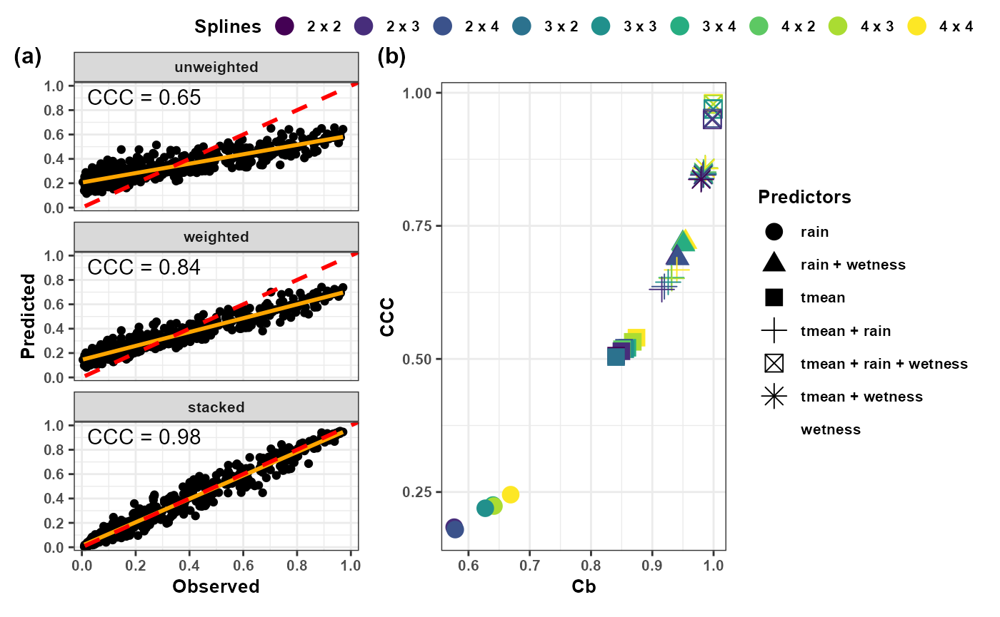

# Model Selection and Ensemble Forecasting

## Introduction

Distributed Lag Nonlinear Models (DLNMs) require several modeling
decisions, including:

- exposure variables;
- lag duration;
- exposure spline complexity;
- lag spline complexity;
- regression engine.

Different specifications may lead to different predictive performance.

`EpiExposure` provides tools for systematically exploring model
configurations, ranking competing models, and combining predictions
through ensemble forecasting.

This section demonstrates:

- automated DLNM model search;
- predictive validation;
- model ranking;
- ensemble forecasting;
- comparison of ensemble strategies.

## Load example data

``` r


library(EpiExposure)
library(dplyr)
library(ggplot2)
library(patchwork)
```

``` r


data("epi_data")

epi_data
#> # A tibble: 44,720 × 6
#>    epi_id  time tmean  rain wetness     y
#>     <dbl> <dbl> <dbl> <dbl>   <dbl> <dbl>
#>  1      1     0  22.0  0       8.83 0.330
#>  2      1     1  21.5  0      11.9  0.330
#>  3      1     2  21.5  5.38   12.5  0.330
#>  4      1     3  21.8 14.6    12.3  0.330
#>  5      1     4  20.8  0      11.4  0.330
#>  6      1     5  23.0  8.24    7.98 0.330
#>  7      1     6  23.9  4.69   10.8  0.330
#>  8      1     7  23.1 12.3     8.58 0.330
#>  9      1     8  25.3  4.14   10.6  0.330
#> 10      1     9  26.0  1.91   14.1  0.330
#> # ℹ 44,710 more rows
```

## Why model selection matters

Exposure-lag-response relationships are highly sensitive to model
specification.

For example, increasing lag flexibility may improve fit but increase
overfitting.

Likewise, adding additional predictors may improve prediction in some
pathosystems while reducing generalizability in others.

`EpiExposure` can evaluate predefined combinations of candidate DLNM
specifications using a consistent fitting and validation workflow.

## Searching candidate models

``` r

library(future)

future::plan(
  future::multisession,
  workers = 4
)
```

The appropriate number of workers depends on the available hardware and
local computing policies. Users should avoid requesting more workers
than their system can support.

``` r


future::plan(future::sequential ) 
```

### Run the model search

``` r

best_models <- find_bestfit(
  data = epi_data,
  response = "y",
  group = "epi_id",
  time = "time",
  vars = c("tmean","rain","wetness"),
  max_lag = 85,
  df_var_grid = c(2,3,4),
  df_lag_grid = c(2,3,4),
  model_engine = "glmmTMB",
  family = "beta",
  keep_fits = TRUE)
```

``` r

plot_performance(
  object = best_models,
 # model_id = c(
  #  63, 42, 56, 35, 49, 28, 40, 61,
    #19, 47, 33, 54, 26, 12, 5
#  ),
  model_id = c(5,12,19,26,28,33,35,40,42,47,49,54,56,61,63),
  metrics = c("CCC"),
  x = "observed",
  y = "predicted",
  scale_factor = 1,
  ncol = 5,
  x_lab = "Observed ",
  y_lab = "Predicted",
  size = 1.4
) +
  ggplot2::theme(
    text = ggplot2::element_text(
      size = 10,
      face = "bold"
    )
  )
```

 Inspect results

``` r

head(best_models)
#> # A tibble: 6 × 28
#>    rank model_id df_var df_lag vars       n_vars   CCC    Cb   rho   RMSE    MAE
#>   <dbl>    <dbl>  <dbl>  <dbl> <chr>       <dbl> <dbl> <dbl> <dbl>  <dbl>  <dbl>
#> 1     1       63      4      4 tmean + r…      3 0.980 1.000 0.980 0.0529 0.0382
#> 2     2       42      3      4 tmean + r…      3 0.978 1.000 0.979 0.0550 0.0395
#> 3     3       56      4      3 tmean + r…      3 0.970 0.999 0.971 0.0642 0.0475
#> 4     4       35      3      3 tmean + r…      3 0.969 0.999 0.969 0.0656 0.0483
#> 5     5       49      4      2 tmean + r…      3 0.952 0.998 0.954 0.0803 0.0577
#> 6     6       28      3      2 tmean + r…      3 0.949 0.998 0.951 0.0825 0.0589
#> # ℹ 17 more variables: n_folds <dbl>, n_success_folds <dbl>,
#> #   n_failed_folds <dbl>, n_predictions <dbl>, n_success <dbl>, n_failed <dbl>,
#> #   n_warning_folds <dbl>, warning_rate <dbl>, n_warning_events <dbl>,
#> #   n_knot_warning_folds <dbl>, n_convergence_warning_folds <dbl>,
#> #   n_hessian_warning_folds <dbl>, n_other_warning_folds <dbl>,
#> #   n_knot_warning_events <dbl>, n_convergence_warning_events <dbl>,
#> #   n_hessian_warning_events <dbl>, n_other_warning_events <dbl>
```

Depending on the selected validation settings, the resulting object can
include:

- a model identifier;
- the fitted predictor combination;
- exposure and lag spline settings;
- the modeling engine and response family;
- the Concordance Correlation Coefficient;
- the Root Mean Square Error;
- the Mean Absolute Error;
- bias-related metrics;
- the fitted model object when `keep_fits = TRUE`.

## Ranking models

### Top-performing models

The following example ranks models by decreasing CCC. This is one
possible ranking criterion, not a universal rule. Candidate models
should also be examined using error metrics, bias, convergence
diagnostics, model complexity, and the scientific plausibility of the
exposure-lag structure.

``` r

best_models %>%
  arrange(desc(CCC)) %>%
  select(
    model_id,
    vars,
    CCC,
    RMSE,
    MAE
  ) %>%
  head(10)
#> # A tibble: 10 × 5
#>    model_id vars                     CCC   RMSE    MAE
#>       <dbl> <chr>                  <dbl>  <dbl>  <dbl>
#>  1       63 tmean + rain + wetness 0.980 0.0529 0.0382
#>  2       42 tmean + rain + wetness 0.978 0.0550 0.0395
#>  3       56 tmean + rain + wetness 0.970 0.0642 0.0475
#>  4       35 tmean + rain + wetness 0.969 0.0656 0.0483
#>  5       49 tmean + rain + wetness 0.952 0.0803 0.0577
#>  6       28 tmean + rain + wetness 0.949 0.0825 0.0589
#>  7       40 tmean + wetness        0.859 0.132  0.0988
#>  8       61 tmean + wetness        0.858 0.132  0.0998
#>  9       19 tmean + wetness        0.851 0.134  0.102 
#> 10       47 tmean + wetness        0.848 0.136  0.104
```

## Visualizing model performance

``` r

best_models %>%
  mutate(
    splines = paste(
      df_var,
      df_lag,
      sep = " × "
    )
  ) %>%
  ggplot(
    aes(
      Cb,
      CCC,
      color = splines
    )
  ) +
  geom_point(size = 3) +
  theme_bw()
```



## Understanding validation metrics

### Concordance Correlation Coefficient

CCC evaluates agreement between observed and predicted outcomes by
combining precision and accuracy.

Values closer to 1 indicate stronger concordance. However, CCC should be
interpreted together with error and bias metrics rather than used as the
only selection criterion.

### Root Mean Square Error

RMSE summarizes the magnitude of prediction errors while assigning
greater influence to larger errors because residuals are squared before
averaging.

Lower values indicate better predictive performance when models are
evaluated on the same response scale and validation data.

### Mean Absolute Error

MAE is the average absolute difference between observed and predicted
outcomes.

Lower values indicate better predictive performance. Because MAE remains
on the response scale, it is often easier to interpret directly than
RMSE.

## Inspecting specific models

Suppose the best model is:

``` r

top_model <- best_models |>
  dplyr::arrange(
    dplyr::desc(
      CCC
    )
  ) |>
  dplyr::slice(
    1L
  )
```

## Why use ensembles?

No single model is guaranteed to be optimal.

Different DLNM structures frequently capture different aspects of the
underlying epidemiological process.

Combining predictions from multiple models often improves stability and
predictive robustness.

## Selecting ensemble candidates

The identifiers below are illustrative. Replace them with model
identifiers selected from the user’s own `best_models` object.

``` r

candidate_models <- c(
  63,
  23,
  44
)
```

Therefore, three candidate models (best ranked \[63\], and the two
lower-ranked models \[23, 44\]) were selected to be used on the ensemble
approaches, with CCC used as the performance metric for the weighted
ensemble.

## Unweighted ensemble

``` r

ens_unweighted <- ensemble_bestfit(
  bestfit = best_models,

  ensemble_scope = "model",

  method = "unweighted",

  model_id = candidate_models)
```

### Inspect results

The ensemble summary can be extracted from the fitted ensemble object:

``` r

ens_unweighted$ensemble_summary
```

The table below shows a precomputed example of the ensemble summary
output.

``` r

ens_unweighted
#> # A tibble: 1 × 20
#>   method     n_models n_oof family outcome_type cv_method cv_scheme            k
#>   <chr>         <dbl> <dbl> <chr>  <chr>        <chr>     <chr>            <dbl>
#> 1 unweighted        3   520 beta   non_binary   LOOCV     leave_one_group…   520
#> # ℹ 12 more variables: weight_metric <chr>, metric_direction <chr>,
#> #   threshold <lgl>, stacking_model <lgl>, stack_objective <lgl>,
#> #   stack_intercept <lgl>, weight_transform <lgl>, CCC <dbl>, Cb <dbl>,
#> #   rho <dbl>, RMSE <dbl>, MAE <dbl>
```

## Weighted ensemble

``` r

ens_weighted <- ensemble_bestfit(
  bestfit = best_models,

  ensemble_scope = "model",

  method = "weighted",

  model_id = candidate_models,

  weight_metric = "CCC",

  weight_transform = "rank_inverse"
)
```

### Inspect results

The ensemble summary can be extracted from the fitted ensemble object:

``` r

ens_weighted$ensemble_summary
```

The table below shows a precomputed example of the ensemble summary
output.

``` r

ens_weighted
#> # A tibble: 1 × 20
#>   method   n_models n_oof family outcome_type cv_method cv_scheme              k
#>   <chr>       <dbl> <dbl> <chr>  <chr>        <chr>     <chr>              <dbl>
#> 1 weighted        3   520 beta   non_binary   LOOCV     leave_one_group_o…   520
#> # ℹ 12 more variables: weight_metric <chr>, metric_direction <chr>,
#> #   threshold <lgl>, stacking_model <lgl>, stack_objective <lgl>,
#> #   stack_intercept <lgl>, weight_transform <chr>, CCC <dbl>, Cb <dbl>,
#> #   rho <dbl>, RMSE <dbl>, MAE <dbl>
```

## Stacked ensemble

``` r

ens_stacked <- ensemble_bestfit(
  bestfit = best_models,

  ensemble_scope = "model",

  method = "stacked",

  model_id = candidate_models,

  stacking_model = "ridge",

  stack_objective = "regularized"
)
```

### Inspect results

The ensemble summary can be extracted from the fitted ensemble object:

``` r

ens_stacked$ensemble_summary
```

The table below shows a precomputed example of the ensemble summary
output.

``` r

ens_stacked
#> # A tibble: 1 × 20
#>   method  n_models n_oof family outcome_type cv_method cv_scheme               k
#>   <chr>      <dbl> <dbl> <chr>  <chr>        <chr>     <chr>               <dbl>
#> 1 stacked        3   520 beta   non_binary   LOOCV     leave_one_group_out   520
#> # ℹ 12 more variables: weight_metric <chr>, metric_direction <chr>,
#> #   threshold <lgl>, stacking_model <chr>, stack_objective <chr>,
#> #   stack_intercept <dbl>, weight_transform <lgl>, CCC <dbl>, Cb <dbl>,
#> #   rho <dbl>, RMSE <dbl>, MAE <dbl>
```

## Comparing ensemble strategies

``` r

ensemble_metrics <- dplyr::bind_rows(
  Unweighted = ens_unweighted$ensemble_summary,
  Weighted = ens_weighted$ensemble_summary,
  Stacked = ens_stacked$ensemble_summary,
  .id = "method"
) |>
  dplyr::select(
    method,
    CCC,
    RMSE,
    MAE
  )
```

``` r

ensemble_metrics
#> # A tibble: 3 × 4
#>   method       CCC   RMSE    MAE
#>   <chr>      <dbl>  <dbl>  <dbl>
#> 1 Unweighted 0.646 0.174  0.148 
#> 2 Weighted   0.839 0.125  0.105 
#> 3 Stacked    0.980 0.0532 0.0385
```

## Visualizing ensemble predictions

``` r


ens_unweighted$ensemble_predictions$method = "unweighted"
ens_weighted$ensemble_predictions$method = "weighted"
ens_stacked$ensemble_predictions$method = "stacked"

ensemble_all = rbind(ens_unweighted$ensemble_predictions,ens_weighted$ensemble_predictions, ens_stacked$ensemble_predictions)
```

``` r

ensemble_all
#> # A tibble: 1,560 × 8
#>    group  fold method     observed predicted_ensemble model_63 model_23 model_44
#>    <chr> <dbl> <chr>         <dbl>              <dbl>    <dbl>    <dbl>    <dbl>
#>  1 1         1 unweighted   0.330               0.471   0.365     0.521    0.528
#>  2 2         2 unweighted   0.0706              0.361   0.0776    0.495    0.510
#>  3 3         3 unweighted   0.190               0.231   0.194     0.251    0.248
#>  4 4         4 unweighted   0.0356              0.274   0.0477    0.381    0.393
#>  5 5         5 unweighted   0.117               0.281   0.121     0.363    0.360
#>  6 6         6 unweighted   0.126               0.301   0.140     0.381    0.381
#>  7 7         7 unweighted   0.276               0.274   0.237     0.292    0.293
#>  8 8         8 unweighted   0.378               0.384   0.436     0.360    0.356
#>  9 9         9 unweighted   0.0250              0.189   0.0228    0.271    0.272
#> 10 10       10 unweighted   0.891               0.546   0.903     0.373    0.362
#> # ℹ 1,550 more rows
```

``` r


ensemble_metrics$method = c("unweighted","weighted","stacked")

ordem_methods <- c(
  "unweighted",
  "weighted",
  "stacked"
)

ensemble_plot <- ensemble_all %>%
  filter(!is.na(method)) %>%
  mutate(
    method = as.character(method)
  ) %>%
  filter(method %in% ordem_methods) %>%
  mutate(
    method = factor(
      method,
      levels = ordem_methods
    )
  )


CCC_plot <- ensemble_metrics %>%
  mutate(
    method = factor(
      method,
      levels = ordem_methods
    )
  )


pos_CCC <- ensemble_plot %>%
  group_by(method) %>%
  summarise(
    x = min(observed, na.rm = TRUE) +
      0.05 * diff(range(observed, na.rm = TRUE)),
   
    y = max(predicted_ensemble, na.rm = TRUE) -
      0.05 * diff(range(predicted_ensemble, na.rm = TRUE)),
   
    .groups = "drop"
  ) %>%
  left_join(
    CCC_plot %>% select(method, CCC),
    by = "method"
  )


 ensemble_gg = ggplot(ensemble_plot,
            aes(observed, predicted_ensemble)) +
  geom_point()+
  geom_smooth(method = "lm",se = FALSE, color = "orange") +
  geom_abline(
    intercept = 0,
    slope = 1,
    color = "red",
    linetype = "dashed",
    linewidth = 1) +
  geom_text(
    data = pos_CCC,
    aes(
      x = 0.02,
      y = 0.97,
      label = sprintf("CCC = %.2f", CCC)
    ),
    inherit.aes = FALSE,
    hjust = 0,
    vjust = 1,
    size = 4) +
  facet_wrap(
    ~method,
    ncol = 1) +
  theme_bw() +
    scale_x_continuous(
    limits = c(0, 1),
    breaks = seq(0, 1, 0.20),
    expand = expansion(mult = 0.03)
  ) +
 
  scale_y_continuous(
    limits = c(0, 1),
    breaks = seq(0, 1, 0.20),
    expand = expansion(mult = 0.03)
  ) +
  labs(
    x = "Observed",
    y = "Predicted") +
  theme(text = element_text(size = 10,face = "bold"),legend.position = "none")
 
 ensemble_gg
```



``` r

best_models_plot <- best_models %>%
   mutate(
    splines = paste(df_lag, df_var, sep = " x ")
  )


best_plot <- best_models_plot %>%
  ggplot(aes(
    Cb, CCC,
    color = as.factor(splines),
    shape = as.factor(vars)
  )) +
 
  geom_point(size = 4) +
 
  scale_color_viridis_d() +
 
  labs(
    x = "Cb",
    y = "CCC",
    color = "Splines",
    shape = "Predictors"
  ) +
 
  guides(
    color = guide_legend(
      position = "top",
      nrow = 1,
      byrow = TRUE,
      title.position = "left",
      theme = theme(
        legend.key.height = unit(0.25, "cm"),
        legend.key.width = unit(0.45, "cm"),
        legend.spacing.y = unit(0, "cm"),
        legend.margin = margin(
          t = -3,
          r = 0,
          b = -3,
          l = 0
        )
      )
    ),
   
    shape = guide_legend(
      position = "right"
    )
  ) +
 
  theme_bw() +
 
  theme(
    text = element_text(
      size = 10,
      face = "bold"
    )
  )
```

``` r

final_plot <- ensemble_gg + best_plot +
  plot_layout(ncol = 2) +
  plot_annotation(
    tag_levels = "a",
    tag_prefix = "(",
    tag_suffix = ")"
  ) &
  theme(
    plot.tag = element_text(
      size = 12,
      face = "bold"
    ),
    plot.tag.position = c(0.02, 0.94)
  )

final_plot
```



## Choosing an ensemble strategy

Each ensemble method has advantages.

**Unweighted ensemble**

- gives equal contribution to the selected models;
- is simple and transparent;
- avoids estimating additional model weights;
- can be affected by weak or redundant candidate models.

**Weighted ensemble**

- assigns different contributions to candidate models;
- can emphasize models with stronger validation performance;
- depends on the selected metric and weight transformation;
- does not guarantee improvement over the best individual model.

**Stacked ensemble**

- estimates combination coefficients from model predictions;
- can account for complementary predictive information;
- requires careful separation between weight estimation and final
  evaluation;
- can overfit when the validation sample is limited or when candidate
  predictions are highly similar.

Therefore, no ensemble method is universally superior.

An unweighted ensemble is useful as a transparent reference because
every candidate contributes equally.

A weighted ensemble is appropriate when the selected validation metric
provides a defensible basis for assigning model contributions.

A stacked ensemble can be useful when candidate models contain
complementary predictive information and the stacking weights are
estimated without using the same observations reserved for final
evaluation.

Regardless of the method, compare the ensemble against:

- the strongest individual candidate;
- a simple baseline model;
- alternative ensemble strategies;
- results on validation data not reused for weight estimation.

### Avoiding optimistic ensemble evaluation

Ensemble weights should be estimated from out-of-sample or
cross-validated predictions whenever possible. Estimating weights and
reporting performance on the same fitted predictions can produce
optimistic results.

The final evaluation should use observations that were not reused to
select candidate models or estimate ensemble weights. If a completely
independent test set is unavailable, nested or repeated cross-validation
may provide a more defensible assessment.

## Summary

This section introduced the `EpiExposure` model-selection and ensemble
framework.

The workflow includes:

- defining a candidate model space;
- fitting candidate DLNM specifications;
- evaluating predictive performance;
- ranking models using multiple criteria;
- retaining selected fitted models;
- combining predictions through unweighted, weighted, or stacked
  ensembles;
- comparing ensemble predictions with individual models and simple
  baselines.

Model selection and ensemble construction do not remove model
uncertainty. Their value depends on the candidate model space,
validation design, selection rules, and independence of the final
performance assessment.
