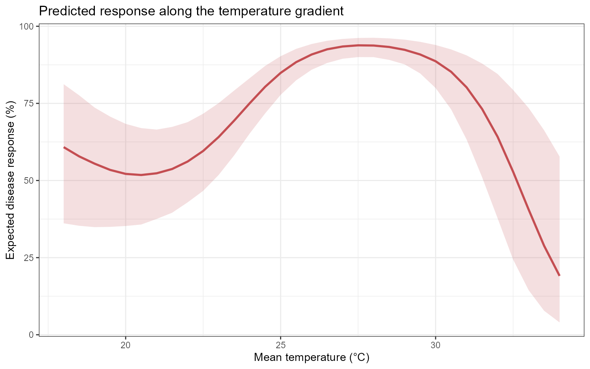
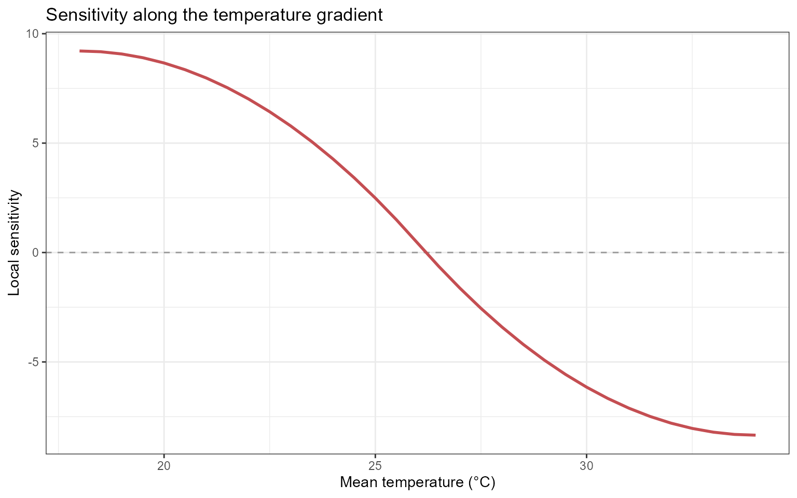
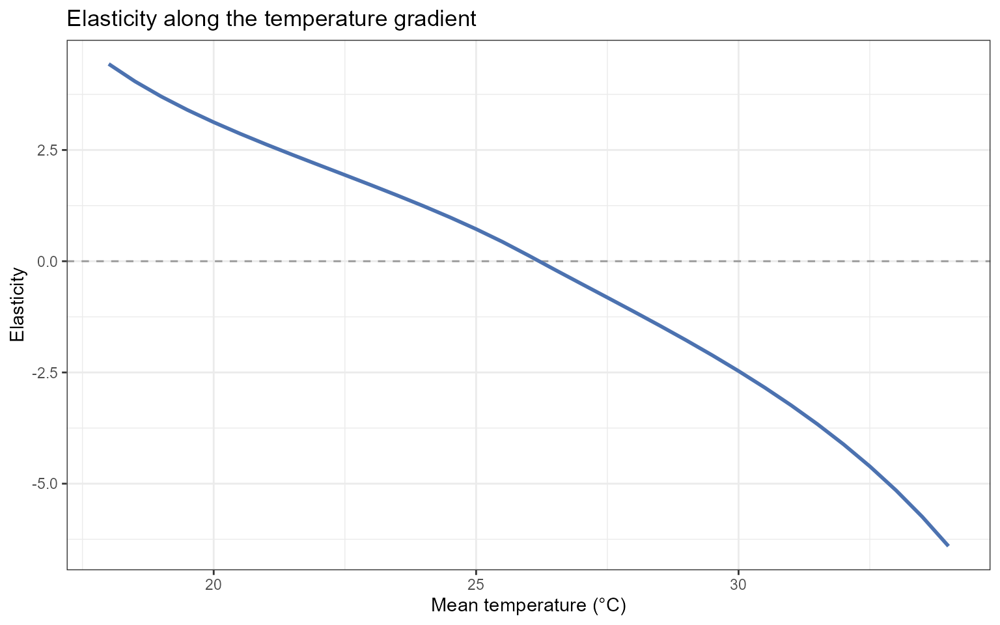
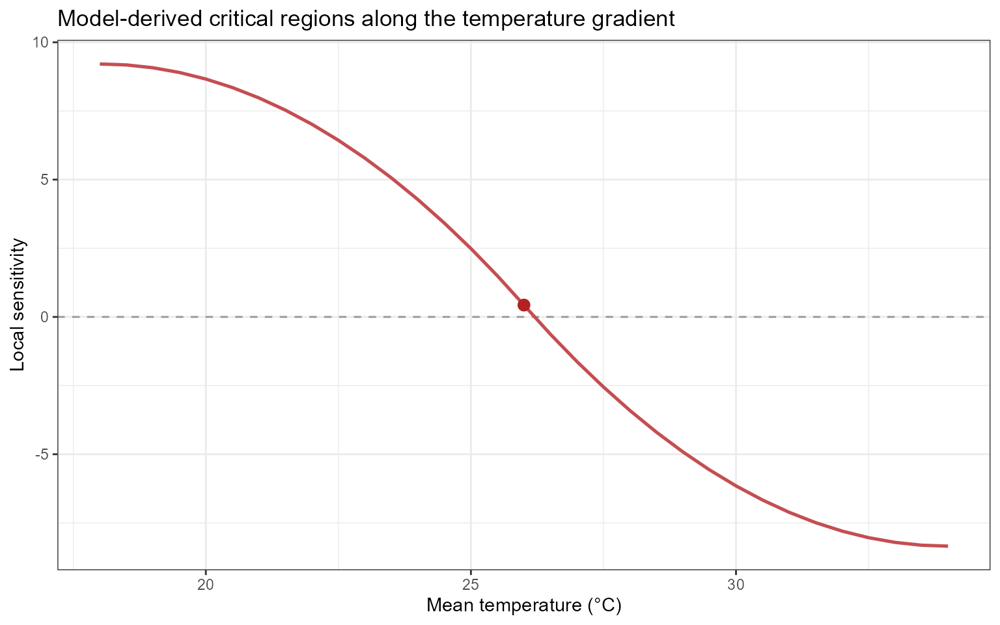
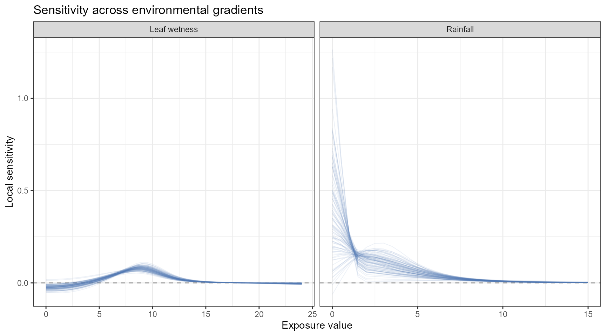
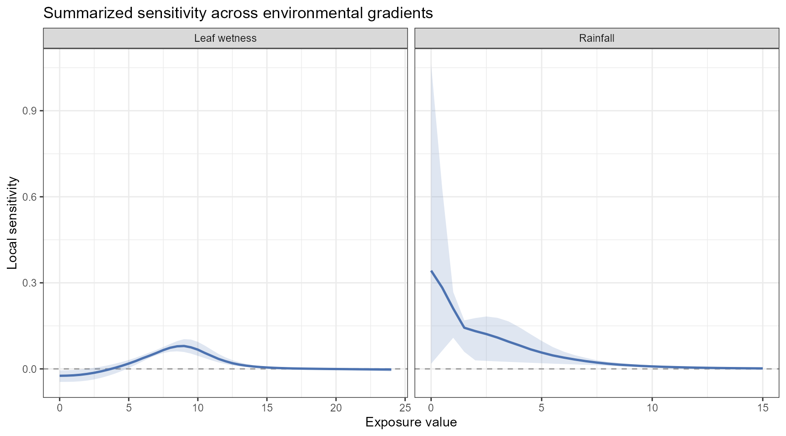

# Sensitivity Analysis and Decision Support

## Introduction

Exposure-response relationships are often non-linear. A small change in
an environmental exposure may correspond to little change in the
expected disease response in one region of the fitted curve but a much
larger change in another.

Effect summaries describe the direction and magnitude of modeled
associations. Sensitivity analysis addresses a complementary question:

> Where does the model-predicted disease response change most rapidly as
> an exposure changes?

`EpiExposure` provides tools for examining:

- local rates of change along prediction curves;
- proportional response changes through elasticity;
- model-derived critical exposure regions;
- differences in sensitivity among environmental drivers;
- potential regions of interest for monitoring and decision support.

**What you will learn.** This tutorial shows how to generate controlled
exposure gradients, predict disease responses along those gradients,
calculate local sensitivity and elasticity, and identify regions in
which the fitted response changes most rapidly.

Sensitivity results describe mathematical features of the fitted model.
They do not automatically establish biological thresholds, causal
intervention points, or management recommendations. Such interpretations
require biological validation and decision criteria appropriate to the
pathosystem.

## Preparing the example model

This section uses the same example dataset and DLNM specification
introduced in the previous tutorials.

``` r

library(EpiExposure)
library(dplyr)
library(ggplot2)
```

``` r

data(
  "epi_data")
```

Define the exposure-lag structures:

``` r

cb <- define_exposures(
  data = epi_data,
  vars = c(
    "tmean",
    "rain",
    "wetness"
  ),
  max_lag = 85,
  df_var = 3,
  df_lag = 2
)
```

Build the epidemic-level design:

``` r

dat <- build_design(
  data = epi_data,
  cb_templates = cb
)
```

Prepare the disease response:

``` r

dat <- prepare_response(
  data = dat,
  response = "y",
  family = "beta"
)
```

Fit the DLNM:

``` r

fit <- fit_epidlnm(
  data = dat,
  model_engine = "glmmTMB",
  family = "beta",
  random_effect = NULL,
  epiexposure_spec = attr(
    cb,
    "spec"
  )
)
```

The fitted model is now used to predict the expected disease response
along controlled environmental gradients.

## From effect interpretation to sensitivity analysis

The *Understanding Effects* section introduced lag-specific,
period-specific, and cumulative summaries of the fitted
exposure-lag-response relationship.

Sensitivity analysis provides a different view. Rather than summarizing
the magnitude of an effect at an exposure-lag combination, it estimates
how rapidly the predicted response changes along a selected exposure
gradient.

Conceptually:

``` text
effect analysis
    → What modeled contrast is associated with an exposure?

sensitivity analysis
    → How rapidly does the predicted response change as the exposure changes?
```

The two approaches are complementary. A region can have a relatively
large predicted response but low sensitivity if the curve is locally
flat. A region with a moderate predicted response can have high
sensitivity if the curve is changing rapidly.

## Generating controlled exposure gradients

The sensitivity workflow uses
[`simulate_ranges()`](https://tomazrg.github.io/EpiExposure/reference/simulate_ranges.md)
and
[`simulate_scenarios()`](https://tomazrg.github.io/EpiExposure/reference/simulate_scenarios.md)
to create controlled exposure gradients.

In this section, these functions are used specifically to evaluate one
environmental variable across a sequence of values while the remaining
variables are held constant.

The broader use of simulation tools for constructing complete exposure
profiles, structured events, and multivariable scenarios is covered in
the *Simulation and Prediction* section.

First, define epidemiological lag periods:

``` r

periods <- define_periods(
  max_lag = 85,
  cuts = c(
    20,
    40,
    60
  ),
  prefix = "Period"
)

periods
#>    period lag_start lag_end
#> 1 Period1         0      20
#> 2 Period2        21      40
#> 3 Period3        41      60
#> 4 Period4        61      85
```

These periods divide the retrospective lag interval into four sections.

Remember that lag order is retrospective:

``` text
smaller lag → closer to disease assessment
larger lag  → earlier exposure condition
```

## Temperature sensitivity

### Generating a temperature gradient

The following scenario grid evaluates mean temperature from 18 to 34 °C
while holding rainfall and leaf wetness constant:

``` r

temp_range <- simulate_ranges(
  periods = periods,
  vary = list(
    rain = 5,
    wetness = 10,
    tmean = seq(
      18,
      34,
      by = 0.5
    )
  ),
  scenario_type = "grid",
  scenario_var = "tmean"
)
```

This is a controlled model-based gradient. It does not represent
additional observed data.

### Predicting responses along the gradient

``` r

temp_predictions <- simulate_scenarios(
  fit = fit,
  scenarios = temp_range,
  data = epi_data,
  uncertainty = TRUE,
  output = "summary",
  n_samples = 100,
  seed = 123
)
```

The predictions from the fitted Beta model are returned as proportions.
For visualization, they are converted to percentages:

``` r

response_curve <- temp_predictions |>
  dplyr::transmute(
    value = tmean,
    prediction = prediction * 100,
    lower = prediction_lower * 100,
    upper = prediction_upper * 100
  ) |>
  dplyr::arrange(
    value
  )
```

Inspect the response curve:

| value | prediction | lower  | upper  |
|:-----:|:----------:|:------:|:------:|
| 18.0  |   60.494   | 39.115 | 81.108 |
| 18.5  |   57.796   | 38.299 | 76.875 |
| 19.0  |   54.725   | 37.171 | 72.546 |
| 19.5  |   52.903   | 36.369 | 68.435 |
| 20.0  |   52.225   | 36.226 | 66.500 |
| 20.5  |   51.628   | 36.636 | 66.483 |
| 21.0  |   52.329   | 37.890 | 67.138 |
| 21.5  |   53.978   | 39.868 | 68.476 |
| 22.0  |   56.220   | 42.945 | 70.361 |
| 22.5  |   58.697   | 47.244 | 72.219 |

First 10 predicted responses along the temperature gradient. {.table}

### Visualizing the response curve

``` r

ggplot(
  response_curve,
  aes(
    x = value,
    y = prediction
  )
) +
  geom_ribbon(
    aes(
      ymin = lower,
      ymax = upper
    ),
    fill = "#C44E52",
    alpha = 0.18
  ) +
  geom_line(
    linewidth = 1,
    color = "#C44E52"
  ) +
  theme_bw() +
  labs(
    x = "Mean temperature (°C)",
    y = "Expected disease response (%)",
    title = "Predicted response along the temperature gradient"
  )
```



The line represents the central expected response under the fitted
model. The ribbon represents uncertainty associated with the fitted
model coefficients.

The curve should not be interpreted as a causal dose-response
relationship unless the study design and assumptions support that
interpretation.

## Why sensitivity analysis?

Prediction curves show the expected response along an exposure gradient.

Sensitivity curves describe the local slope of those prediction curves.

For a response function $`f(x)`$, local sensitivity is conceptually
related to:

``` math
S(x) = \frac{\partial f(x)}{\partial x}
```

where $`x`$ is the exposure value.

A large absolute sensitivity indicates that the predicted response is
changing rapidly at that point of the fitted curve. A sensitivity near
zero indicates a locally flat region.

## Computing temperature sensitivity

``` r

temp_sensitivity <- epi_sensitivity(
  data = response_curve,
  x = "value",
  y = "prediction",
  scenario_var = NULL,
  elasticity = TRUE,
  critical = TRUE,
  k = 3
)
```

Inspect the resulting columns:

| value | prediction | lower | upper | sensitivity | sensitivity_curve_value | elasticity | critical | critical_type | critical_x |
|:--:|:--:|:--:|:--:|:--:|:--:|:--:|:--:|:--:|:--:|
| 18.0 | 60.4939 | 39.1146 | 81.1078 | 9.2108 | 37.3974 | 4.4333 | FALSE | NA | NA |
| 18.5 | 57.7958 | 38.2991 | 76.8746 | 9.1765 | 41.9971 | 4.0423 | FALSE | NA | NA |
| 19.0 | 54.7253 | 37.1710 | 72.5464 | 9.0736 | 46.5625 | 3.7025 | FALSE | NA | NA |
| 19.5 | 52.9027 | 36.3691 | 68.4354 | 8.9022 | 51.0593 | 3.3998 | FALSE | NA | NA |
| 20.0 | 52.2246 | 36.2260 | 66.4998 | 8.6621 | 55.4532 | 3.1241 | FALSE | NA | NA |
| 20.5 | 51.6278 | 36.6358 | 66.4830 | 8.3535 | 59.7100 | 2.8680 | FALSE | NA | NA |
| 21.0 | 52.3285 | 37.8897 | 67.1383 | 7.9763 | 63.7953 | 2.6256 | FALSE | NA | NA |
| 21.5 | 53.9778 | 39.8684 | 68.4755 | 7.5305 | 67.6749 | 2.3924 | FALSE | NA | NA |
| 22.0 | 56.2202 | 42.9446 | 70.3610 | 7.0161 | 71.3144 | 2.1644 | FALSE | NA | NA |
| 22.5 | 58.6974 | 47.2438 | 72.2187 | 6.4332 | 74.6796 | 1.9382 | FALSE | NA | NA |

First 10 temperature sensitivity results. {.table}

## Interpreting sensitivity

Positive sensitivity indicates that the expected disease response
increases locally as the exposure increases.

Negative sensitivity indicates that the expected disease response
decreases locally as the exposure increases.

Values near zero indicate a locally flat region of the model-predicted
response curve.

Sensitivity describes the local slope of the prediction curve. It should
not automatically be interpreted as disease risk or as a causal effect
of changing the exposure.

### Visualizing temperature sensitivity

``` r

ggplot(
  temp_sensitivity,
  aes(
    x = value,
    y = sensitivity
  )
) +
  geom_hline(
    yintercept = 0,
    color = "grey60",
    linetype = "dashed"
  ) +
  geom_line(
    linewidth = 1,
    color = "#C44E52"
  ) +
  theme_bw() +
  labs(
    x = "Mean temperature (°C)",
    y = "Local sensitivity",
    title = "Sensitivity along the temperature gradient"
  )
```



The sign describes the direction of local change, whereas the absolute
magnitude describes how rapidly the prediction changes.

## Elasticity analysis

### What is elasticity?

Sensitivity measures the absolute local rate of change in the predicted
response with respect to an exposure.

Elasticity expresses the local response change relative to the current
exposure and response scales.

Conceptually, elasticity can be represented as:

``` math
E(x)
=
\frac{\partial f(x)}{\partial x}
\frac{x}{f(x)}
```

It addresses the question:

> What proportional change in the expected disease response is
> associated with a proportional change in the exposure at this point of
> the fitted curve?

Elasticity is dimensionless, which can facilitate comparisons across
variables measured in different units.

However, elasticity may become unstable when the exposure or predicted
response is close to zero. It should be interpreted cautiously in those
regions.

### Visualizing elasticity

``` r

ggplot(
  temp_sensitivity,
  aes(
    x = value,
    y = elasticity
  )
) +
  geom_hline(
    yintercept = 0,
    color = "grey60",
    linetype = "dashed"
  ) +
  geom_line(
    linewidth = 1,
    color = "#4C72B0"
  ) +
  theme_bw() +
  labs(
    x = "Mean temperature (°C)",
    y = "Elasticity",
    title = "Elasticity along the temperature gradient"
  )
```



Elasticity should be interpreted together with the underlying prediction
and sensitivity curves. A large elasticity value can arise from a small
denominator rather than from a large absolute response change.

## Identifying critical regions

When:

``` r

critical = TRUE
```

[`epi_sensitivity()`](https://tomazrg.github.io/EpiExposure/reference/epi_sensitivity.md)
identifies points or regions that satisfy the function’s criterion for
comparatively strong local response change.

These locations are model-derived critical regions. They may suggest
exposure ranges that deserve closer biological investigation, but they
should not automatically be described as biological thresholds.

A biological or management threshold requires additional justification,
such as:

- experimental validation;
- an established disease criterion;
- a decision-relevant loss boundary;
- demonstrated management value;
- acceptable classification or forecasting performance.

### Extracting critical points

``` r

critical_temperature <- temp_sensitivity |>
  dplyr::filter(
    critical
  )

critical_temperature
#>   value prediction    lower  upper sensitivity sensitivity_curve_value
#> 1    26   90.32056 86.96177 93.959   0.4321628                87.67416
#>   elasticity critical critical_type critical_x
#> 1   0.128159     TRUE local_maximum   26.20327
```

### Visualizing critical points

``` r

ggplot(
  temp_sensitivity,
  aes(
    x = value,
    y = sensitivity
  )
) +
  geom_hline(
    yintercept = 0,
    color = "grey60",
    linetype = "dashed"
  ) +
  geom_line(
    linewidth = 0.9,
    color = "#C44E52"
  ) +
  geom_point(
    data = critical_temperature,
    color = "#B22222",
    size = 2.8
  ) +
  theme_bw() +
  labs(
    x = "Mean temperature (°C)",
    y = "Local sensitivity",
    title = "Model-derived critical regions along the temperature gradient"
  )
```



The highlighted points indicate comparatively strong local changes
according to the criterion used by
[`epi_sensitivity()`](https://tomazrg.github.io/EpiExposure/reference/epi_sensitivity.md).
They do not, by themselves, establish biologically validated thresholds.

## Comparing environmental drivers

Sensitivity analyses can also be conducted for rainfall and leaf
wetness.

The following examples evaluate one exposure at a time while holding the
other environmental variables constant.

## Rainfall sensitivity

### Generating a rainfall gradient

``` r

rain_range <- simulate_ranges(
  periods = periods,
  vary = list(
    tmean = 25,
    wetness = 10,
    rain = seq(
      0,
      15,
      by = 0.5
    )
  ),
  scenario_type = "grid",
  scenario_var = "rain"
)
```

### Predicting rainfall scenarios

Sample-level predictions are requested so that sensitivity can be
evaluated across uncertainty realizations:

``` r

rain_predictions <- simulate_scenarios(
  fit = fit,
  scenarios = rain_range,
  data = epi_data,
  uncertainty = TRUE,
  output = "samples",
  n_samples = 100,
  seed = 123
)
```

### Computing rainfall sensitivity

``` r

sens_rain <- epi_sensitivity(
  data = rain_predictions,
  x = "rain",
  y = "prediction",
  scenario_var = "sample",
  elasticity = TRUE,
  critical = TRUE,
  method = "finite",
  k = 3
)
```

## Leaf wetness sensitivity

### Generating a leaf wetness gradient

``` r

wetness_range <- simulate_ranges(
  periods = periods,
  vary = list(
    tmean = 25,
    rain = 5,
    wetness = seq(
      0,
      24,
      by = 0.5
    )
  ),
  scenario_type = "grid",
  scenario_var = "wetness"
)
```

### Predicting leaf wetness scenarios

``` r

wetness_predictions <- simulate_scenarios(
  fit = fit,
  scenarios = wetness_range,
  data = epi_data,
  uncertainty = TRUE,
  output = "samples",
  n_samples = 100,
  seed = 456
)
```

### Computing leaf wetness sensitivity

``` r

sens_wetness <- epi_sensitivity(
  data = wetness_predictions,
  x = "wetness",
  y = "prediction",
  scenario_var = "sample",
  elasticity = TRUE,
  critical = TRUE,
  method = "finite",
  k = 3
)
```

## Combining sensitivity results

Rainfall and leaf wetness are measured on different scales. Therefore,
they should not be placed on a shared exposure axis without preserving
their original units.

Create a common exposure-value column and retain the variable
identifier:

``` r

sens_rain_plot <- sens_rain |>
  dplyr::mutate(
    variable = "Rainfall",
    exposure_value = rain
  )

sens_wetness_plot <- sens_wetness |>
  dplyr::mutate(
    variable = "Leaf wetness",
    exposure_value = wetness
  )

combined_sensitivity <- dplyr::bind_rows(
  sens_rain_plot,
  sens_wetness_plot
)
```

### Visualizing uncertainty realizations

``` r

ggplot(
  combined_sensitivity,
  aes(
    x = exposure_value,
    y = sensitivity,
    group = sample
  )
) +
  geom_hline(
    yintercept = 0,
    color = "grey60",
    linetype = "dashed"
  ) +
  geom_line(
    alpha = 0.10,
    linewidth = 0.35,
    color = "#4C72B0"
  ) +
  facet_wrap(
    vars(
      variable
    ),
    scales = "free_x"
  ) +
  theme_bw() +
  labs(
    x = "Exposure value",
    y = "Local sensitivity",
    title = "Sensitivity across environmental gradients"
  )
```



Each line represents one uncertainty realization. The collection of
lines shows how coefficient uncertainty propagates into the estimated
sensitivity curves.

If the sample identifier returned by
[`simulate_scenarios()`](https://tomazrg.github.io/EpiExposure/reference/simulate_scenarios.md)
has a different column name, replace:

``` r

group = sample
```

with the corresponding sample-identification column.

## Summarizing sensitivity uncertainty

Sample-level sensitivity results can be summarized at each exposure
value.

``` r

sensitivity_summary <- combined_sensitivity |>
  dplyr::group_by(
    variable,
    exposure_value
  ) |>
  dplyr::summarise(
    sensitivity_median = stats::median(
      sensitivity,
      na.rm = TRUE
    ),
    sensitivity_lower = stats::quantile(
      sensitivity,
      probs = 0.025,
      na.rm = TRUE
    ),
    sensitivity_upper = stats::quantile(
      sensitivity,
      probs = 0.975,
      na.rm = TRUE
    ),
    .groups = "drop"
  )
```

Inspect the summaries:

| variable | exposure_value | sensitivity_median | sensitivity_lower | sensitivity_upper |
|:--:|:--:|:--:|:--:|:--:|
| Leaf wetness | 0.0 | -0.0241 | -0.0455 | -0.0053 |
| Leaf wetness | 0.5 | -0.0236 | -0.0453 | -0.0047 |
| Leaf wetness | 1.0 | -0.0225 | -0.0449 | -0.0037 |
| Leaf wetness | 1.5 | -0.0205 | -0.0432 | -0.0019 |
| Leaf wetness | 2.0 | -0.0175 | -0.0406 | 0.0006 |
| Leaf wetness | 2.5 | -0.0136 | -0.0366 | 0.0038 |
| Leaf wetness | 3.0 | -0.0086 | -0.0312 | 0.0078 |
| Leaf wetness | 3.5 | -0.0028 | -0.0244 | 0.0125 |
| Leaf wetness | 4.0 | 0.0036 | -0.0165 | 0.0180 |
| Leaf wetness | 4.5 | 0.0107 | -0.0074 | 0.0241 |

First 10 summarized sensitivity estimates. {.table}

### Visualizing summarized sensitivity

``` r

ggplot(
  sensitivity_summary,
  aes(
    x = exposure_value,
    y = sensitivity_median
  )
) +
  geom_hline(
    yintercept = 0,
    color = "grey60",
    linetype = "dashed"
  ) +
  geom_ribbon(
    aes(
      ymin = sensitivity_lower,
      ymax = sensitivity_upper
    ),
    fill = "#4C72B0",
    alpha = 0.18
  ) +
  geom_line(
    linewidth = 0.9,
    color = "#4C72B0"
  ) +
  facet_wrap(
    vars(
      variable
    ),
    scales = "free_x"
  ) +
  theme_bw() +
  labs(
    x = "Exposure value",
    y = "Local sensitivity",
    title = "Summarized sensitivity across environmental gradients"
  )
```



The uncertainty interval describes uncertainty propagated from the
fitted model into the sensitivity calculation. It does not include
uncertainty in the scenario values or additional observation-level
variability.

## Comparing sensitivity across variables

Absolute sensitivity values depend on the units of both the exposure and
the predicted response.

For example:

- temperature is measured in degrees Celsius;
- rainfall is measured in millimeters;
- leaf wetness is measured in its recorded unit.

Consequently, the numerical magnitudes of raw sensitivity should not be
compared directly across variables without considering their units and
scales.

Elasticity can facilitate proportional comparisons because it is
dimensionless. However, elasticity can be unstable near zero exposure or
zero predicted response.

A defensible comparison should therefore consider:

- sensitivity;
- elasticity;
- predicted disease level;
- uncertainty;
- observed exposure support;
- biological plausibility;
- the units and feasible range of each exposure.

## Decision-support interpretation

Sensitivity analysis can help identify model-derived regions that merit
closer attention, but it does not automatically define a management
rule.

Potential applications include:

- identifying exposure ranges associated with rapid predicted response
  change;
- prioritizing environmental monitoring;
- identifying candidate regions for experimental validation;
- informing the construction of warning criteria;
- comparing sensitivity across environmental gradients;
- examining climate or management scenarios;
- supporting disease-forecasting research.

A decision-support interpretation should combine sensitivity with
additional information, including:

- the absolute predicted disease response;
- uncertainty in the prediction and sensitivity;
- the frequency of the exposure condition;
- exposure values supported by the observed data;
- biological feasibility;
- intervention timing;
- management costs;
- potential yield or economic losses;
- consequences of false-positive and false-negative decisions.

**High sensitivity is not automatically high disease.** Sensitivity
describes the local slope of the predicted response curve. A region can
have high sensitivity but a moderate predicted response, or high
predicted disease but low sensitivity if the response curve has reached
a plateau.

## Example interpretation

Suppose the temperature sensitivity analysis indicates:

- relatively small local changes below 20 °C;
- the largest positive sensitivity between 24 and 28 °C;
- decreasing sensitivity above 30 °C.

Under the fitted model, the expected disease response changes most
rapidly along the 24–28 °C portion of the evaluated temperature
gradient.

This region may deserve closer monitoring or biological investigation.
However, high sensitivity alone does not establish a management
threshold.

A management interpretation should also consider:

- the predicted disease level in that region;
- uncertainty around the sensitivity estimates;
- whether temperatures in that interval are common in the target system;
- whether the exposure can be modified;
- whether an intervention can be applied in time;
- the expected yield and economic consequences;
- the cost and effectiveness of the intervention.

## Interpretation checklist

Before reporting sensitivity or elasticity results, verify:

1.  which response family and link were fitted;
2.  which environmental variable was varied;
3.  which variables were held constant;
4.  which lag periods were represented in the scenarios;
5.  whether the evaluated gradient is supported by the observed data;
6.  whether the disease response was analyzed as a proportion or
    percentage;
7.  whether uncertainty samples were propagated;
8.  how the sensitivity derivative was estimated;
9.  how critical regions were defined;
10. whether the result is being interpreted as a modeled association or
    as a validated decision threshold.

## Summary

This section demonstrated how `EpiExposure` can be used to examine local
changes along model-predicted response curves.

The sensitivity workflow consists of:

``` text
controlled exposure gradient
            ↓
predicted disease-response curve
            ↓
local sensitivity
            ↓
elasticity
            ↓
model-derived critical regions
```

The principal tools are:

- [`simulate_ranges()`](https://tomazrg.github.io/EpiExposure/reference/simulate_ranges.md)
  for creating controlled exposure gradients;
- [`simulate_scenarios()`](https://tomazrg.github.io/EpiExposure/reference/simulate_scenarios.md)
  for predicting responses along those gradients;
- [`epi_sensitivity()`](https://tomazrg.github.io/EpiExposure/reference/epi_sensitivity.md)
  for calculating sensitivity, elasticity, and critical regions.

Sensitivity analysis complements the effect summaries introduced in the
*Understanding Effects* section

Lag-specific and period-specific effects describe the fitted
exposure-lag association, whereas sensitivity describes how rapidly a
predicted response changes along a selected environmental gradient.

Sensitivity and elasticity are model-derived quantities. Their use in
decision support requires biological interpretation, uncertainty
assessment, and decision criteria appropriate to the pathosystem.

## Next steps

The next section, *Simulation and Prediction*, expands from controlled
one-variable gradients to complete hypothetical exposure profiles and
multivariable scenarios.

It introduces:

- [`simulate_exposures()`](https://tomazrg.github.io/EpiExposure/reference/simulate_exposures.md)
  for generating complete chronological profiles;
- [`simulate_ranges()`](https://tomazrg.github.io/EpiExposure/reference/simulate_ranges.md)
  for constructing candidate exposure combinations;
- [`simulate_scenarios()`](https://tomazrg.github.io/EpiExposure/reference/simulate_scenarios.md)
  for predicting across scenario grids;
- [`predict_outcomes()`](https://tomazrg.github.io/EpiExposure/reference/predict_outcomes.md)
  for complete exposure profiles;
- [`compare_exposures()`](https://tomazrg.github.io/EpiExposure/reference/compare_exposures.md)
  for comparing environmental profiles;
- [`compare_predictions()`](https://tomazrg.github.io/EpiExposure/reference/compare_predictions.md)
  for comparing their expected disease outcomes.

These tools allow researchers to investigate exposure timing, construct
alternative environmental profiles, propagate parameter uncertainty, and
compare model-based disease predictions.
