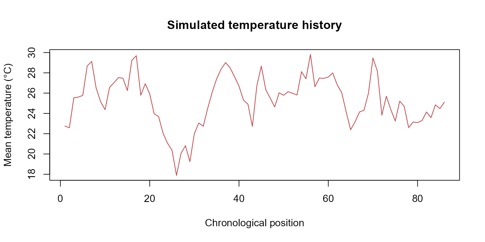
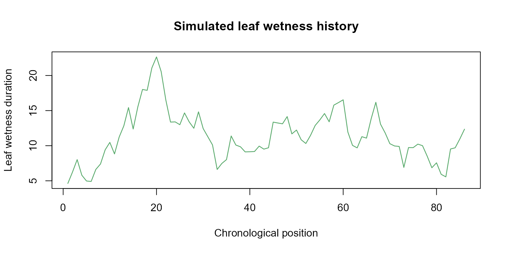
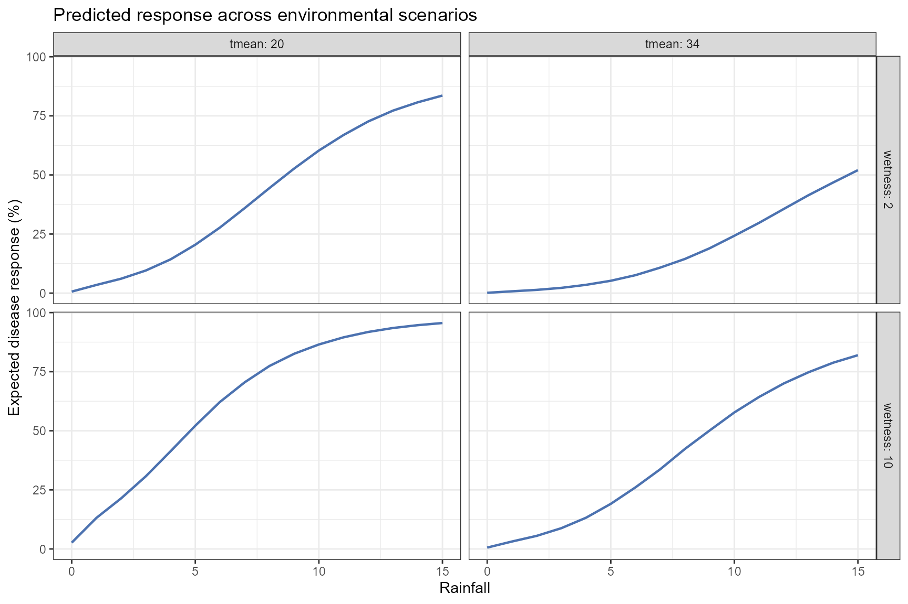
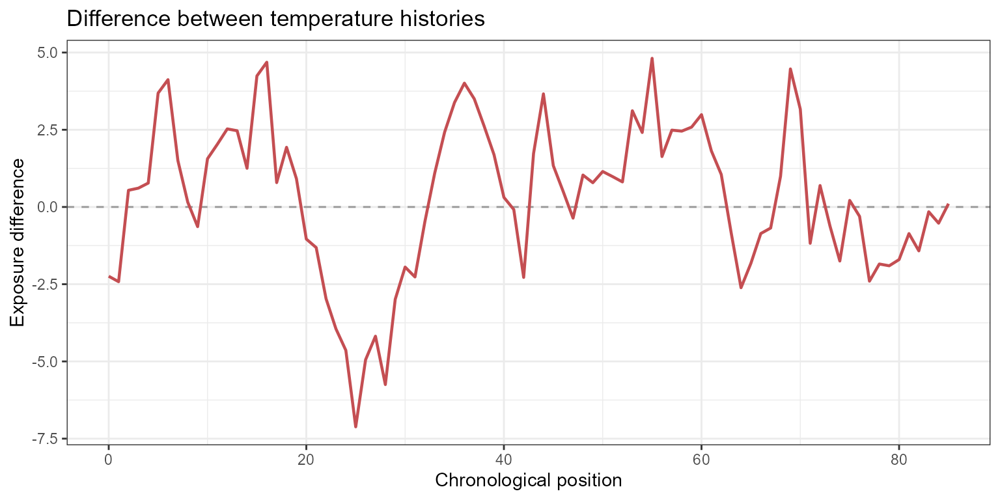

# Simulation and Prediction

## Introduction

Understanding historical exposure-lag associations is important for
epidemiological interpretation, but researchers are often interested in
a different question:

> What is the expected disease outcome under an alternative
> environmental history?

`EpiExposure` provides simulation and prediction tools that allow
researchers to:

- generate complete synthetic exposure histories;
- introduce structured exposure events;
- construct hypothetical epidemiological scenarios;
- predict expected disease outcomes;
- propagate parameter uncertainty;
- compare alternative exposure profiles and their predictions.

Unlike lag-specific effect summaries, prediction evaluates all exposure
values and lags jointly. Therefore, every prediction represents a
complete environmental history rather than an isolated exposure value.

**What you will learn.** This tutorial shows how to simulate complete
exposure histories, predict expected disease outcomes, propagate
parameter uncertainty, construct scenario grids, and compare alternative
environmental conditions.

The outputs describe predictions and contrasts under the fitted
statistical model. Hypothetical scenarios should not automatically be
interpreted as causal interventions unless the study design and
assumptions support that interpretation.

## Preparing the example model

This vignette uses the same dataset and DLNM specification introduced in
the previous tutorials.

``` r

library(EpiExposure)
library(ggplot2)
```

``` r

data("epi_data")
```

Define the exposure-lag structures:

``` r

cb <- define_exposures(
  data = epi_data,
  vars = c(
    "tmean",
    "rain",
    "wetness"
  ),
  max_lag = 85,
  df_var = 3,
  df_lag = 2
)
```

Build the epidemic-level design:

``` r

dat <- build_design(
  data = epi_data,
  cb_templates = cb
)
```

Prepare the response:

``` r

dat <- prepare_response(
  data = dat,
  response = "y",
  family = "beta"
)
```

Fit the model:

``` r

fit <- fit_epidlnm(
  data = dat,
  model_engine = "glmmTMB",
  family = "beta",
  random_effect = NULL,
  epiexposure_spec = attr(
    cb,
    "spec"
  )
)
```

The fitted model relates complete histories of temperature, rainfall,
and leaf wetness to the expected disease response.

## Complete exposure histories

Each exposure supplied to
[`predict_outcomes()`](https://tomazrg.github.io/EpiExposure/reference/predict_outcomes.md)
must contain exactly:

``` math
\text{max lag} + 1
```

chronologically ordered observations.

With:

``` r

max_lag = 85
```

each profile must contain 86 values:

``` text
position 1  → time 0  → maximum lag
position 86 → time 85 → lag 0
```

The order is chronological. `EpiExposure` converts these positions into
retrospective lags when reconstructing the cross-basis predictors.

**Complete profiles are required.** Temperature, rainfall, and leaf
wetness profiles must have the same length and temporal interpretation
used to fit the model. Coordinates, blocks, years, and other grouping
variables are not exposure profiles.

## Simulating exposure histories

### Why simulate exposures?

Environmental conditions rarely occur as isolated observations. Disease
development can reflect sequences of temperature, rainfall, leaf
wetness, and other exposures occurring throughout the epidemic.

[`simulate_exposures()`](https://tomazrg.github.io/EpiExposure/reference/simulate_exposures.md)
generates complete chronological profiles that can be used in prediction
and scenario analysis.

A simulated exposure profile is not a disease prediction. It becomes a
prediction scenario only after it is combined with the other required
exposures and supplied to
[`predict_outcomes()`](https://tomazrg.github.io/EpiExposure/reference/predict_outcomes.md).

## Simulating a background process

The following example generates a temperature profile using an
autoregressive background process:

``` r

temperature_profile <- simulate_exposures(
  max_lag = 85,
  mode = "profile",
  seed = 123,
  background = list(
    dist = "ar1",
    mean = 25,
    sd = 4,
    phi = 0.90
  )
)
```

The result contains the simulated chronological profile:

[TABLE]

Visualize the complete profile:

``` r

plot(
  temperature_profile$profile,
  type = "l",
  lwd = 1.2,
  col = "#C44E52",
  xlab = "Chronological position",
  ylab = "Mean temperature (°C)",
  main = "Simulated temperature history"
)
```



The autoregressive parameter:

``` r

phi = 0.90
```

produces temporal dependence among consecutive observations. It does not
represent an exposure-lag effect. The lag-response relationship remains
determined by the fitted DLNM.

## Simulating structured exposure events

A structured event can be superimposed on a background profile.

The following example constructs a rainfall pattern with values assigned
to selected portions of the temporal history:

``` r

rain_profile <- simulate_exposures(
  max_lag = 85,
  mode = "pattern",
  pattern = "block_times",
  block_times = c(
    0,
    40
  ),
  fixed_value = 15,
  background = list(
    dist = "fixed",
    value = 0
  )
)
```

Visualize the rainfall profile:

``` r

plot(
  rain_profile$profile,
  type = "s",
  lwd = 1.2,
  col = "#4C72B0",
  xlab = "Chronological position",
  ylab = "Rainfall",
  main = "Simulated rainfall history"
)
```


A leaf wetness profile can be generated independently:

``` r

wetness_profile <- simulate_exposures(
  max_lag = 85,
  mode = "profile",
  seed = 456,
  background = list(
    dist = "ar1",
    mean = 10,
    sd = 4,
    phi = 0.90
  )
)
```

``` r

plot(
  wetness_profile$profile,
  type = "l",
  lwd = 1.2,
  col = "#55A868",
  xlab = "Chronological position",
  ylab = "Leaf wetness duration",
  main = "Simulated leaf wetness history"
)
```



The three profiles can now be combined into one complete hypothetical
environmental history.

## Predicting disease outcomes

### Deterministic prediction

[`predict_outcomes()`](https://tomazrg.github.io/EpiExposure/reference/predict_outcomes.md)
reconstructs the fitted cross-basis values from the supplied profiles
and calculates the expected response under the fitted model.

``` r

prediction <- predict_outcomes(
  fit = fit,
  profiles = list(
    tmean = temperature_profile$profile,
    rain = rain_profile$profile,
    wetness = wetness_profile$profile
  ),
  uncertainty = FALSE
)

prediction
#>   prediction
#> 1  0.1195241
```

The prediction combines:

- all temperature values and lags;
- all rainfall values and lags;
- all leaf wetness values and lags;
- the fitted joint cross-basis coefficients;
- the inverse link required by the response family.

For the fitted Beta model, the result is an expected response on the
proportion scale.

The prediction is not a newly simulated disease observation. It
represents the central expected response associated with the complete
exposure history.

## Prediction uncertainty

A deterministic prediction uses the central fitted coefficient
estimates. However, the coefficients are estimated with uncertainty.

When:

``` r

uncertainty = TRUE
```

`EpiExposure` propagates joint coefficient uncertainty through the
complete prediction calculation.

To inspect individual uncertainty realizations, request sample-level
output:

``` r

prediction_samples <- predict_outcomes(
  fit = fit,
  profiles = list(
    tmean = temperature_profile$profile,
    rain = rain_profile$profile,
    wetness = wetness_profile$profile
  ),
  uncertainty = TRUE,
  n_samples = 1000,
  output = "samples",
  seed = 123
)
```

Inspect the first realizations:

| sample | prediction |
|:------:|:----------:|
|   1    |   0.1424   |
|   2    |   0.0954   |
|   3    |   0.1765   |
|   4    |   0.1030   |
|   5    |   0.1641   |
|   6    |   0.1242   |
|   7    |   0.1088   |
|   8    |   0.0885   |
|   9    |   0.1529   |
|   10   |   0.1414   |

Visualize the prediction distribution:

``` r

ggplot(
  prediction_samples,
  aes(
    x = prediction * 100
  )
) +
  geom_histogram(
    bins = 25,
    fill = "#4C72B0",
    color = "white"
  ) +
  theme_bw() +
  labs(
    x = "Predicted disease response (%)",
    y = "Number of uncertainty realizations",
    title = "Parameter uncertainty in the predicted response"
  )
```


This distribution represents parameter uncertainty in the expected
response. It does not include observation-level noise and should not be
interpreted as a distribution of newly simulated disease observations.

A summarized prediction can also be requested when individual
realizations are not needed:

``` r

prediction_summary <- predict_outcomes(
  fit = fit,
  profiles = list(
    tmean = temperature_profile$profile,
    rain = rain_profile$profile,
    wetness = wetness_profile$profile
  ),
  uncertainty = TRUE,
  n_samples = 1000,
  output = "summary",
  seed = 123
)

prediction_summary
#>   prediction prediction_sd prediction_lower prediction_upper
#> 1  0.1193798    0.03606169       0.06598203        0.2043394
```

## Scenario simulation

### Why construct scenarios?

A single profile describes one complete hypothetical history. Scenario
analysis extends this idea by evaluating multiple combinations of
environmental conditions systematically.

Possible questions include:

- How does the predicted response change across rainfall levels?
- Does the rainfall association differ under distinct temperature
  conditions?
- Which combinations of temperature and leaf wetness yield larger
  expected responses?
- How does the timing of an exposure pattern alter the prediction?

These are model-based comparisons. They describe how the fitted model
responds to supplied histories and do not automatically demonstrate
causal interventions.

## Defining epidemiological periods

The scenario grid can be organized using epidemiological periods:

``` r

periods <- define_periods(
  max_lag = 85,
  cuts = c(
    20,
    40,
    60
  ),
  prefix = "Period"
)

periods
#>    period lag_start lag_end
#> 1 Period1         0      20
#> 2 Period2        21      40
#> 3 Period3        41      60
#> 4 Period4        61      85
```

The resulting periods divide the retrospective lag interval into four
subintervals.

Remember that lag order is retrospective:

``` text
smaller lag → closer to disease assessment
larger lag  → earlier exposure condition
```

## Generating candidate scenarios

The following example varies rainfall across a grid while evaluating
selected temperature and leaf wetness conditions:

``` r

scenarios <- simulate_ranges(
  periods = periods,
  vary = list(
    tmean = c(
      20,
      34
    ),
    rain = seq(
      0,
      15,
      by = 1
    ),
    wetness = c(
      2,
      10
    )
  ),
  scenario_type = "grid",
  scenario_var = "rain"
)
```

Inspect the first scenarios:

[TABLE]

## Predicting scenario outcomes

``` r

pred_scenarios <- simulate_scenarios(
  fit = fit,
  scenarios = scenarios,
  data = epi_data,
  uncertainty = TRUE,
  output = "summary",
  n_samples = 1000,
  seed = 123
)
```

Inspect the predictions:

| scenario | scenario_point | tmean | rain | wetness | prediction | prediction_sd | prediction_lower | prediction_upper |
|:--:|:--:|:--:|:--:|:--:|:--:|:--:|:--:|:--:|
| RAIN_s1 | 1 | 20 | 0 | 2 | 0.0064 | 0.0023 | 0.0035 | 0.0125 |
| RAIN_s2 | 1 | 34 | 0 | 2 | 0.0014 | 0.0020 | 0.0003 | 0.0073 |
| RAIN_s3 | 1 | 20 | 1 | 2 | 0.0346 | 0.0305 | 0.0093 | 0.1184 |
| RAIN_s4 | 1 | 34 | 1 | 2 | 0.0077 | 0.0154 | 0.0010 | 0.0512 |
| RAIN_s5 | 1 | 20 | 2 | 2 | 0.0610 | 0.0411 | 0.0188 | 0.1670 |
| RAIN_s6 | 1 | 34 | 2 | 2 | 0.0137 | 0.0234 | 0.0020 | 0.0871 |
| RAIN_s7 | 1 | 20 | 3 | 2 | 0.0958 | 0.0480 | 0.0362 | 0.2208 |
| RAIN_s8 | 1 | 34 | 3 | 2 | 0.0222 | 0.0323 | 0.0036 | 0.1272 |
| RAIN_s9 | 1 | 20 | 4 | 2 | 0.1428 | 0.0551 | 0.0652 | 0.2805 |
| RAIN_s10 | 1 | 34 | 4 | 2 | 0.0351 | 0.0446 | 0.0060 | 0.1759 |

## Visualizing scenario predictions

The modeled rainfall association can be displayed across combinations of
temperature and leaf wetness:

``` r

ggplot(
  pred_scenarios,
  aes(
    x = rain,
    y = prediction * 100,
    group = interaction(
      wetness,
      tmean
    )
  )
) +
  geom_line(
    linewidth = 0.8,
    color = "#4C72B0"
  ) +
  facet_grid(
    rows = vars(
      wetness
    ),
    cols = vars(
      tmean
    ),
    labeller = label_both
  ) +
  theme_bw() +
  labs(
    x = "Rainfall",
    y = "Expected disease response (%)",
    title = "Predicted response across environmental scenarios"
  )
```



The figure should be interpreted as a visualization of the fitted model
over the scenario grid. Predictions far outside the observed exposure
support should be treated cautiously.

## Scenario surfaces

When enough values are evaluated along two continuous dimensions,
predictions can be presented as a scenario surface.

The current example evaluates only two temperature values. Therefore, a
line or point representation is more appropriate than a dense continuous
surface.

A tile display can still summarize the evaluated grid:

``` r

ggplot(
  pred_scenarios,
  aes(
    x = rain,
    y = factor(
      tmean
    ),
    fill = prediction * 100
  )
) +
  geom_tile() +
  facet_wrap(
    vars(
      wetness
    ),
    labeller = label_both
  ) +
  scale_fill_viridis_c(
    name = "Expected\ndisease (%)"
  ) +
  theme_bw() +
  labs(
    x = "Rainfall",
    y = "Mean temperature",
    title = "Predicted response across the evaluated scenario grid"
  )
```


A smoother surface requires a denser sequence of temperature values in
[`simulate_ranges()`](https://tomazrg.github.io/EpiExposure/reference/simulate_ranges.md).

## Comparing exposure histories

### Why compare profiles?

Two complete exposure histories can have similar averages while
differing in timing, variability, persistence, or extreme values.

[`compare_exposures()`](https://tomazrg.github.io/EpiExposure/reference/compare_exposures.md)
describes differences between two exposure profiles directly, before
disease predictions are compared.

``` r

exposure_comparison <- compare_exposures(
  exposure1 = temperature_profile$profile,
  exposure2 = rep(
    25,
    86
  ),
  mode = "timewise"
)
```

Inspect the comparison:

| exposure1 | exposure2 | position | time | lag | value1 | value2 | diff | abs_diff | ratio | ratio_defined |
|:--:|:--:|:--:|:--:|:--:|:--:|:--:|:--:|:--:|:--:|:--:|
| exposure1 | exposure2 | 1 | 0 | 85 | 22.758 | 25 | -2.242 | 2.242 | 0.910 | TRUE |
| exposure1 | exposure2 | 2 | 1 | 84 | 22.581 | 25 | -2.419 | 2.419 | 0.903 | TRUE |
| exposure1 | exposure2 | 3 | 2 | 83 | 25.541 | 25 | 0.541 | 0.541 | 1.022 | TRUE |
| exposure1 | exposure2 | 4 | 3 | 82 | 25.609 | 25 | 0.609 | 0.609 | 1.024 | TRUE |
| exposure1 | exposure2 | 5 | 4 | 81 | 25.774 | 25 | 0.774 | 0.774 | 1.031 | TRUE |
| exposure1 | exposure2 | 6 | 5 | 80 | 28.687 | 25 | 3.687 | 3.687 | 1.147 | TRUE |
| exposure1 | exposure2 | 7 | 6 | 79 | 29.122 | 25 | 4.122 | 4.122 | 1.165 | TRUE |
| exposure1 | exposure2 | 8 | 7 | 78 | 26.504 | 25 | 1.504 | 1.504 | 1.060 | TRUE |
| exposure1 | exposure2 | 9 | 8 | 77 | 25.156 | 25 | 0.156 | 0.156 | 1.006 | TRUE |
| exposure1 | exposure2 | 10 | 9 | 76 | 24.363 | 25 | -0.637 | 0.637 | 0.975 | TRUE |

Visualize the differences:

``` r

ggplot(
  exposure_comparison,
  aes(
    x = time,
    y = diff
  )
) +
  geom_hline(
    yintercept = 0,
    color = "grey60",
    linetype = "dashed"
  ) +
  geom_line(
    linewidth = 0.8,
    color = "#C44E52"
  ) +
  theme_bw() +
  labs(
    x = "Chronological position",
    y = "Exposure difference",
    title = "Difference between temperature histories"
  )
```



This comparison describes the exposure profiles themselves. It does not
yet indicate whether the fitted model predicts different disease
outcomes.

## Comparing predictions

### Defining candidate histories

The following profiles represent two complete hypothetical environmental
histories:

``` r

scenario_A <- list(
  tmean = rep(
    25,
    86
  ),
  rain = rep(
    5,
    86
  ),
  wetness = rep(
    10,
    86
  )
)

scenario_B <- list(
  tmean = rep(
    34,
    86
  ),
  rain = rep(
    15,
    86
  ),
  wetness = rep(
    20,
    86
  )
)
```

The scenarios differ simultaneously in all three exposures. Therefore,
the resulting prediction contrast represents their combined change and
should not be attributed to one exposure individually.

### Comparing expected outcomes

``` r

prediction_comparison <- compare_predictions(
  fit = fit,
  profiles = list(
    A = scenario_A,
    B = scenario_B
  ),
  uncertainty = TRUE,
  n_samples = 1000,
  seed = 123
)

prediction_comparison
#>   scenario1 scenario2     pred1  pred1_sd pred1_lower pred1_upper    pred2
#> 1         A         B 0.8488397 0.0322545   0.7776632   0.9029296 0.980287
#>     pred2_sd pred2_lower pred2_upper      diff    diff_sd diff_lower diff_upper
#> 1 0.03257791   0.8937059   0.9972314 0.1270512 0.05137956 0.02233513    0.21234
#>    abs_diff abs_diff_sd abs_diff_lower abs_diff_upper percentage_point_change
#> 1 0.1273395   0.0452089      0.0326767      0.2131056                12.70512
#>   percentage_point_change_sd percentage_point_change_lower
#> 1                   5.137956                      2.233513
#>   percentage_point_change_upper relative_defined_fraction
#> 1                        21.234                         1
#>   relative_change_defined    ratio   ratio_sd ratio_lower ratio_upper
#> 1                    TRUE 1.148629 0.06563577    1.025754    1.272211
#>   percent_change percent_change_sd percent_change_lower percent_change_upper
#> 1       14.86291          6.563577             2.575395             27.22106
```

The comparison quantifies the difference in the expected response
between the two complete histories under the fitted model.

For a variable-specific comparison, change one exposure at a time while
holding the other profiles constant.

For example:

``` r

scenario_low_rain <- list(
  tmean = rep(
    25,
    86
  ),
  rain = rep(
    2,
    86
  ),
  wetness = rep(
    10,
    86
  )
)

scenario_high_rain <- list(
  tmean = rep(
    25,
    86
  ),
  rain = rep(
    15,
    86
  ),
  wetness = rep(
    10,
    86
  )
)

rainfall_comparison <- compare_predictions(
  fit = fit,
  profiles = list(
    low_rain = scenario_low_rain,
    high_rain = scenario_high_rain
  ),
  uncertainty = TRUE,
  n_samples = 1000,
  seed = 123
)

rainfall_comparison
#>   scenario1 scenario2     pred1 pred1_sd pred1_lower pred1_upper     pred2
#> 1  low_rain high_rain 0.5818581 0.116623   0.3443916   0.7858604 0.9910837
#>      pred2_sd pred2_lower pred2_upper      diff   diff_sd diff_lower diff_upper
#> 1 0.004417166   0.9806425   0.9961524 0.4096384 0.1196277  0.2007757  0.6515508
#>    abs_diff abs_diff_sd abs_diff_lower abs_diff_upper percentage_point_change
#> 1 0.4096384   0.1196277      0.2007757      0.6515508                40.96384
#>   percentage_point_change_sd percentage_point_change_lower
#> 1                   11.96277                      20.07757
#>   percentage_point_change_upper relative_defined_fraction
#> 1                      65.15508                         1
#>   relative_change_defined    ratio  ratio_sd ratio_lower ratio_upper
#> 1                    TRUE 1.703248 0.4325714    1.255485    2.891892
#>   percent_change percent_change_sd percent_change_lower percent_change_upper
#> 1       70.32475          43.25714             25.54854             189.1892
```

Because temperature and leaf wetness remain unchanged, this contrast
isolates the modeled difference associated with the two supplied
rainfall histories, conditional on the fixed profiles of the other
exposures.

## Interpreting simulation and prediction outputs

Simulation and prediction tools provide related but distinct outputs:

- [`simulate_exposures()`](https://tomazrg.github.io/EpiExposure/reference/simulate_exposures.md)
  creates one complete exposure profile;
- [`simulate_ranges()`](https://tomazrg.github.io/EpiExposure/reference/simulate_ranges.md)
  constructs combinations of candidate exposure values;
- [`simulate_scenarios()`](https://tomazrg.github.io/EpiExposure/reference/simulate_scenarios.md)
  predicts outcomes over multiple scenarios;
- [`predict_outcomes()`](https://tomazrg.github.io/EpiExposure/reference/predict_outcomes.md)
  predicts the expected response for complete profiles;
- [`compare_exposures()`](https://tomazrg.github.io/EpiExposure/reference/compare_exposures.md)
  compares the exposure histories themselves;
- [`compare_predictions()`](https://tomazrg.github.io/EpiExposure/reference/compare_predictions.md)
  compares their model-based expected outcomes.

Before interpreting a result, verify:

1.  whether the exposure histories are chronological;
2.  whether every profile contains `max_lag + 1` observations;
3.  whether all exposures required by the fitted model were supplied;
4.  whether scenario values are supported by the observed data;
5.  whether multiple exposures changed simultaneously;
6.  whether uncertainty was propagated;
7.  whether the output contains summaries or individual samples;
8.  whether the prediction is population-level or group-specific;
9.  whether the interpretation is associational or supported by a causal
    design.

**Prediction is not observation simulation.**
[`predict_outcomes()`](https://tomazrg.github.io/EpiExposure/reference/predict_outcomes.md)
returns the expected response under the fitted model. Parameter
uncertainty can be propagated through coefficient draws, but this does
not automatically add observation-level variability.

## Summary

This vignette demonstrated how `EpiExposure` transforms a fitted DLNM
into a framework for evaluating complete exposure histories.

The workflow allows users to:

- generate chronological exposure profiles;
- add structured exposure patterns;
- predict expected disease outcomes;
- propagate parameter uncertainty;
- evaluate scenario grids;
- compare exposure histories;
- compare predicted responses.

These tools extend inference from the fitted exposure-lag surface to
explicit, model-based comparisons of complete environmental histories.

## Next steps

The next vignette translates predicted disease outcomes into practical
outcomes such as yield and economic losses using the
[`simulate_losses()`](https://tomazrg.github.io/EpiExposure/reference/simulate_losses.md)
function.

These tools connect exposure-lag-response relationships with agronomic
and economic consequences.
