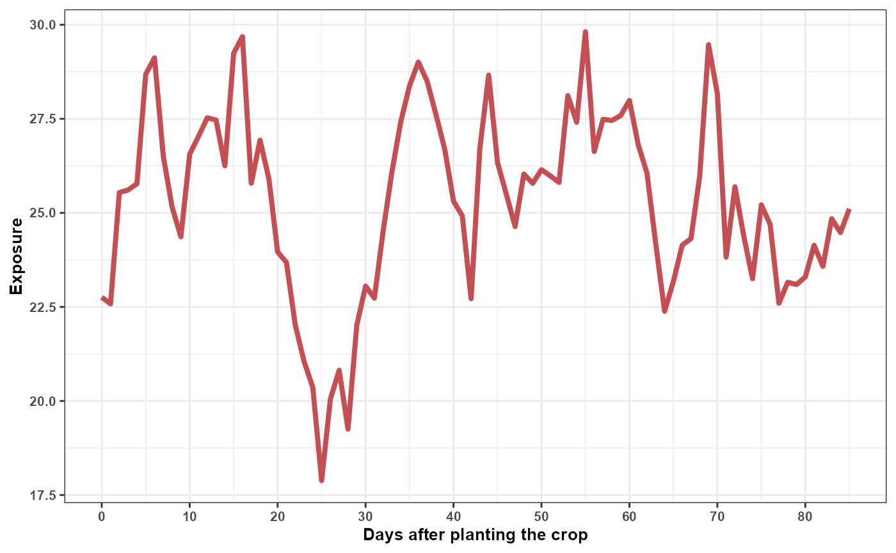
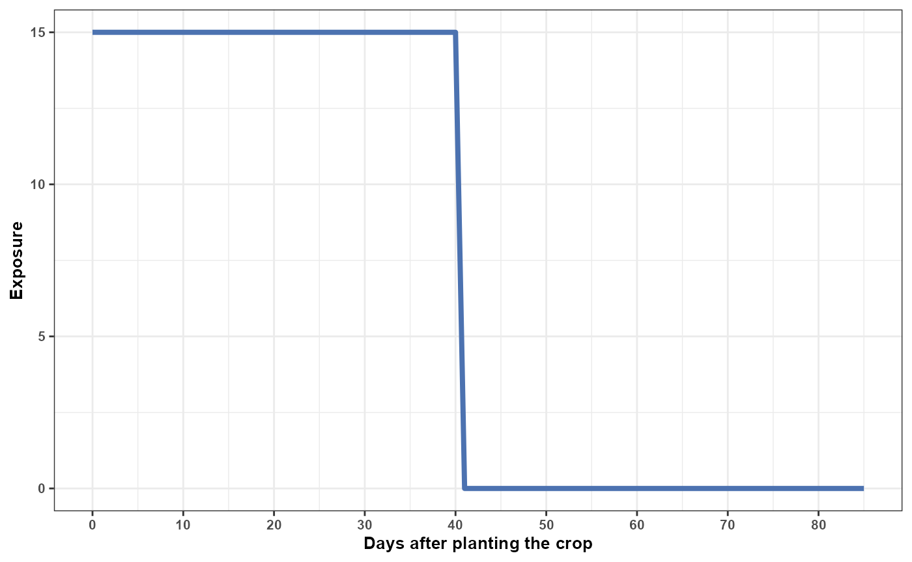
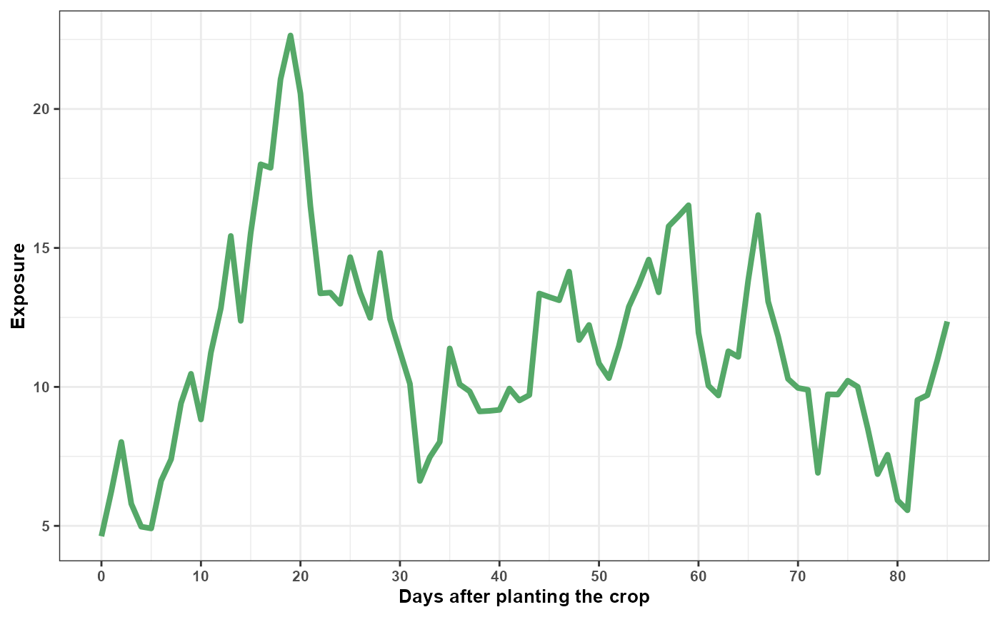
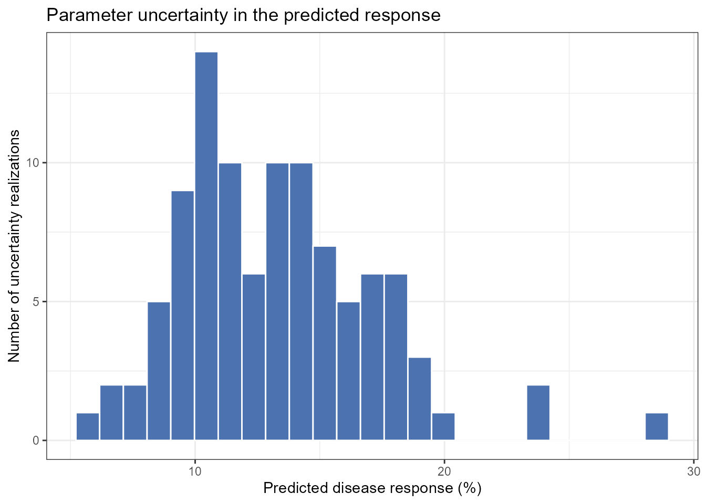
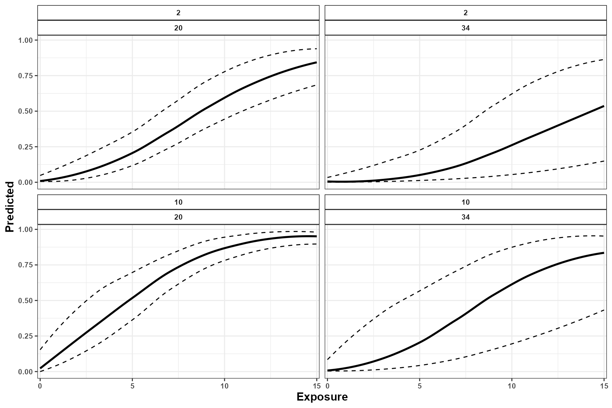
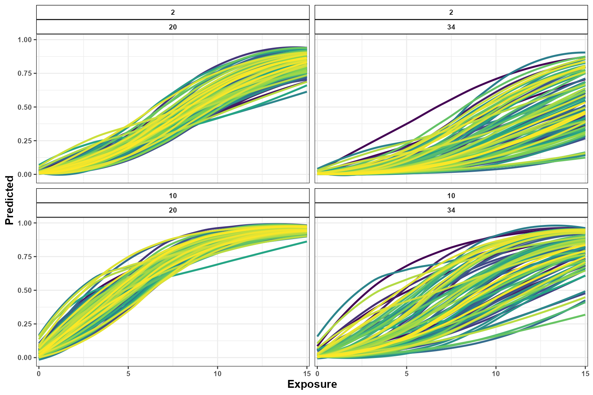
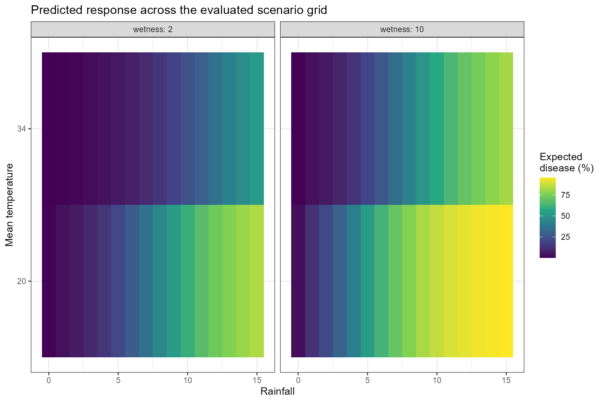
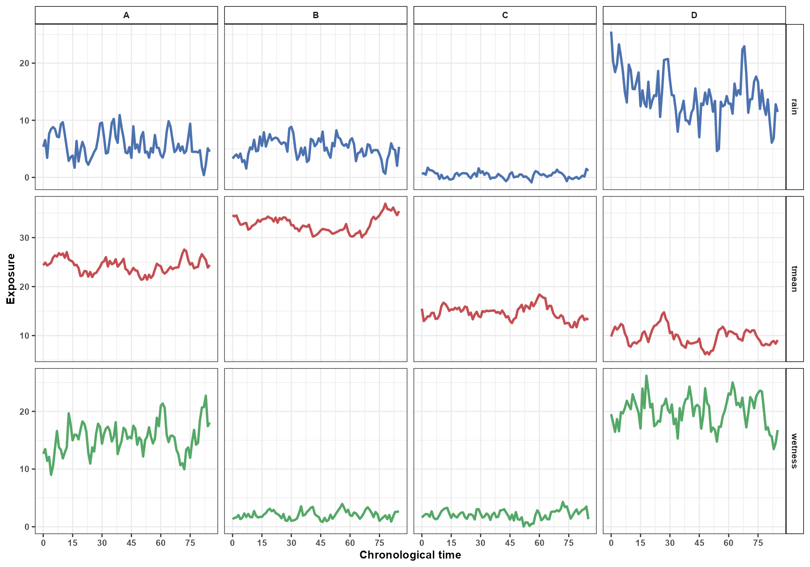
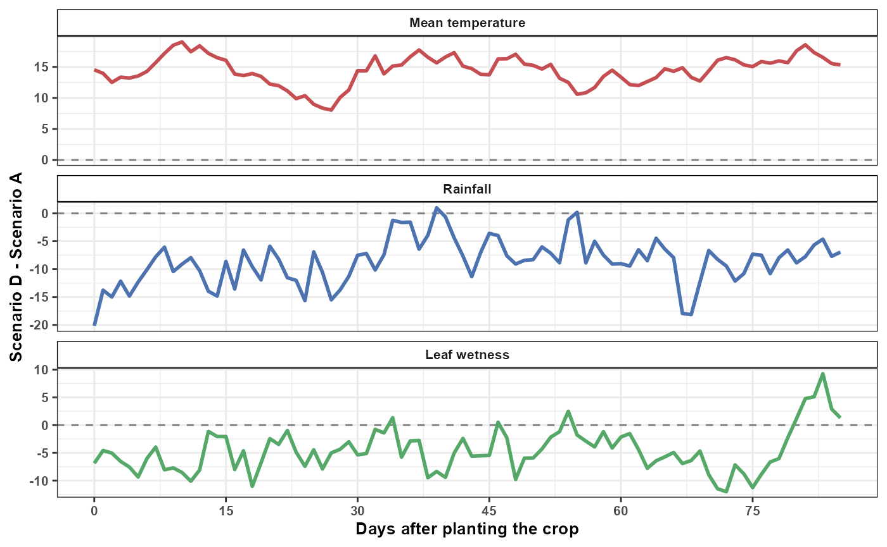
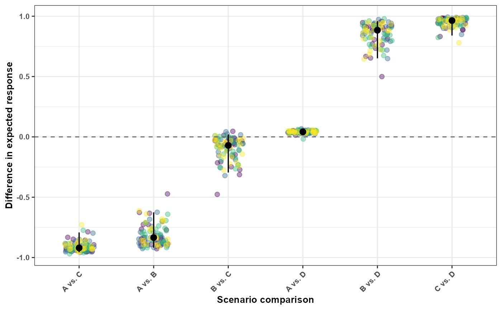

# Simulation and Prediction

## Introduction

Understanding historical exposure-lag associations is important for
epidemiological interpretation, but researchers are often interested in
a different question:

> What is the expected disease outcome under an alternative
> environmental history?

`EpiExposure` provides simulation and prediction tools that allow
researchers to:

- generate complete synthetic exposure histories;
- introduce structured exposure events;
- construct hypothetical epidemiological scenarios;
- predict expected disease outcomes;
- propagate parameter uncertainty;
- compare alternative exposure profiles and their predictions.

Unlike lag-specific effect summaries, prediction evaluates all exposure
values and lags jointly. Therefore, every prediction represents a
complete environmental history rather than an isolated exposure value.

**What you will learn.** This tutorial shows how to simulate complete
exposure histories, predict expected disease outcomes, propagate
parameter uncertainty, construct scenario grids, and compare alternative
environmental conditions.

The outputs describe predictions and contrasts under the fitted
statistical model. Hypothetical scenarios should not automatically be
interpreted as causal interventions unless the study design and
assumptions support that interpretation.

## Preparing the example model

This section uses the same dataset and DLNM specification introduced in
the previous tutorials.

``` r

library(EpiExposure)
library(ggplot2)
```

``` r

data("epi_data")
```

Define the exposure-lag structures:

``` r

cb <- define_exposures(
  data = epi_data,
  vars = c(
    "tmean",
    "rain",
    "wetness"
  ),
  max_lag = 85,
  df_var = 3,
  df_lag = 2
)
```

Build the epidemic-level design:

``` r

dat <- build_design(
  data = epi_data,
  cb_templates = cb
)
```

Prepare the response:

``` r

dat <- prepare_response(
  data = dat,
  response = "y",
  family = "beta"
)
```

Fit the model:

``` r

fit <- fit_epidlnm(
  data = dat,
  model_engine = "glmmTMB",
  family = "beta",
  random_effect = NULL,
  epiexposure_spec = attr(
    cb,
    "spec"
  )
)
```

The fitted model relates complete histories of temperature, rainfall,
and leaf wetness to the expected disease response.

## Complete exposure histories

Each exposure profile supplied to
[`predict_outcomes()`](https://tomazrg.github.io/EpiExposure/reference/predict_outcomes.md)
must contain exactly `max_lag + 1` observations. With `max_lag = 85`,
each profile therefore contains 86 values.

Profiles are supplied in chronological order, from the earliest exposure
observation to the most recent:

- the first value (`time = 0`) is the oldest observation and corresponds
  to lag 85;
- the final value (`time = 85`) is the most recent observation and
  corresponds to lag 0.

More generally, chronological time and retrospective lag are related by:

``` math
\text{lag} = \text{max\_lag} - \text{time}.
```

Profile construction and visualization use chronological time, whereas
DLNM effects are interpreted on the retrospective lag scale. Thus,
chronological time increases from the oldest to the most recent
observation, while retrospective lag increases in the opposite
direction, from the most recent to progressively older observations.

[`simulate_exposures()`](https://tomazrg.github.io/EpiExposure/reference/simulate_exposures.md)
generates profiles directly in chronological order and does not reverse
them. Simulated or manually defined profiles should therefore be
supplied to
[`predict_outcomes()`](https://tomazrg.github.io/EpiExposure/reference/predict_outcomes.md)
in the same order in which they were created. Users should not reverse
the profiles manually.

**Complete profiles are required.** Temperature, rainfall, and leaf
wetness profiles must have the same length and temporal interpretation
used to fit the model. Coordinates, blocks, years, and other grouping
variables are not exposure profiles.

## Simulating exposure histories

### Why simulate exposures?

Environmental conditions rarely occur as isolated observations. Disease
development can reflect sequences of temperature, rainfall, leaf
wetness, and other exposures occurring throughout the epidemic.

[`simulate_exposures()`](https://tomazrg.github.io/EpiExposure/reference/simulate_exposures.md)
generates complete chronological profiles that can be used in prediction
and scenario analysis.

A simulated exposure profile is not a disease prediction. It becomes a
prediction scenario only after it is combined with the other required
exposures and supplied to
[`predict_outcomes()`](https://tomazrg.github.io/EpiExposure/reference/predict_outcomes.md).

## Simulating a background process

The following example generates a temperature profile using an
autoregressive background process:

``` r

temperature_profile <- simulate_exposures(
  max_lag = 85,
  mode = "profile",
  seed = 123,
  background = list(
    dist = "ar1",
    mean = 25,
    sd = 4,
    phi = 0.90
  )
)
```

The result contains the simulated chronological profile:

    #>   time_0   time_1   time_2   time_3   time_4   time_5   time_6   time_7 
    #> 22.75810 22.58096 25.54056 25.60944 25.77392 28.68685 29.12180 26.50391 
    #>   time_8   time_9  time_10  time_11  time_12  time_13  time_14  time_15 
    #> 25.15595 24.36331 26.56124 27.03248 27.52800 27.46818 26.25222 29.24259 
    #>  time_16  time_17  time_18  time_19  time_20  time_21  time_22  time_23 
    #> 29.68636 25.78881 26.93278 25.91517 23.96184 23.68560 22.02814 21.05446 
    #>  time_24  time_25  time_26  time_27  time_28  time_29  time_30  time_31 
    #> 20.35922 17.88245 20.05494 20.81686 19.25076 22.01179 23.05417 22.73428 
    #>  time_32  time_33  time_34  time_35  time_36  time_37  time_38  time_39 
    #> 24.52156 26.10048 27.42291 28.38130 29.00896 28.50012 27.61664 26.69160 
    #>  time_40  time_41  time_42  time_43  time_44  time_45  time_46  time_47 
    #> 25.31118 24.91755 22.71950 26.72925 28.66248 26.33803 25.50177 24.63795 
    #>  time_48  time_49  time_50  time_51  time_52  time_53  time_54  time_55 
    #> 26.03407 25.78531 26.14845 25.98383 25.81070 28.11587 27.41064 29.81363 
    #>  time_56  time_57  time_58  time_59  time_60  time_61  time_62  time_63 
    #> 26.63193 27.48804 27.45519 27.58617 27.98948 26.81470 26.05226 24.17109 
    #>  time_64  time_65  time_66  time_67  time_68  time_69  time_70  time_71 
    #> 22.38525 23.17595 24.13983 24.31826 25.99447 29.46946 28.16638 23.82356 
    #>  time_72  time_73  time_74  time_75  time_76  time_77  time_78  time_79 
    #> 25.69477 24.38876 23.25030 25.21342 24.69556 22.59761 23.15396 23.09640 
    #>  time_80  time_81  time_82  time_83  time_84  time_85 
    #> 23.29681 24.13889 23.57873 24.84437 24.47550 25.10643

The profile is ordered from the oldest to the most recent exposure
observation. For this 86-value history, the first value corresponds to
lag 85 and the final value corresponds to lag 0. The profile remains in
chronological order when it is later supplied to
[`predict_outcomes()`](https://tomazrg.github.io/EpiExposure/reference/predict_outcomes.md).

Visualize the complete profile:

``` r


df_tmean <- data.frame(
  time = 0:85,
  value = as.numeric(temperature_profile$profile)
)

 df_tmean%>% 
  ggplot(aes(time,value))+
  geom_line(color = "#C44E52", size = 1.4)+
  theme_bw()+
  labs(x = "Days after planting the crop",
       y = "Exposure")+
  scale_x_continuous(
  limits = c(0, 85),
  breaks = seq(0, 85, by = 10)
)+
  theme(text = element_text(size = 10, face = "bold"))
```



The autoregressive parameter:

``` r

phi = 0.90
```

produces temporal dependence among consecutive observations. It does not
represent an exposure-lag effect. The lag-response relationship remains
determined by the fitted DLNM.

## Simulating structured exposure events

A structured event can be superimposed on a background profile.

The following example constructs a rainfall pattern with values assigned
to selected portions of the temporal history:

``` r

rain_profile <- simulate_exposures(
  max_lag = 85,
  mode = "pattern",
  pattern = "block_times",
  block_times = c(
    0,
    40
  ),
  fixed_value = 15,
  background = list(
    dist = "fixed",
    value = 0
  )
)
```

    #>  time_0  time_1  time_2  time_3  time_4  time_5  time_6  time_7  time_8  time_9 
    #>      15      15      15      15      15      15      15      15      15      15 
    #> time_10 time_11 time_12 time_13 time_14 time_15 time_16 time_17 time_18 time_19 
    #>      15      15      15      15      15      15      15      15      15      15 
    #> time_20 time_21 time_22 time_23 time_24 time_25 time_26 time_27 time_28 time_29 
    #>      15      15      15      15      15      15      15      15      15      15 
    #> time_30 time_31 time_32 time_33 time_34 time_35 time_36 time_37 time_38 time_39 
    #>      15      15      15      15      15      15      15      15      15      15 
    #> time_40 time_41 time_42 time_43 time_44 time_45 time_46 time_47 time_48 time_49 
    #>      15       0       0       0       0       0       0       0       0       0 
    #> time_50 time_51 time_52 time_53 time_54 time_55 time_56 time_57 time_58 time_59 
    #>       0       0       0       0       0       0       0       0       0       0 
    #> time_60 time_61 time_62 time_63 time_64 time_65 time_66 time_67 time_68 time_69 
    #>       0       0       0       0       0       0       0       0       0       0 
    #> time_70 time_71 time_72 time_73 time_74 time_75 time_76 time_77 time_78 time_79 
    #>       0       0       0       0       0       0       0       0       0       0 
    #> time_80 time_81 time_82 time_83 time_84 time_85 
    #>       0       0       0       0       0       0

Visualize the rainfall profile:

``` r

df_rain <- data.frame(
  time = 0:85,
  value = as.numeric(rain_profile$profile)
)

 df_rain%>% 
  ggplot(aes(time,value))+
  geom_line(color = "#4C72B0", size = 1.4)+
  theme_bw()+
  labs(x = "Days after planting the crop",
       y = "Exposure")+
  scale_x_continuous(
  limits = c(0, 85),
  breaks = seq(0, 85, by = 10)
)+
  theme(text = element_text(size = 10, face = "bold"))
```

 A
leaf wetness profile can be generated independently:

``` r

wetness_profile <- simulate_exposures(
  max_lag = 85,
  mode = "profile",
  seed = 456,
  background = list(
    dist = "ar1",
    mean = 10,
    sd = 4,
    phi = 0.90
  )
)
```

    #>    time_0    time_1    time_2    time_3    time_4    time_5    time_6    time_7 
    #>  4.625914  6.247426  8.019056  5.795534  4.970456  4.908391  6.621729  7.396401 
    #>    time_8    time_9   time_10   time_11   time_12   time_13   time_14   time_15 
    #>  9.413140 10.471295  8.827395 11.230632 12.831472 15.432048 12.376714 15.534374 
    #>   time_16   time_17   time_18   time_19   time_20   time_21   time_22   time_23 
    #> 18.009388 17.884050 21.071020 22.645309 20.553278 16.503720 13.365585 13.392098 
    #>   time_24   time_25   time_26   time_27   time_28   time_29   time_30   time_31 
    #> 12.990405 14.669058 13.395137 12.483066 14.823142 12.441433 11.275305 10.112462 
    #>   time_32   time_33   time_34   time_35   time_36   time_37   time_38   time_39 
    #>  6.615987  7.470749  8.021169 11.384750 10.094474  9.840489  9.117208  9.137949 
    #>   time_40   time_41   time_42   time_43   time_44   time_45   time_46   time_47 
    #>  9.173692  9.941607  9.512229  9.706507 13.360498 13.235160 13.117645 14.148516 
    #>   time_48   time_49   time_50   time_51   time_52   time_53   time_54   time_55 
    #> 11.684280 12.229035 10.846750 10.314809 11.466825 12.883845 13.673602 14.581575 
    #>   time_56   time_57   time_58   time_59   time_60   time_61   time_62   time_63 
    #> 13.403023 15.778860 16.145459 16.537209 11.952268 10.044761  9.690582 11.283632 
    #>   time_64   time_65   time_66   time_67   time_68   time_69   time_70   time_71 
    #> 11.079345 13.843590 16.184937 13.070750 11.814142 10.288002  9.962817  9.895465 
    #>   time_72   time_73   time_74   time_75   time_76   time_77   time_78   time_79 
    #>  6.906054  9.733334  9.725104 10.223759 10.004476  8.513481  6.859744  7.560886 
    #>   time_80   time_81   time_82   time_83   time_84   time_85 
    #>  5.922656  5.560829  9.527843  9.702088 10.967745 12.353884

``` r

df_wetness <- data.frame(
  time = 0:85,
  value = as.numeric(wetness_profile$profile)
)


 df_wetness%>% 
  ggplot(aes(time,value))+
  geom_line(color = "#55A868", size = 1.4)+
  theme_bw()+
  labs(x = "Days after planting the crop",
       y = "Exposure")+
  scale_x_continuous(
  limits = c(0, 85),
  breaks = seq(0, 85, by = 10)
)+
  theme(text = element_text(size = 10, face = "bold"))
```

 The
three profiles can now be combined into one complete hypothetical
environmental history.

All three profiles follow the same chronological convention and contain
86 observations. At each chronological position, the temperature,
rainfall, and leaf wetness values describe the environmental conditions
assigned to that point in the hypothetical history.

When these profiles are supplied to
[`predict_outcomes()`](https://tomazrg.github.io/EpiExposure/reference/predict_outcomes.md),
the function validates their length and order and projects each complete
history through the cross-basis definition stored in the fitted model.
The resulting design follows the retrospective DLNM lag convention, in
which lag 0 represents the most recent exposure and increasing lags
represent progressively older exposures.

This internal transformation does not require the user to reverse or
otherwise rearrange the simulated profiles.

## Predicting disease outcomes

### Deterministic prediction

[`predict_outcomes()`](https://tomazrg.github.io/EpiExposure/reference/predict_outcomes.md)
receives the complete profiles in chronological order and projects them
through the cross-basis definition stored in the fitted model. The
reconstructed cross-basis predictors represent the exposure histories on
the retrospective DLNM lag scale, allowing the function to calculate the
population-level expected response associated with the complete
multivariable history.

``` r

prediction <- predict_outcomes(
  fit = fit,
  profiles = list(
    tmean = temperature_profile$profile,
    rain = rain_profile$profile,
    wetness = wetness_profile$profile
  ),
  uncertainty = FALSE
)
```

``` r

prediction
#>   prediction
#> 1  0.1195241
```

The prediction combines:

- the complete chronological temperature history;
- the complete chronological rainfall history;
- the complete chronological leaf wetness history;
- the corresponding retrospective lag contributions reconstructed from
  the fitted cross-basis;
- the fitted joint cross-basis coefficients;
- the inverse link required by the response family.

The output represents one joint prediction for the three complete
exposure histories. It is not calculated independently for each day or
lag.

The prediction is not a newly simulated disease observation. It
represents the central expected response associated with the complete
exposure history.

For the fitted Beta model, the result is an expected response on the
proportion scale.

## Prediction uncertainty

A deterministic prediction uses the central fitted coefficient
estimates. However, the coefficients are estimated with uncertainty.

When:

``` r

uncertainty = TRUE
```

`EpiExposure` propagates joint coefficient uncertainty through the
complete prediction calculation.

To inspect individual uncertainty realizations, request sample-level
output:

``` r

prediction_samples <- predict_outcomes(
  fit = fit,
  profiles = list(
    tmean = temperature_profile$profile,
    rain = rain_profile$profile,
    wetness = wetness_profile$profile
  ),
  uncertainty = TRUE,
  n_samples = 100,
  output = "samples",
  seed = 123
)
```

``` r

head(prediction_samples)
#>   sample prediction
#> 1      1  0.1034903
#> 2      2  0.1042327
#> 3      3  0.0892574
#> 4      4  0.1337358
#> 5      5  0.0837315
#> 6      6  0.1593514
```

Inspect the first realizations:

| sample | prediction |
|:------:|:----------:|
|   1    |   0.1035   |
|   2    |   0.1042   |
|   3    |   0.0893   |
|   4    |   0.1337   |
|   5    |   0.0837   |
|   6    |   0.1594   |
|   7    |   0.1302   |
|   8    |   0.2368   |
|   9    |   0.1578   |
|   10   |   0.1566   |

Visualize the prediction distribution:

``` r

ggplot(
  prediction_samples,
  aes(
    x = prediction * 100
  )
) +
  geom_histogram(
    bins = 25,
    fill = "#4C72B0",
    color = "white"
  ) +
  theme_bw() +
  labs(
    x = "Predicted disease response (%)",
    y = "Number of uncertainty realizations",
    title = "Parameter uncertainty in the predicted response"
  )
```



This distribution represents parameter uncertainty in the expected
response. It does not include observation-level noise and should not be
interpreted as a distribution of newly simulated disease observations.

A summarized prediction can also be requested when individual
realizations are not needed:

``` r

prediction_summary <- predict_outcomes(
  fit = fit,
  profiles = list(
    tmean = temperature_profile$profile,
    rain = rain_profile$profile,
    wetness = wetness_profile$profile
  ),
  uncertainty = TRUE,
  n_samples = 100,
  output = "summary",
  seed = 123
)
```

``` r

prediction_summary
#>   prediction prediction_sd prediction_lower prediction_upper
#> 1  0.1293006    0.03879026       0.07271773        0.2212469
```

## Scenario simulation

### Why construct scenarios?

A single profile describes one complete hypothetical history. Scenario
analysis extends this idea by evaluating multiple combinations of
environmental conditions systematically.

Possible questions include:

- How does the predicted response change across rainfall levels?
- Does the rainfall association differ under distinct temperature
  conditions?
- Which combinations of temperature and leaf wetness yield larger
  expected responses?
- How does the timing of an exposure pattern alter the prediction?

These are model-based comparisons. They describe how the fitted model
responds to supplied histories and do not automatically demonstrate
causal interventions.

## Defining epidemiological periods

The scenario grid can be organized using epidemiological periods:

``` r

periods <- define_periods(
  max_lag = 85,
  cuts = c(
    20,
    40,
    60
  ),
  prefix = "Period"
)
```

``` r

periods
#>    period lag_start lag_end
#> 1 Period1         0      20
#> 2 Period2        21      40
#> 3 Period3        41      60
#> 4 Period4        61      85
```

The resulting periods divide the retrospective lag interval into four
subintervals.

Remember that lag order is retrospective:

``` text
smaller lag → closer to disease assessment
larger lag  → earlier exposure condition
```

## Generating candidate scenarios

The following example varies rainfall across a grid while evaluating
selected temperature and leaf wetness conditions:

``` r

scenarios <- simulate_ranges(
  periods = periods,
  vary = list(
    tmean = c(
      20,
      34
    ),
    rain = seq(
      0,
      15,
      by = 1
    ),
    wetness = c(
      2,
      10
    )
  ),
  scenario_type = "grid",
  scenario_var = "rain"
)
```

## Predicting scenario outcomes

[`simulate_scenarios()`](https://tomazrg.github.io/EpiExposure/reference/simulate_scenarios.md)
evaluates the expected disease outcome associated with each complete
exposure scenario. When `uncertainty = TRUE`, uncertainty in the joint
fitted model parameters is propagated through the prediction
calculation.

### Summarizing scenario predictions

With:

``` r

output = "summary"
```

the parameter-draw predictions are summarized for each scenario. The
`prediction` column contains the median expected response across the
parameter draws, while `prediction_lower` and `prediction_upper` contain
the empirical uncertainty interval defined by the selected
probabilities. The default probabilities correspond to a 95% interval.

``` r

pred_scenarios <- simulate_scenarios(
  fit = fit,
  scenarios = scenarios,
  data = epi_data,
  uncertainty = TRUE,
  output = "summary",
  n_samples = 100,
  seed = 123
)
```

Inspect the summarized predictions:

| scenario | scenario_point | tmean | rain | wetness | prediction | prediction_sd | prediction_lower | prediction_upper |
|:--:|:--:|:--:|:--:|:--:|:--:|:--:|:--:|:--:|
| RAIN_s1 | 1 | 20 | 0 | 2 | 0.0066 | 0.0022 | 0.0039 | 0.0119 |
| RAIN_s2 | 1 | 34 | 0 | 2 | 0.0015 | 0.0018 | 0.0003 | 0.0063 |
| RAIN_s3 | 1 | 20 | 1 | 2 | 0.0326 | 0.0339 | 0.0107 | 0.1403 |
| RAIN_s4 | 1 | 34 | 1 | 2 | 0.0067 | 0.0226 | 0.0016 | 0.0880 |
| RAIN_s5 | 1 | 20 | 2 | 2 | 0.0591 | 0.0432 | 0.0211 | 0.1866 |
| RAIN_s6 | 1 | 34 | 2 | 2 | 0.0117 | 0.0318 | 0.0031 | 0.1212 |
| RAIN_s7 | 1 | 20 | 3 | 2 | 0.0943 | 0.0472 | 0.0398 | 0.2148 |
| RAIN_s8 | 1 | 34 | 3 | 2 | 0.0206 | 0.0396 | 0.0052 | 0.1504 |
| RAIN_s9 | 1 | 20 | 4 | 2 | 0.1443 | 0.0514 | 0.0696 | 0.2589 |
| RAIN_s10 | 1 | 34 | 4 | 2 | 0.0314 | 0.0499 | 0.0088 | 0.1844 |

### Visualizing summarized scenario predictions

The modeled rainfall association can be displayed across the selected
combinations of temperature and leaf wetness. For summary output,
[`plot_scenarios()`](https://tomazrg.github.io/EpiExposure/reference/plot_scenarios.md)
displays the central predicted response together with the corresponding
lower and upper uncertainty limits.

``` r

plot_scenarios(
  data = pred_scenarios,
  x = "rain",
  facet = c(
    "wetness",
    "tmean"
  ),
  x_limits = c(
    0,
    15
  ),
  output = "summary"
)
```



The central curve represents the median expected response for each
scenario, whereas the lower and upper curves describe uncertainty
arising from the fitted model parameters.

### Returning individual prediction samples

With:

``` r

output = "samples"
```

[`simulate_scenarios()`](https://tomazrg.github.io/EpiExposure/reference/simulate_scenarios.md)
returns every draw-specific prediction instead of summarizing the draws.
Each row represents one parameter draw for one scenario in the exposure
grid.

These samples are not additional exposure simulations and are not newly
simulated disease observations. The exposure scenarios remain fixed;
what changes across samples is the joint draw of the fitted model
parameters used to calculate the expected response.

Draw-level output is useful for constructing customized uncertainty
summaries, examining the complete distribution of expected responses,
propagating parameter uncertainty into downstream calculations, or
creating custom visualizations.

``` r

pred_scenarios_s <- simulate_scenarios(
  fit = fit,
  scenarios = scenarios,
  data = epi_data,
  uncertainty = TRUE,
  output = "samples",
  n_samples = 100,
  seed = 123
)
```

Inspect the first draw-specific predictions:

| scenario | scenario_point | tmean | rain | wetness | sample | prediction |
|:--------:|:--------------:|:-----:|:----:|:-------:|:------:|:----------:|
| RAIN_s1  |       1        |  20   |  0   |    2    |   1    |   0.0067   |
| RAIN_s1  |       1        |  20   |  0   |    2    |   2    |   0.0070   |
| RAIN_s1  |       1        |  20   |  0   |    2    |   3    |   0.0099   |
| RAIN_s1  |       1        |  20   |  0   |    2    |   4    |   0.0062   |
| RAIN_s1  |       1        |  20   |  0   |    2    |   5    |   0.0056   |
| RAIN_s1  |       1        |  20   |  0   |    2    |   6    |   0.0120   |
| RAIN_s1  |       1        |  20   |  0   |    2    |   7    |   0.0050   |
| RAIN_s1  |       1        |  20   |  0   |    2    |   8    |   0.0050   |
| RAIN_s1  |       1        |  20   |  0   |    2    |   9    |   0.0046   |
| RAIN_s1  |       1        |  20   |  0   |    2    |   10   |   0.0047   |

### Visualizing individual prediction samples

When draw-level output is supplied,
[`plot_scenarios()`](https://tomazrg.github.io/EpiExposure/reference/plot_scenarios.md)
displays the prediction curves associated with the individual parameter
draws. The collection of curves shows how uncertainty in the fitted
parameters propagates across the complete scenario grid.

``` r

plot_scenarios(
  data = pred_scenarios_s,
  x = "rain",
  facet = c(
    "wetness",
    "tmean"
  ),
  x_limits = c(
    0,
    15
  ),
  output = "samples"
)
```



The summary and sample outputs describe the same parameter-uncertainty
distribution at different levels of detail:

- `output = "summary"` reports the median expected response and its
  empirical uncertainty interval for each scenario;
- `output = "samples"` retains every draw-specific expected response
  used to construct those summaries.

The figures should be interpreted as visualizations of the fitted model
over the scenario grid. Predictions outside or near the limits of the
observed exposure support should be treated cautiously. Neither output
includes observation-level noise, and neither should be interpreted as a
distribution of newly simulated disease observations.

## Scenario surfaces

When enough values are evaluated along two continuous dimensions,
predictions can be presented as a scenario surface.

The current example evaluates only two temperature values. Therefore, a
line or point representation is more appropriate than a dense continuous
surface.

A tile display can still summarize the evaluated grid:

``` r

ggplot(
  pred_scenarios,
  aes(
    x = rain,
    y = factor(
      tmean
    ),
    fill = prediction * 100
  )
) +
  geom_tile() +
  facet_wrap(
    vars(
      wetness
    ),
    labeller = label_both
  ) +
  scale_fill_viridis_c(
    name = "Expected\ndisease (%)"
  ) +
  theme_bw() +
  labs(
    x = "Rainfall",
    y = "Mean temperature",
    title = "Predicted response across the evaluated scenario grid"
  )
```



A smoother surface requires a denser sequence of temperature values in
[`simulate_ranges()`](https://tomazrg.github.io/EpiExposure/reference/simulate_ranges.md).

## Comparing predictions

### Comparing complete simulated histories

A single prediction describes the expected response associated with one
complete environmental history.
[`compare_predictions()`](https://tomazrg.github.io/EpiExposure/reference/compare_predictions.md)
extends this analysis by contrasting the expected responses associated
with two or more complete histories.

The following example constructs four hypothetical environmental
scenarios. Each scenario contains chronological temperature, rainfall,
and leaf wetness profiles generated with autoregressive background
processes.

The scenarios differ in their mean exposure values, temporal
variability, and persistence:

- **Scenario A:** moderate temperature and rainfall with prolonged leaf
  wetness;
- **Scenario B:** high temperature, moderate rainfall, and low leaf
  wetness;
- **Scenario C:** cool and relatively dry conditions with low leaf
  wetness;
- **Scenario D:** cooler conditions with high rainfall and prolonged
  leaf wetness.

Because several exposures differ simultaneously, the resulting
prediction contrasts represent joint differences between the complete
environmental histories. They should not be attributed to one exposure
individually.

### Defining Scenario A

``` r

exposure_tmean_A <- simulate_exposures(
  max_lag = 85,
  mode = "profile",
  seed = 101,
  background = list(
    dist = "ar1",
    mean = 25,
    sd = 2,
    phi = 0.90
  ),
  n = 1
)

exposure_rain_A <- simulate_exposures(
  max_lag = 85,
  mode = "profile",
  seed = 102,
  background = list(
    dist = "ar1",
    mean = 5,
    sd = 2,
    phi = 0.50
  ),
  n = 1
)

exposure_wetness_A <- simulate_exposures(
  max_lag = 85,
  mode = "profile",
  seed = 103,
  background = list(
    dist = "ar1",
    mean = 15,
    sd = 3,
    phi = 0.70
  ),
  n = 1
)

scenario_A <- list(
  tmean = exposure_tmean_A,
  rain = exposure_rain_A,
  wetness = exposure_wetness_A
)
```

### Defining Scenario B

``` r

exposure_tmean_B <- simulate_exposures(
  max_lag = 85,
  mode = "profile",
  seed = 201,
  background = list(
    dist = "ar1",
    mean = 34,
    sd = 2,
    phi = 0.95
  ),
  n = 1
)

exposure_rain_B <- simulate_exposures(
  max_lag = 85,
  mode = "profile",
  seed = 202,
  background = list(
    dist = "ar1",
    mean = 5,
    sd = 1.5,
    phi = 0.40
  ),
  n = 1
)

exposure_wetness_B <- simulate_exposures(
  max_lag = 85,
  mode = "profile",
  seed = 203,
  background = list(
    dist = "ar1",
    mean = 2,
    sd = 0.7,
    phi = 0.60
  ),
  n = 1
)

scenario_B <- list(
  tmean = exposure_tmean_B,
  rain = exposure_rain_B,
  wetness = exposure_wetness_B
)
```

### Defining Scenario C

``` r

exposure_tmean_C <- simulate_exposures(
  max_lag = 85,
  mode = "profile",
  seed = 301,
  background = list(
    dist = "ar1",
    mean = 15,
    sd = 2,
    phi = 0.90
  ),
  n = 1
)

exposure_rain_C <- simulate_exposures(
  max_lag = 85,
  mode = "profile",
  seed = 302,
  background = list(
    dist = "ar1",
    mean = 0.5,
    sd = 0.5,
    phi = 0.40
  ),
  n = 1
)

exposure_wetness_C <- simulate_exposures(
  max_lag = 85,
  mode = "profile",
  seed = 303,
  background = list(
    dist = "ar1",
    mean = 2,
    sd = 0.8,
    phi = 0.60
  ),
  n = 1
)

scenario_C <- list(
  tmean = exposure_tmean_C,
  rain = exposure_rain_C,
  wetness = exposure_wetness_C
)
```

### Defining Scenario D

``` r

exposure_tmean_D <- simulate_exposures(
  max_lag = 85,
  mode = "profile",
  seed = 401,
  background = list(
    dist = "ar1",
    mean = 10,
    sd = 2,
    phi = 0.90
  ),
  n = 1
)

exposure_rain_D <- simulate_exposures(
  max_lag = 85,
  mode = "profile",
  seed = 402,
  background = list(
    dist = "ar1",
    mean = 15,
    sd = 4,
    phi = 0.60
  ),
  n = 1
)

exposure_wetness_D <- simulate_exposures(
  max_lag = 85,
  mode = "profile",
  seed = 403,
  background = list(
    dist = "ar1",
    mean = 20,
    sd = 3,
    phi = 0.70
  ),
  n = 1
)

scenario_D <- list(
  tmean = exposure_tmean_D,
  rain = exposure_rain_D,
  wetness = exposure_wetness_D
)
```

All profiles contain 86 observations and are ordered chronologically
from the oldest to the most recent exposure. The profiles should not be
reversed before being supplied to
[`compare_predictions()`](https://tomazrg.github.io/EpiExposure/reference/compare_predictions.md).

### Visualizing the candidate histories

Before comparing their predicted outcomes, the complete exposure
profiles can be inspected to verify how the scenarios differ.

The following helper converts one simulated exposure profile into a data
frame:

``` r

profile_to_data <- function(
    exposure,
    variable,
    scenario
) {
  data.frame(
    scenario = scenario,
    var = variable,
    time = 0:85,
    lag = 85:0,
    value = as.numeric(exposure$profile),
    stringsAsFactors = FALSE
  )
}

df_simulations <- dplyr::bind_rows(
  profile_to_data(
    exposure_tmean_A,
    variable = "tmean",
    scenario = "A"
  ),
  profile_to_data(
    exposure_rain_A,
    variable = "rain",
    scenario = "A"
  ),
  profile_to_data(
    exposure_wetness_A,
    variable = "wetness",
    scenario = "A"
  ),
  profile_to_data(
    exposure_tmean_B,
    variable = "tmean",
    scenario = "B"
  ),
  profile_to_data(
    exposure_rain_B,
    variable = "rain",
    scenario = "B"
  ),
  profile_to_data(
    exposure_wetness_B,
    variable = "wetness",
    scenario = "B"
  ),
  profile_to_data(
    exposure_tmean_C,
    variable = "tmean",
    scenario = "C"
  ),
  profile_to_data(
    exposure_rain_C,
    variable = "rain",
    scenario = "C"
  ),
  profile_to_data(
    exposure_wetness_C,
    variable = "wetness",
    scenario = "C"
  ),
  profile_to_data(
    exposure_tmean_D,
    variable = "tmean",
    scenario = "D"
  ),
  profile_to_data(
    exposure_rain_D,
    variable = "rain",
    scenario = "D"
  ),
  profile_to_data(
    exposure_wetness_D,
    variable = "wetness",
    scenario = "D"
  )
)
```

Although both chronological time and retrospective lag are retained in
`df_simulations`, the profiles are visualized below in chronological
order. Thus, time 0 is the oldest observation and time 85 is the most
recent observation.

``` r

simulation_plot <- ggplot(
  df_simulations,
  aes(
    x = time,
    y = value,
    color = var
  )
) +
  geom_line(linewidth = 1) +
  facet_grid(
    rows = vars(var),
    cols = vars(scenario),
    scales = "free_y"
  ) +
  scale_x_continuous(
    limits = c(
      0,
      85
    ),
    breaks = seq(
      0,
      85,
      by = 15
    )
  ) +
  scale_color_manual(
    values = c(
      tmean = "#C44E52",
      rain = "#4C72B0",
      wetness = "#55A868"
    )
  ) +
  theme_bw() +
  labs(
    x = "Chronological time",
    y = "Exposure",
    color = "Variable"
  ) +
  theme(
    text = element_text(
      size = 10,
      face = "bold"
    ),
    legend.position = "none",
    strip.background = element_rect(
      color = "black",
      fill = "white"
    ),
    strip.text = element_text(
      face = "bold"
    )
  )

simulation_plot
```



The figure shows the exposure histories exactly as they are supplied to
[`compare_predictions()`](https://tomazrg.github.io/EpiExposure/reference/compare_predictions.md).
Internally, EpiExposure projects each chronological history through the
fitted cross-basis, where lag 0 represents the most recent exposure and
increasing lags represent progressively older exposures.

### Comparing the exposure histories

Before comparing the predicted disease outcomes, the exposure histories
themselves can be compared directly.

[`compare_exposures()`](https://tomazrg.github.io/EpiExposure/reference/compare_exposures.md)
describes how two chronological exposure profiles differ across time.
This comparison does not use the fitted disease model and does not
produce a predicted response. It only quantifies differences between the
supplied exposure histories.

The following example compares Scenarios A and D. These scenarios differ
in temperature, rainfall, and leaf wetness, so each exposure is compared
separately.

#### Comparing temperature histories

``` r

comparison_tmean_AD <- compare_exposures(
  exposure1 = exposure_tmean_A$profile,
  exposure2 = exposure_tmean_D$profile,
  mode = "timewise"
)

comparison_tmean_AD$var <- "tmean"
comparison_tmean_AD$scenario1 <- "A"
comparison_tmean_AD$scenario2 <- "D"
```

#### Comparing rainfall histories

``` r

comparison_rain_AD <- compare_exposures(
  exposure1 = exposure_rain_A$profile,
  exposure2 = exposure_rain_D$profile,
  mode = "timewise"
)

comparison_rain_AD$var <- "rain"
comparison_rain_AD$scenario1 <- "A"
comparison_rain_AD$scenario2 <- "D"
```

#### Comparing leaf wetness histories

``` r

comparison_wetness_AD <- compare_exposures(
  exposure1 = exposure_wetness_A$profile,
  exposure2 = exposure_wetness_D$profile,
  mode = "timewise"
)

comparison_wetness_AD$var <- "wetness"
comparison_wetness_AD$scenario1 <- "A"
comparison_wetness_AD$scenario2 <- "D"
```

The three comparisons can be combined into one data frame:

``` r

exposure_comparison_AD <- dplyr::bind_rows(
  comparison_tmean_AD,
  comparison_rain_AD,
  comparison_wetness_AD
)

exposure_comparison_AD$var <- factor(
  exposure_comparison_AD$var,
  levels = c(
    "tmean",
    "rain",
    "wetness"
  )
)
```

Inspect the first time-specific differences:

| exposure1 | exposure2 | position | time | lag | value1 | value2 | diff | abs_diff | ratio | ratio_defined | var | scenario1 | scenario2 |
|:--:|:--:|:--:|:--:|:--:|:--:|:--:|:--:|:--:|:--:|:--:|:--:|:--:|:--:|
| exposure1 | exposure2 | 1 | 0 | 85 | 24.348 | 9.808 | 14.540 | 14.540 | 2.482 | TRUE | tmean | A | D |
| exposure1 | exposure2 | 2 | 1 | 84 | 24.895 | 10.920 | 13.975 | 13.975 | 2.280 | TRUE | tmean | A | D |
| exposure1 | exposure2 | 3 | 2 | 83 | 24.317 | 11.809 | 12.508 | 12.508 | 2.059 | TRUE | tmean | A | D |
| exposure1 | exposure2 | 4 | 3 | 82 | 24.572 | 11.225 | 13.347 | 13.347 | 2.189 | TRUE | tmean | A | D |
| exposure1 | exposure2 | 5 | 4 | 81 | 24.886 | 11.670 | 13.215 | 13.215 | 2.132 | TRUE | tmean | A | D |
| exposure1 | exposure2 | 6 | 5 | 80 | 25.921 | 12.378 | 13.542 | 13.542 | 2.094 | TRUE | tmean | A | D |
| exposure1 | exposure2 | 7 | 6 | 79 | 26.368 | 12.086 | 14.282 | 14.282 | 2.182 | TRUE | tmean | A | D |
| exposure1 | exposure2 | 8 | 7 | 78 | 26.133 | 10.431 | 15.702 | 15.702 | 2.505 | TRUE | tmean | A | D |
| exposure1 | exposure2 | 9 | 8 | 77 | 26.819 | 9.636 | 17.183 | 17.183 | 2.783 | TRUE | tmean | A | D |
| exposure1 | exposure2 | 10 | 9 | 76 | 26.443 | 7.942 | 18.501 | 18.501 | 3.330 | TRUE | tmean | A | D |
| exposure1 | exposure2 | 11 | 10 | 75 | 26.757 | 7.726 | 19.032 | 19.032 | 3.463 | TRUE | tmean | A | D |
| exposure1 | exposure2 | 12 | 11 | 74 | 25.889 | 8.438 | 17.451 | 17.451 | 3.068 | TRUE | tmean | A | D |

#### Visualizing the exposure differences

The time-specific differences can be displayed separately for each
exposure:

``` r

exposure_comparison_plot <- ggplot(
  exposure_comparison_AD,
  aes(
    x = time,
    y = diff,
    color = var
  )
) +
  geom_hline(
    yintercept = 0,
    color = "grey50",
    linetype = "dashed",
    linewidth = 0.5
  ) +
  geom_line(
    linewidth = 1
  ) +
  facet_wrap(
    vars(var),
    ncol = 1,
    scales = "free_y",
    labeller = as_labeller(
      c(
        tmean = "Mean temperature",
        rain = "Rainfall",
        wetness = "Leaf wetness"
      )
    )
  ) +
  scale_x_continuous(
    limits = c(
      0,
      85
    ),
    breaks = seq(
      0,
      85,
      by = 15
    )
  ) +
  scale_color_manual(
    values = c(
      tmean = "#C44E52",
      rain = "#4C72B0",
      wetness = "#55A868"
    )
  ) +
  theme_bw() +
  labs(
    x = "Days after planting the crop",
    y = "Scenario D - Scenario A",
    color = "Exposure"
  ) +
  theme(
    text = element_text(
      size = 10,
      face = "bold"
    ),
    legend.position = "none",
    strip.background = element_rect(
      fill = "white",
      color = "black"
    ),
    strip.text = element_text(
      face = "bold"
    )
  )
```

``` r

exposure_comparison_plot
```



The horizontal zero line represents identical exposure values in
Scenarios A and D at a given chronological time. Under the difference
convention returned by
[`compare_exposures()`](https://tomazrg.github.io/EpiExposure/reference/compare_exposures.md):

- positive values indicate that the exposure is higher in Scenario D
  than in Scenario A;
- negative values indicate that the exposure is lower in Scenario D than
  in Scenario A;
- values near zero indicate similar exposure values at that
  chronological position.

The facets use independent y-axis scales because temperature, rainfall,
and leaf wetness are measured in different units. Consequently, the
numerical magnitudes of the differences should not be compared directly
across exposures.

These comparisons describe the environmental histories themselves. They
do not account for the fitted cross-basis coefficients and do not
indicate how strongly each exposure difference contributes to the
disease response.

The next section uses
[`compare_predictions()`](https://tomazrg.github.io/EpiExposure/reference/compare_predictions.md)
to determine how the fitted model translates the complete multivariable
histories into differences in expected disease outcomes.

### Comparing the expected outcomes

With four scenarios,
[`compare_predictions()`](https://tomazrg.github.io/EpiExposure/reference/compare_predictions.md)
returns all pairwise comparisons:

- A versus B;
- A versus C;
- A versus D;
- B versus C;
- B versus D;
- C versus D.

The same joint parameter draw is used for both scenarios in each
comparison. This preserves the covariance between their predictions when
calculating differences, ratios, and relative changes.

#### Summarized comparisons

With:

``` r

output = "summary"
```

the function summarizes the draw-specific comparisons using their
central values and empirical uncertainty intervals.

``` r

comp_pred <- compare_predictions(
  fit = fit,
  profiles = list(
    A = scenario_A,
    B = scenario_B,
    C = scenario_C,
    D = scenario_D
  ),
  uncertainty = TRUE,
  output = "summary",
  n_samples = 100,
  seed = 123
)

comp_pred <- comp_pred |>
  dplyr::mutate(
    comparison = paste(
      scenario1,
      scenario2,
      sep = " vs. "
    )
  )
```

Inspect selected comparison results:

| comparison | pred1 | pred1_lower | pred1_upper | pred2 | pred2_lower | pred2_upper | diff | diff_lower | diff_upper | percentage_point_change | percentage_point_change_lower | percentage_point_change_upper |
|:--:|:--:|:--:|:--:|:--:|:--:|:--:|:--:|:--:|:--:|:--:|:--:|:--:|
| A vs. B | 0.9579 | 0.9420 | 0.9714 | 0.1157 | 0.0391 | 0.3447 | -0.8343 | -0.9182 | -0.6255 | -83.4328 | -91.8209 | -62.5461 |
| A vs. C | 0.9579 | 0.9420 | 0.9714 | 0.0354 | 0.0061 | 0.1601 | -0.9200 | -0.9560 | -0.7921 | -92.0031 | -95.5952 | -79.2087 |
| A vs. D | 0.9579 | 0.9420 | 0.9714 | 0.9997 | 0.9944 | 1.0000 | 0.0416 | 0.0243 | 0.0577 | 4.1587 | 2.4322 | 5.7701 |
| B vs. C | 0.1157 | 0.0391 | 0.3447 | 0.0354 | 0.0061 | 0.1601 | -0.0706 | -0.2953 | 0.0206 | -7.0565 | -29.5259 | 2.0589 |
| B vs. D | 0.1157 | 0.0391 | 0.3447 | 0.9997 | 0.9944 | 1.0000 | 0.8839 | 0.6510 | 0.9591 | 88.3883 | 65.1010 | 95.9142 |
| C vs. D | 0.0354 | 0.0061 | 0.1601 | 0.9997 | 0.9944 | 1.0000 | 0.9639 | 0.8399 | 0.9898 | 96.3927 | 83.9893 | 98.9832 |

Each row compares the expected response under two complete environmental
histories. For example, `diff` represents the draw-by-draw difference
between the expected response for `scenario2` and the expected response
for `scenario1`, summarized across the joint parameter draws.

For a Beta or Binomial response, `percentage_point_change` expresses the
absolute change in the expected proportion or probability multiplied by
100. It is different from `percent_change`, which describes the relative
change between predictions when that ratio is defined.

The example uses 100 parameter draws to limit the computational time
required to build the tutorial. A larger number of draws may be used in
a final analysis when more stable uncertainty summaries are required.

#### Draw-specific comparisons

With:

``` r

output = "samples"
```

the function retains every draw-specific comparison instead of reducing
the draws to summary statistics.

``` r

comp_pred_samples <- compare_predictions(
  fit = fit,
  profiles = list(
    A = scenario_A,
    B = scenario_B,
    C = scenario_C,
    D = scenario_D
  ),
  uncertainty = TRUE,
  output = "samples",
  n_samples = 100,
  seed = 123
)

comp_pred_samples <- comp_pred_samples |>
  dplyr::mutate(
    comparison = paste(
      scenario1,
      scenario2,
      sep = " vs. "
    )
  )
```

Inspect the first draw-specific comparisons:

| scenario1 | scenario2 | sample | pred1 | pred2 | diff | abs_diff | ratio | percent_change | relative_change_defined | percentage_point_change | comparison |
|:--:|:--:|:--:|:--:|:--:|:--:|:--:|:--:|:--:|:--:|:--:|:--:|
| A | B | 1 | 0.9701 | 0.4976 | -0.4725 | 0.4725 | 0.5129 | -48.7083 | TRUE | -47.2536 | A vs. B |
| A | B | 2 | 0.9714 | 0.3447 | -0.6267 | 0.6267 | 0.3549 | -64.5112 | TRUE | -62.6669 | A vs. B |
| A | B | 3 | 0.9554 | 0.1223 | -0.8331 | 0.8331 | 0.1280 | -87.2032 | TRUE | -83.3096 | A vs. B |
| A | B | 4 | 0.9603 | 0.0799 | -0.8804 | 0.8804 | 0.0832 | -91.6805 | TRUE | -88.0417 | A vs. B |
| A | B | 5 | 0.9581 | 0.1939 | -0.7642 | 0.7642 | 0.2024 | -79.7637 | TRUE | -76.4188 | A vs. B |
| A | B | 6 | 0.9441 | 0.0988 | -0.8454 | 0.8454 | 0.1046 | -89.5400 | TRUE | -84.5369 | A vs. B |
| A | B | 7 | 0.9482 | 0.0913 | -0.8569 | 0.8569 | 0.0963 | -90.3678 | TRUE | -85.6904 | A vs. B |
| A | B | 8 | 0.9582 | 0.0789 | -0.8793 | 0.8793 | 0.0823 | -91.7705 | TRUE | -87.9342 | A vs. B |
| A | B | 9 | 0.9675 | 0.2654 | -0.7020 | 0.7020 | 0.2744 | -72.5639 | TRUE | -70.2048 | A vs. B |
| A | B | 10 | 0.9576 | 0.0706 | -0.8869 | 0.8869 | 0.0737 | -92.6260 | TRUE | -88.6946 | A vs. B |

Each row now represents one joint parameter draw for one scenario pair.
These samples describe parameter uncertainty in the expected responses
and their contrasts. They are not new exposure histories and are not
newly simulated disease observations.

The draw-level output can be used to calculate customized summaries,
propagate uncertainty into subsequent analyses, or visualize the
complete distribution of a selected comparison metric.

### Visualizing comparison uncertainty

The summarized and draw-specific outputs can be displayed together. Each
colored point represents the difference obtained from one joint
parameter draw. The black point represents the central summarized
difference, and the vertical line represents its empirical uncertainty
interval.

``` r

comparison_order <- comp_pred |>
  dplyr::arrange(diff) |>
  dplyr::pull(comparison)

comp_pred <- comp_pred |>
  dplyr::mutate(
    comparison = factor(
      comparison,
      levels = comparison_order
    )
  )

comp_pred_samples <- comp_pred_samples |>
  dplyr::mutate(
    comparison = factor(
      comparison,
      levels = comparison_order
    )
  )

sc_simu_plot <- ggplot(
  comp_pred,
  aes(
    x = comparison,
    y = diff
  )
) +
  geom_jitter(
    data = comp_pred_samples,
    aes(
      x = comparison,
      y = diff,
      color = sample
    ),
    alpha = 0.4,
    size = 2,
    width = 0.20,
    height = 0,
    inherit.aes = FALSE
  ) +
  scale_color_viridis_b() +
  geom_pointrange(
    aes(
      ymin = diff_lower,
      ymax = diff_upper
    ),
    color = "black",
    linewidth = 0.6
  ) +
  geom_hline(
    yintercept = 0,
    linetype = 2,
    color = "gray40",
    linewidth = 0.5
  ) +
  theme_bw() +
  labs(
    x = "Scenario comparison",
    y = "Difference in expected response"
  ) +
  theme(
    text = element_text(
      size = 10,
      face = "bold"
    ),
    legend.position = "none",
    axis.text.x = element_text(
      angle = 45,
      hjust = 1
    )
  )
```

``` r

sc_simu_plot
```



The colored points show the complete distribution of draw-specific
differences for each scenario pair. The black point is the central
difference reported in the summary output, while the vertical black line
extends from `diff_lower` to `diff_upper`.

Values above zero indicate that the expected response for `scenario2` is
higher than the expected response for `scenario1`. Values below zero
indicate that the expected response for `scenario2` is lower.
Comparisons whose uncertainty intervals cross zero include both positive
and negative differences across the joint parameter draws.

**These are joint environmental contrasts.** Temperature, rainfall, and
leaf wetness differ simultaneously among Scenarios A–D. The resulting
differences therefore describe contrasts between complete multivariable
environmental histories and should not be interpreted as the isolated
effect of any one exposure.

### Comparing one exposure at a time

When the objective is to investigate a contrast involving one exposure,
the remaining histories should be held constant. The following example
changes rainfall while maintaining the same temperature and leaf wetness
profiles.

``` r

scenario_low_rain <- list(
  tmean = exposure_tmean_A,
  rain = simulate_exposures(
    max_lag = 85,
    mode = "profile",
    seed = 501,
    background = list(
      dist = "ar1",
      mean = 2,
      sd = 1,
      phi = 0.50
    ),
    n = 1
  ),
  wetness = exposure_wetness_A
)

scenario_high_rain <- list(
  tmean = exposure_tmean_A,
  rain = simulate_exposures(
    max_lag = 85,
    mode = "profile",
    seed = 502,
    background = list(
      dist = "ar1",
      mean = 15,
      sd = 3,
      phi = 0.50
    ),
    n = 1
  ),
  wetness = exposure_wetness_A
)
```

``` r

rainfall_comparison <- compare_predictions(
  fit = fit,
  profiles = list(
    low_rain = scenario_low_rain,
    high_rain = scenario_high_rain
  ),
  uncertainty = TRUE,
  output = "summary",
  n_samples = 100,
  seed = 123
)
```

``` r

rainfall_comparison
#>   scenario1 scenario2     pred1   pred1_sd pred1_lower pred1_upper     pred2
#> 1  low_rain high_rain 0.8852602 0.04879873   0.7618158   0.9553559 0.9981504
#>       pred2_sd pred2_lower pred2_upper      diff    diff_sd diff_lower
#> 1 0.0009853875   0.9952408   0.9991543 0.1133656 0.04937617 0.04094392
#>   diff_upper  abs_diff abs_diff_sd abs_diff_lower abs_diff_upper
#> 1  0.2372621 0.1133656  0.04937617     0.04094392      0.2372621
#>   percentage_point_change percentage_point_change_sd
#> 1                11.33656                   4.937617
#>   percentage_point_change_lower percentage_point_change_upper
#> 1                      4.094392                      23.72621
#>   relative_defined_fraction relative_change_defined    ratio   ratio_sd
#> 1                         1                    TRUE 1.128128 0.06699667
#>   ratio_lower ratio_upper percent_change percent_change_sd percent_change_lower
#> 1    1.042867    1.311432       12.81284          6.699667             4.286725
#>   percent_change_upper
#> 1             31.14316
```

Temperature and leaf wetness are identical in the two histories.
Therefore, the contrast is specifically associated with the change in
the complete rainfall profile under the fitted multivariable model.

This remains a model-based associational comparison. It should not
automatically be interpreted as the causal effect of intervening on
rainfall unless the study design and assumptions support that
interpretation.

## Interpreting simulation and prediction outputs

Simulation and prediction tools provide related but distinct outputs:

- [`simulate_exposures()`](https://tomazrg.github.io/EpiExposure/reference/simulate_exposures.md)
  creates one complete exposure profile;
- [`simulate_ranges()`](https://tomazrg.github.io/EpiExposure/reference/simulate_ranges.md)
  constructs combinations of candidate exposure values;
- [`simulate_scenarios()`](https://tomazrg.github.io/EpiExposure/reference/simulate_scenarios.md)
  predicts outcomes over multiple scenarios;
- [`predict_outcomes()`](https://tomazrg.github.io/EpiExposure/reference/predict_outcomes.md)
  predicts the expected response for complete profiles;
- [`compare_exposures()`](https://tomazrg.github.io/EpiExposure/reference/compare_exposures.md)
  compares the exposure histories themselves;
- [`compare_predictions()`](https://tomazrg.github.io/EpiExposure/reference/compare_predictions.md)
  compares their model-based expected outcomes.

Before interpreting a result, verify:

1.  whether the exposure histories are chronological;
2.  whether every profile contains `max_lag + 1` observations;
3.  whether all exposures required by the fitted model were supplied;
4.  whether scenario values are supported by the observed data;
5.  whether multiple exposures changed simultaneously;
6.  whether uncertainty was propagated;
7.  whether the output contains summaries or individual samples;
8.  whether the prediction is population-level or group-specific;
9.  whether the interpretation is associational or supported by a causal
    design.

**Prediction is not observation simulation.**
[`predict_outcomes()`](https://tomazrg.github.io/EpiExposure/reference/predict_outcomes.md)
returns the expected response under the fitted model. Parameter
uncertainty can be propagated through coefficient draws, but this does
not automatically add observation-level variability.

## Summary

This section demonstrated how `EpiExposure` transforms a fitted DLNM
into a framework for evaluating complete exposure histories.

The workflow allows users to:

- generate chronological exposure profiles;
- add structured exposure patterns;
- predict expected disease outcomes;
- propagate parameter uncertainty;
- evaluate scenario grids;
- compare exposure histories;
- compare predicted responses.

These tools extend inference from the fitted exposure-lag surface to
explicit, model-based comparisons of complete environmental histories.

## Next steps

The next section translates predicted disease outcomes into practical
outcomes such as yield and economic losses using the
[`simulate_losses()`](https://tomazrg.github.io/EpiExposure/reference/simulate_losses.md)
function.

These tools connect exposure-lag-response relationships with agronomic
and economic consequences.
