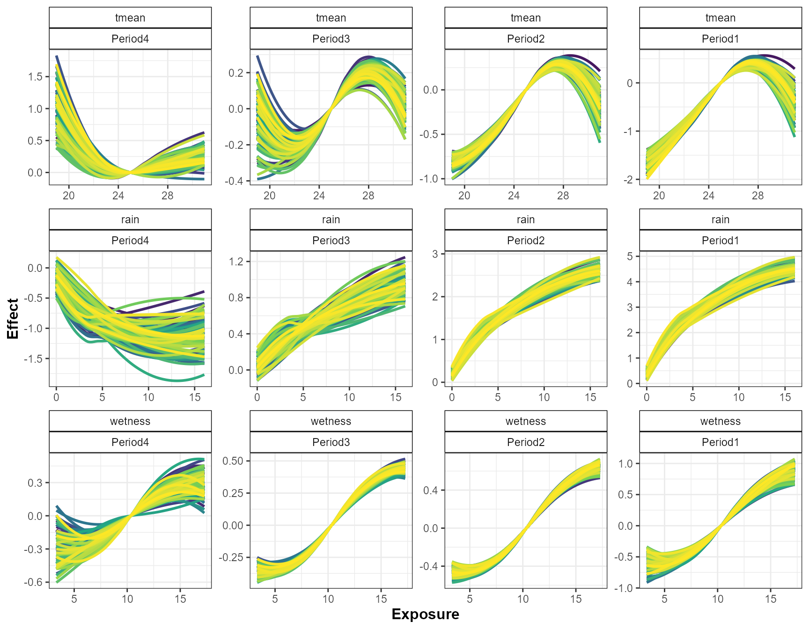
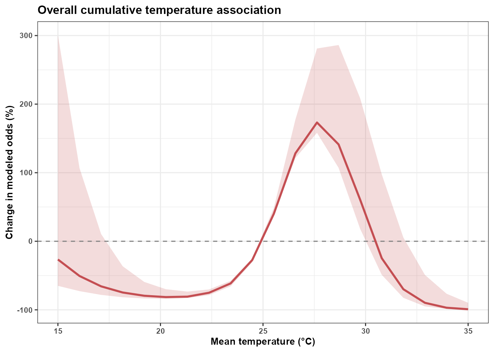
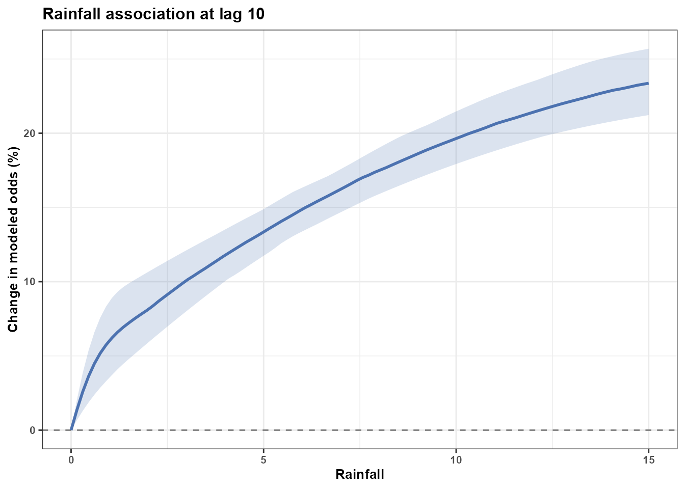
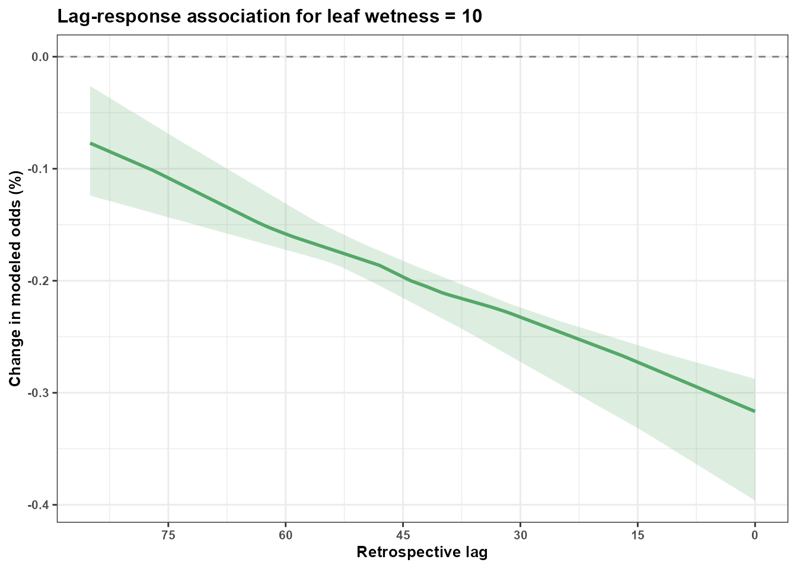
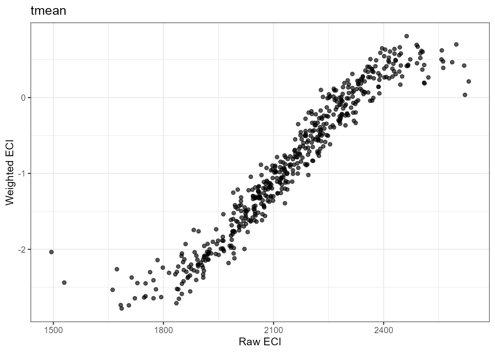
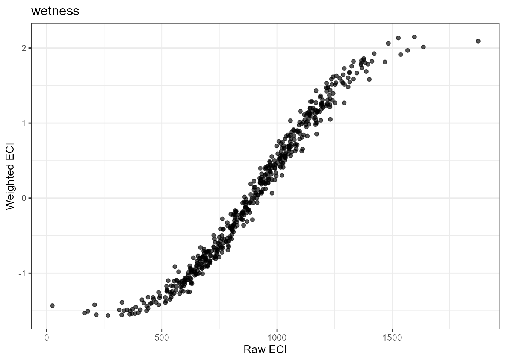
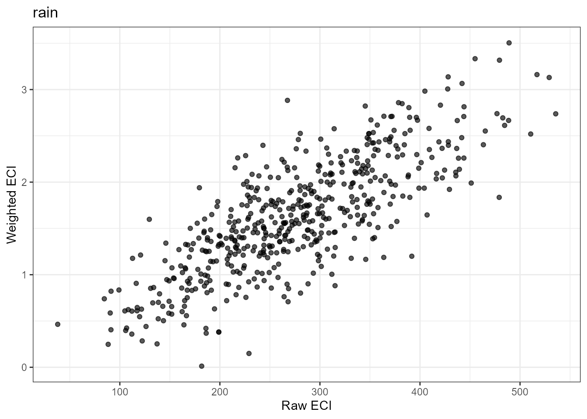

# Understanding Effects

## Introduction

The primary goal of `EpiExposure` is not only to fit distributed lag
non-linear models, but also to translate estimated exposure-lag-response
surfaces into epidemiologically meaningful quantities.

This section introduces five complementary approaches:

- lag-specific effects;
- period-specific effects;
- one-dimensional reduction of the fitted DLNM association;
- Exposure Cumulative Impact, or ECI;
- lag-specific decomposition of ECI.

These approaches help researchers investigate when associations are
strongest, compare biologically meaningful lag periods, and summarize
complete exposure histories.

**What you will learn.** This tutorial shows how to reconstruct and
interpret lag-specific and period-specific effects, reduce a fitted DLNM
association to one dimension, calculate ECI for complete exposure
histories, and identify the lags contributing most strongly to ECI.

Effect estimates should be interpreted as modeled associations under the
fitted DLNM. They do not, by themselves, establish causal effects.

## Preparing the example model

This section uses the same example dataset and basic model specification
introduced in the *Get Started* section

``` r

library(EpiExposure)
library(ggplot2)
```

``` r

data("epi_data")
```

Define the exposure-lag structures:

``` r

cb <- define_exposures(
  data = epi_data,
  vars = c(
    "tmean",
    "rain",
    "wetness"
  ),
  max_lag = 85,
  df_var = 3,
  df_lag = 2
)
```

Build the epidemic-level design:

``` r

dat <- build_design(
  data = epi_data,
  cb_templates = cb
)
```

Prepare the response:

``` r

dat <- prepare_response(
  data = dat,
  response = "y",
  family = "beta"
)
```

Fit the model:

``` r

fit <- fit_epidlnm(
  data = dat,
  model_engine = "glmmTMB",
  family = "beta",
  random_effect = NULL,
  epiexposure_spec = attr(
    cb,
    "spec"
  )
)
```

The individual `cb_*` coefficients are components of the cross-basis
expansion and should not be interpreted separately. The functions below
reconstruct those coefficients into quantities defined over exposure
values and retrospective lags.

## Reference conditions and effect measures

Exposure-lag effects are interpreted relative to reference conditions.
When an exposure value is evaluated at a particular lag, the other lags
are held at their corresponding reference values.

Three effect measures are supported:

- `"linear"` returns the DLNM contrast on the linear predictor scale
  (`eta`).
- `"exponentiated"` returns `exp(eta)`, corresponding to response ratios
  for log-link models and odds ratios for logit-link models.
- `"percent"` returns `100 × (exp(eta) - 1)`, representing percent
  changes relative to the selected reference profile.

For links such as `"identity"`, `"probit"`, `"cloglog"`, or `"inverse"`,
only `"linear"` is available.

In the examples below, we use:

``` r

effect_measure = "percent"
```

expresses modeled contrasts as percentage effects relative to the
selected reference profile.

The interpretation of effect direction depends on the response and
contrast:

- positive values indicate a higher modeled response than the reference;
- negative values indicate a lower modeled response than the reference;
- values near zero indicate little modeled contrast from the reference.

These values describe contrasts in the expected response under the
fitted model. They should not automatically be interpreted as causal
risk changes.

## Lag-specific effects

### What are lag-specific effects?

Lag-specific effects describe how the modeled disease response changes
across exposure values at an individual retrospective lag, while the
remaining lags are held at their reference conditions.

A lag refers to the time elapsed between an exposure observation and the
final disease assessment:

``` text
lag 0  → exposure measured at the disease assessment time
lag 1  → exposure measured one time unit before assessment
...
lag 85 → earliest exposure observation in the fitted history
```

Lag-specific summaries help identify portions of the exposure history in
which the fitted model shows stronger or weaker associations.

They do not imply that an individual `cb_*` coefficient corresponds to a
specific biological process. The lag-specific effect is reconstructed
from the joint cross-basis representation.

### Estimating lag-specific effects

``` r

epi_l <- summarise_effects(
  fit = fit,
  data = epi_data,
  scale = "lag",
  effect_measure = "percent",
  uncertainty = TRUE,
  n_samples = 1000,
  output = "summary",
  at = list(
    tmean = seq(
      15,
      35,
      length.out = 100
    ),
    rain = seq(
      0,
      15,
      length.out = 100
    ),
    wetness = seq(
      0,
      24,
      length.out = 100
    )
  )
)
```

The `at` argument defines the exposure values at which the fitted
exposure-lag-response relationships are evaluated.

The number of values in each sequence controls the resolution of the
resulting effect grid. A denser grid produces smoother visualizations
but increases computation and output size.

Inspect the reconstructed summaries:

| var | lag | scale | value | eta | eta_sd | eta_lower | eta_upper | effect | effect_sd | effect_lower | effect_upper | baseline | baseline_sd | baseline_lower | baseline_upper | predicted | predicted_sd | predicted_lower | predicted_upper | delta | delta_sd | delta_lower | delta_upper |
|:--:|:--:|:--:|:--:|:--:|:--:|:--:|:--:|:--:|:--:|:--:|:--:|:--:|:--:|:--:|:--:|:--:|:--:|:--:|:--:|:--:|:--:|:--:|:--:|
| tmean | 0 | lag | 15.000 | -0.156 | 0.022 | -0.200 | -0.113 | -14.472 | 1.918 | -18.088 | -10.695 | 0.141 | 0.018 | 0.109 | 0.18 | 0.123 | 0.016 | 0.095 | 0.159 | -0.018 | 0.003 | -0.025 | -0.012 |
| tmean | 0 | lag | 15.202 | -0.154 | 0.022 | -0.195 | -0.112 | -14.236 | 1.857 | -17.718 | -10.564 | 0.141 | 0.018 | 0.109 | 0.18 | 0.124 | 0.016 | 0.095 | 0.159 | -0.018 | 0.003 | -0.025 | -0.012 |
| tmean | 0 | lag | 15.404 | -0.151 | 0.021 | -0.191 | -0.110 | -13.991 | 1.795 | -17.347 | -10.452 | 0.141 | 0.018 | 0.109 | 0.18 | 0.124 | 0.016 | 0.095 | 0.159 | -0.017 | 0.003 | -0.024 | -0.011 |
| tmean | 0 | lag | 15.606 | -0.148 | 0.020 | -0.186 | -0.109 | -13.761 | 1.734 | -16.982 | -10.342 | 0.141 | 0.018 | 0.109 | 0.18 | 0.124 | 0.016 | 0.095 | 0.160 | -0.017 | 0.003 | -0.024 | -0.011 |
| tmean | 0 | lag | 15.808 | -0.145 | 0.019 | -0.182 | -0.108 | -13.526 | 1.673 | -16.641 | -10.234 | 0.141 | 0.018 | 0.109 | 0.18 | 0.125 | 0.016 | 0.096 | 0.160 | -0.017 | 0.003 | -0.024 | -0.011 |
| tmean | 0 | lag | 16.010 | -0.142 | 0.019 | -0.177 | -0.107 | -13.273 | 1.612 | -16.251 | -10.125 | 0.141 | 0.018 | 0.109 | 0.18 | 0.125 | 0.016 | 0.096 | 0.160 | -0.016 | 0.003 | -0.023 | -0.011 |
| tmean | 0 | lag | 16.212 | -0.139 | 0.018 | -0.173 | -0.106 | -13.017 | 1.551 | -15.877 | -10.015 | 0.141 | 0.018 | 0.109 | 0.18 | 0.125 | 0.016 | 0.096 | 0.160 | -0.016 | 0.003 | -0.023 | -0.011 |
| tmean | 0 | lag | 16.414 | -0.137 | 0.017 | -0.169 | -0.104 | -12.759 | 1.491 | -15.526 | -9.887 | 0.141 | 0.018 | 0.109 | 0.18 | 0.126 | 0.016 | 0.096 | 0.161 | -0.016 | 0.003 | -0.022 | -0.011 |
| tmean | 0 | lag | 16.616 | -0.134 | 0.016 | -0.164 | -0.103 | -12.511 | 1.431 | -15.145 | -9.763 | 0.141 | 0.018 | 0.109 | 0.18 | 0.126 | 0.016 | 0.097 | 0.161 | -0.015 | 0.003 | -0.022 | -0.011 |
| tmean | 0 | lag | 16.818 | -0.131 | 0.016 | -0.160 | -0.101 | -12.256 | 1.372 | -14.783 | -9.637 | 0.141 | 0.018 | 0.109 | 0.18 | 0.126 | 0.016 | 0.097 | 0.161 | -0.015 | 0.003 | -0.021 | -0.010 |

### Visualizing lag-specific effects

``` r

plot_effects(
  data = epi_l,
  scale = "lag",
  metric = "effect",
  vars = c(
    "tmean",
    "rain",
    "wetness"
  )
)
```


Interpret these plots jointly across exposure values and lags. Avoid
drawing conclusions from one isolated point, especially where
uncertainty is large or data support is limited.

### Local sensitivity and delta effects

In addition to effect estimates, `EpiExposure` can display local
sensitivity measures, denoted by (Delta).

Delta describes how rapidly the modeled effect changes as the exposure
value increases locally:

- positive values indicate an increasing modeled response;
- negative values indicate a decreasing modeled response;
- values near zero indicate local stability or a relatively flat portion
  of the estimated relationship.

``` r

plot_effects(
  data = epi_l,
  scale = "lag",
  metric = "delta",
  delta_multiplier = 100,
  vars = c(
    "tmean",
    "rain",
    "wetness"
  )
)
```


Delta should be interpreted as a local feature of the fitted
exposure-lag-response surface. It is not a separate regression
coefficient or an independent causal effect.

## Period-specific effects

### Why summarize lag periods?

Individual lags may be difficult to interpret biologically, particularly
when disease development involves broader phases such as infection,
colonization, symptom development, or secondary spread.

Period-specific effects combine information across predefined lag
intervals. This allows the exposure-lag association to be summarized
over biologically meaningful phases rather than interpreted one lag at a
time.

The periods should be selected using biological knowledge whenever
possible. They should not be chosen only because they produce larger or
more visually distinct effects.

### Defining epidemiological periods

``` r

periods <- define_periods(
  max_lag = 85,
  cuts = c(
    20,
    40,
    60
  ),
  prefix = "Period"
)
```

``` r

periods
#>    period lag_start lag_end
#> 1 Period1         0      20
#> 2 Period2        21      40
#> 3 Period3        41      60
#> 4 Period4        61      85
```

The selected cut points divide the fitted lag interval into four
periods:

- Period1: lags 0–20 (most recent exposures)
- Period2: lags 21–40
- Period3: lags 41–60
- Period4: lags 61–85 (oldest exposures)

These periods are defined on the retrospective lag scale used by DLNMs
and `EpiExposure` rather than on the original chronological time scale.
Consequently, Period1 contains exposures occurring closest to the
disease assessment date, whereas Period4 contains exposures occurring
furthest in the past. When assigning biological labels, remember that
lower lags represent more recent exposure conditions and higher lags
represent earlier exposure conditions.

### Estimating period-specific effects

``` r

epi_p_summary <- summarise_effects(
  fit = fit,
  data = epi_data,
  scale = "period",
  lag_periods = periods,
  effect_measure = "percent",
  uncertainty = TRUE,
  n_samples = 100,
  output = "summary"
)
```

When `output = "summary"` and `uncertainty = TRUE`, `EpiExposure`
summarizes the simulated parameter draws for each exposure-period
combination. The reported effect corresponds to the median estimate
across draws, while the lower and upper bounds represent the empirical
uncertainty interval defined by `interval_probs` (95% by default).

This output is useful when the goal is to summarize the central tendency
and uncertainty of the estimated effects rather than inspect each
individual draw.

Inspect the summary:

| var | period | scale | value | eta | eta_sd | eta_lower | eta_upper | effect | effect_sd | effect_lower | effect_upper | baseline | baseline_sd | baseline_lower | baseline_upper | predicted | predicted_sd | predicted_lower | predicted_upper | delta | delta_sd | delta_lower | delta_upper |
|:--:|:--:|:--:|:--:|:--:|:--:|:--:|:--:|:--:|:--:|:--:|:--:|:--:|:--:|:--:|:--:|:--:|:--:|:--:|:--:|:--:|:--:|:--:|:--:|
| tmean | Period1 | period | 18.979 | -1.671 | 0.136 | -1.955 | -1.423 | -81.203 | 2.574 | -85.840 | -75.885 | 0.14 | 0.018 | 0.109 | 0.173 | 0.031 | 0.004 | 0.022 | 0.038 | -0.111 | 0.016 | -0.142 | -0.084 |
| tmean | Period1 | period | 19.241 | -1.610 | 0.127 | -1.873 | -1.377 | -80.008 | 2.539 | -84.641 | -74.757 | 0.14 | 0.018 | 0.109 | 0.173 | 0.032 | 0.004 | 0.024 | 0.039 | -0.110 | 0.016 | -0.140 | -0.083 |
| tmean | Period1 | period | 19.506 | -1.547 | 0.118 | -1.800 | -1.329 | -78.707 | 2.510 | -83.476 | -73.527 | 0.14 | 0.018 | 0.109 | 0.173 | 0.034 | 0.004 | 0.026 | 0.041 | -0.108 | 0.016 | -0.138 | -0.082 |
| tmean | Period1 | period | 19.752 | -1.491 | 0.111 | -1.735 | -1.288 | -77.496 | 2.490 | -82.351 | -72.416 | 0.14 | 0.018 | 0.109 | 0.173 | 0.036 | 0.004 | 0.027 | 0.044 | -0.106 | 0.016 | -0.135 | -0.080 |
| tmean | Period1 | period | 19.965 | -1.436 | 0.105 | -1.676 | -1.250 | -76.210 | 2.480 | -81.296 | -71.346 | 0.14 | 0.018 | 0.109 | 0.173 | 0.038 | 0.004 | 0.029 | 0.046 | -0.104 | 0.016 | -0.133 | -0.079 |
| tmean | Period1 | period | 20.171 | -1.378 | 0.100 | -1.620 | -1.206 | -74.796 | 2.476 | -80.201 | -70.056 | 0.14 | 0.018 | 0.109 | 0.173 | 0.040 | 0.004 | 0.031 | 0.048 | -0.102 | 0.015 | -0.131 | -0.077 |
| tmean | Period1 | period | 20.362 | -1.329 | 0.096 | -1.566 | -1.166 | -73.527 | 2.480 | -79.112 | -68.851 | 0.14 | 0.018 | 0.109 | 0.173 | 0.041 | 0.005 | 0.032 | 0.050 | -0.100 | 0.015 | -0.129 | -0.076 |
| tmean | Period1 | period | 20.547 | -1.285 | 0.092 | -1.513 | -1.129 | -72.324 | 2.489 | -77.974 | -67.672 | 0.14 | 0.018 | 0.109 | 0.173 | 0.043 | 0.005 | 0.034 | 0.052 | -0.098 | 0.015 | -0.126 | -0.074 |
| tmean | Period1 | period | 20.737 | -1.242 | 0.088 | -1.457 | -1.089 | -71.107 | 2.506 | -76.711 | -66.357 | 0.14 | 0.018 | 0.109 | 0.173 | 0.045 | 0.005 | 0.036 | 0.055 | -0.096 | 0.015 | -0.124 | -0.072 |
| tmean | Period1 | period | 20.902 | -1.199 | 0.085 | -1.408 | -1.052 | -69.841 | 2.527 | -75.540 | -65.066 | 0.14 | 0.018 | 0.109 | 0.173 | 0.047 | 0.005 | 0.037 | 0.057 | -0.094 | 0.014 | -0.122 | -0.070 |

The summary output contains one row for each exposure-period combination
and includes uncertainty summaries for the estimated effects, baseline
prediction, predicted response, and response-scale difference (`delta`).

Visualizing period-specific effects:

``` r

plot_effects(
  data = epi_p_summary,
  scale = "period",
  vars = c(
    "tmean",
    "rain",
    "wetness"
  ),
  period_order = c(
    "Period4",
    "Period3",
    "Period2",
    "Period1"
  ),
  vars_order = c(
    "tmean",
    "rain",
    "wetness"
  ),
  period_response = "eta",
  period_ylab = "Effect"
)
```


Period-specific summaries describe the modeled contribution accumulated
over each defined lag interval. They should not be interpreted as four
independently estimated models because all periods arise from the same
fitted cross-basis surface.

### Returning uncertainty samples

When `output = "samples"`, the function returns the individual
draw-specific results instead of summary statistics. Each row
corresponds to one parameter draw and one exposure-period combination,
allowing custom uncertainty analyses and visualizations.

This output is particularly useful when calculating user-defined
summaries, propagating uncertainty through downstream analyses, or
building custom graphics.

In contrast to `output = "summary"`, which reports median estimates and
uncertainty intervals across all simulated draws, `output = "samples"`
returns the complete draw-by-draw results used to construct those
summaries.

``` r

epi_p_samples <- summarise_effects(
  fit = fit,
  data = epi_data,
  scale = "period",
  lag_periods = periods,
  effect_measure = "percent",
  uncertainty = TRUE,
  n_samples = 100,
  output = "samples"
)
```

Visualizing period-specific effects:

``` r

plot_effects(
  data = epi_p_samples,
  scale = "period",
  vars = c(
    "tmean",
    "rain",
    "wetness"
  ),
  period_order = c(
    "Period4",
    "Period3",
    "Period2",
    "Period1"
  ),
  vars_order = c(
    "tmean",
    "rain",
    "wetness"
  ),
  period_response = "eta",
  period_ylab = "Effect"
)
```



Inspect a subset of the sample-level output:

| sample |  var  | period  | scale  | value  |  eta   | effect  | baseline | predicted | delta  |
|:------:|:-----:|:-------:|:------:|:------:|:------:|:-------:|:--------:|:---------:|:------:|
|   1    | tmean | Period1 | period | 18.979 | -1.505 | -77.799 |  0.116   |   0.028   | -0.088 |
|   1    | tmean | Period1 | period | 19.241 | -1.457 | -76.700 |  0.116   |   0.030   | -0.086 |
|   1    | tmean | Period1 | period | 19.506 | -1.406 | -75.498 |  0.116   |   0.031   | -0.085 |
|   1    | tmean | Period1 | period | 19.752 | -1.358 | -74.295 |  0.116   |   0.033   | -0.083 |
|   1    | tmean | Period1 | period | 19.965 | -1.316 | -73.179 |  0.116   |   0.034   | -0.082 |
|   1    | tmean | Period1 | period | 20.171 | -1.274 | -72.033 |  0.116   |   0.035   | -0.081 |
|   1    | tmean | Period1 | period | 20.362 | -1.235 | -70.902 |  0.116   |   0.037   | -0.079 |
|   1    | tmean | Period1 | period | 20.547 | -1.195 | -69.738 |  0.116   |   0.038   | -0.078 |
|   1    | tmean | Period1 | period | 20.737 | -1.154 | -68.463 |  0.116   |   0.040   | -0.076 |
|   1    | tmean | Period1 | period | 20.902 | -1.118 | -67.292 |  0.116   |   0.041   | -0.075 |

The sample output preserves individual uncertainty realizations. It can
support custom summaries, probability calculations, sensitivity
analyses, and user-defined visualizations.

The rows belonging to the same draw should remain associated when
comparing periods, exposures, scenarios, or contrasts.

## Reducing the fitted DLNM association

### Why reduce an exposure-lag association?

A fitted DLNM represents a two-dimensional association across exposure
values and retrospective lags. Although this complete surface is useful,
researchers may also need a one-dimensional representation of the fitted
association.

[`reduce_effects()`](https://tomazrg.github.io/EpiExposure/reference/reduce_effects.md)
uses
[`dlnm::crossreduce()`](https://rdrr.io/pkg/dlnm/man/crossreduce.html)
to re-express the fitted cross-basis association in one dimension. The
function supports three complementary reductions:

- `"overall"` summarizes the cumulative exposure-response association
  across the complete fitted lag interval;
- `"lag"` summarizes the exposure-response association at one selected
  lag;
- `"var"` summarizes the lag-response association at one selected
  exposure value.

The reduction is algebraic. It uses the cross-basis and coefficient
mapping stored in the fitted EpiExposure model and does not fit a new
epidemiological model. Knots, boundary knots, basis dimensions, and lag
definitions are not re-estimated from the supplied data.

The `data` argument is used to validate the temporal histories,
determine method-based reference values, and verify exposure support. It
is not used to construct a new cross-basis.

**Reduction and prediction answer different questions.**
[`reduce_effects()`](https://tomazrg.github.io/EpiExposure/reference/reduce_effects.md)
returns a centered association contrast from the fitted DLNM. It does
not return an absolute expected disease response. Use
[`summarise_effects()`](https://tomazrg.github.io/EpiExposure/reference/summarise_effects.md)
or
[`predict_outcomes()`](https://tomazrg.github.io/EpiExposure/reference/predict_outcomes.md)
when baseline, predicted, or response-scale quantities are required.

### Overall cumulative exposure-response association

The following example reduces the fitted temperature association across
the complete lag interval.

Because the fitted Beta model uses a logit link, `scale = "percent"`
represents the percentage change in the modeled odds relative to the
selected temperature reference. It is not a percentage-point change in
the expected disease proportion.

``` r

reduced_tmean <- reduce_effects(
  fit = fit,
  data = epi_data,
  vars = "tmean",
  group = "epi_id",
  time = "time",
  type = "overall",
  scale = "percent",
  uncertainty = TRUE,
  output = "summary",
  n_samples = 100,
  seed = 123,
  ref = list(
    method = "median",
    value = NULL
  ),
  at = seq(
    15,
    35,
    length.out = 100
  )
)
```

The median observed temperature is used as the reference. At that value,
the centered association is neutral:

``` text
eta = 0
percent effect = 0
```

Values above zero indicate higher modeled odds than at the reference
temperature, whereas values below zero indicate lower modeled odds.

Inspect the reduced association:

| var | type | value | reference | scale | x | eta | eta_sd | low | high | effect | effect_sd | low_eff | high_eff |
|:--:|:--:|:--:|:--:|:--:|:--:|:--:|:--:|:--:|:--:|:--:|:--:|:--:|:--:|
| tmean | overall | NA | 24.971 | percent | 15.000 | -0.203 | 0.897 | -1.888 | 1.551 | -18.352 | 129.602 | -84.508 | 371.772 |
| tmean | overall | NA | 24.971 | percent | 15.202 | -0.286 | 0.869 | -1.925 | 1.413 | -24.877 | 112.548 | -85.068 | 310.778 |
| tmean | overall | NA | 24.971 | percent | 15.404 | -0.373 | 0.840 | -1.962 | 1.279 | -31.116 | 97.750 | -85.604 | 259.493 |
| tmean | overall | NA | 24.971 | percent | 15.606 | -0.459 | 0.812 | -1.998 | 1.147 | -36.805 | 84.927 | -86.116 | 214.792 |
| tmean | overall | NA | 24.971 | percent | 15.808 | -0.545 | 0.784 | -2.034 | 1.014 | -41.983 | 73.829 | -86.602 | 175.879 |
| tmean | overall | NA | 24.971 | percent | 16.010 | -0.631 | 0.756 | -2.069 | 0.881 | -46.795 | 64.234 | -87.062 | 141.437 |
| tmean | overall | NA | 24.971 | percent | 16.212 | -0.716 | 0.728 | -2.103 | 0.760 | -51.125 | 55.942 | -87.493 | 113.963 |
| tmean | overall | NA | 24.971 | percent | 16.414 | -0.792 | 0.700 | -2.130 | 0.644 | -54.698 | 48.782 | -87.840 | 90.514 |
| tmean | overall | NA | 24.971 | percent | 16.616 | -0.866 | 0.673 | -2.145 | 0.530 | -57.939 | 42.600 | -88.060 | 69.932 |
| tmean | overall | NA | 24.971 | percent | 16.818 | -0.944 | 0.647 | -2.159 | 0.419 | -61.078 | 37.264 | -88.259 | 52.022 |

The main columns are:

- `x`: temperature value at which the reduced association is evaluated;
- `eta`: median centered association on the linear-predictor scale;
- `low` and `high`: empirical uncertainty limits for `eta`;
- `effect`: median transformed association on the requested scale;
- `low_eff` and `high_eff`: empirical uncertainty limits for the
  transformed association;
- `reference`: temperature value used for centering.

The uncertainty summaries are calculated after transforming each
coherent parameter draw. They therefore describe uncertainty in the
reduced fitted association and do not include observation-level or
posterior-predictive noise.

### Visualizing the overall reduction

``` r

ggplot(
  reduced_tmean,
  aes(
    x = x,
    y = effect
  )
) +
  geom_ribbon(
    aes(
      ymin = low_eff,
      ymax = high_eff
    ),
    fill = "#C44E52",
    alpha = 0.20
  ) +
  geom_hline(
    yintercept = 0,
    color = "grey50",
    linetype = "dashed"
  ) +
  geom_line(
    color = "#C44E52",
    linewidth = 1
  ) +
  theme_bw() +
  labs(
    x = "Mean temperature (°C)",
    y = "Change in modeled odds (%)",
    title = "Overall cumulative temperature association"
  ) +
  theme(
    text = element_text(
      size = 10,
      face = "bold"
    )
  )
```



The solid curve represents the median cumulative association across the
fitted lag interval. The shaded region represents the empirical
parameter-uncertainty interval. The horizontal zero line represents the
median temperature reference.

This curve is cumulative across lags. It should not be interpreted as
the association at one specific lag.

### Exposure-response association at a selected lag

A `"lag"` reduction evaluates the exposure-response association at one
retrospective lag. The following example evaluates rainfall at lag 10:

``` r

reduced_rain_lag10 <- reduce_effects(
  fit = fit,
  data = epi_data,
  vars = "rain",
  group = "epi_id",
  time = "time",
  type = "lag",
  value = 10,
  scale = "percent",
  uncertainty = TRUE,
  output = "summary",
  n_samples = 100,
  seed = 123,
  ref = list(
    method = "median",
    value = NULL
  ),
  at = seq(
    0,
    15,
    length.out = 100
  )
)
```

Here:

``` r

type = "lag"
value = 10
```

requests the fitted rainfall association ten time units before the
disease assessment. Other lag coordinates are not part of this
one-dimensional reduction.

``` r

ggplot(
  reduced_rain_lag10,
  aes(
    x = x,
    y = effect
  )
) +
  geom_ribbon(
    aes(
      ymin = low_eff,
      ymax = high_eff
    ),
    fill = "#4C72B0",
    alpha = 0.20
  ) +
  geom_hline(
    yintercept = 0,
    color = "grey50",
    linetype = "dashed"
  ) +
  geom_line(
    color = "#4C72B0",
    linewidth = 1
  ) +
  theme_bw() +
  labs(
    x = "Rainfall",
    y = "Change in modeled odds (%)",
    title = "Rainfall association at lag 10"
  ) +
  theme(
    text = element_text(
      size = 10,
      face = "bold"
    )
  )
```



This reduction differs from the overall curve because it describes one
selected lag rather than the cumulative association across the complete
lag interval.

### Lag-response association at a selected exposure value

A `"var"` reduction reverses the perspective. Instead of showing how the
association changes across exposure values, it shows how the association
changes across lags at one selected exposure value.

The following example evaluates leaf wetness at a fixed value of 10:

``` r

reduced_wetness_10 <- reduce_effects(
  fit = fit,
  data = epi_data,
  vars = "wetness",
  group = "epi_id",
  time = "time",
  type = "var",
  value = 10,
  scale = "percent",
  uncertainty = TRUE,
  output = "summary",
  n_samples = 100,
  seed = 123,
  ref = list(
    method = "median",
    value = NULL
  )
)
```

For this reduction:

``` text
x = retrospective lag
value = selected leaf wetness exposure
```

The resulting curve describes how the centered association for leaf
wetness equal to 10 is distributed across the fitted lag interval.

``` r

ggplot(
  reduced_wetness_10,
  aes(
    x = x,
    y = effect
  )
) +
  geom_ribbon(
    aes(
      ymin = low_eff,
      ymax = high_eff
    ),
    fill = "#55A868",
    alpha = 0.20
  ) +
  geom_hline(
    yintercept = 0,
    color = "grey50",
    linetype = "dashed"
  ) +
  geom_line(
    color = "#55A868",
    linewidth = 1
  ) +
  scale_x_reverse(
    breaks = seq(
      0,
      85,
      by = 15
    )
  ) +
  theme_bw() +
  labs(
    x = "Retrospective lag",
    y = "Change in modeled odds (%)",
    title = "Lag-response association for leaf wetness = 10"
  ) +
  theme(
    text = element_text(
      size = 10,
      face = "bold"
    )
  )
```



Lag 0 represents the most recent exposure observation, whereas
increasing lag values represent progressively older exposure conditions.

### Summary versus sample output

As with other EpiExposure uncertainty functions, draw-level output can
be requested with:

``` r

uncertainty = TRUE
output = "samples"
```

For example:

``` r

reduced_tmean_samples <- reduce_effects(
  fit = fit,
  data = epi_data,
  vars = "tmean",
  group = "epi_id",
  time = "time",
  type = "overall",
  scale = "percent",
  uncertainty = TRUE,
  output = "samples",
  n_samples = 100,
  seed = 123,
  ref = list(
    method = "median",
    value = NULL
  ),
  at = seq(
    15,
    35,
    length.out = 100
  )
)
```

Each `sample` identifies one coherent joint parameter draw. Rows
belonging to the same sample should remain associated when constructing
custom curves or downstream uncertainty calculations.

With `output = "summary"`, `eta` and `effect` are medians across
parameter draws. With `output = "samples"`, they retain the
draw-specific reduced associations.

### Interpreting reduced associations

The three reduction types answer different questions:

- `type = "overall"` asks how the cumulative association across the
  complete lag window changes over exposure values;
- `type = "lag"` asks how the exposure-response association changes at
  one selected lag;
- `type = "var"` asks how the lag-response association changes at one
  selected exposure value.

These reductions should not be interpreted as new model fits or as
independent effects. All three are reparameterizations of the same
fitted cross-basis association.

For a logit-link model:

- `scale = "link"` reports the centered log-odds contrast;
- `scale = "response"` reports an odds ratio;
- `scale = "percent"` reports the percentage change in odds.

None of these transformations alone represents an absolute expected
disease proportion. Absolute baseline, predicted, and response-scale
difference quantities require the broader prediction information
supplied by
[`summarise_effects()`](https://tomazrg.github.io/EpiExposure/reference/summarise_effects.md)
or
[`predict_outcomes()`](https://tomazrg.github.io/EpiExposure/reference/predict_outcomes.md).

## Exposure Cumulative Impact

### Why use ECI?

Disease responses depend on complete exposure histories rather than
isolated observations.

Two epidemic histories may have similar average rainfall or temperature
but different modeled epidemiological implications because favorable
conditions occurred at different times.

Exposure Cumulative Impact, or ECI, summarizes a complete exposure
history while retaining information from the fitted
exposure-lag-response relationship.

ECI complements the lag-specific and period-specific summaries:

- lag-specific effects examine individual lags;
- period-specific effects combine predefined lag intervals;
- ECI summarizes the complete observed exposure history of each
  epidemic.

### Calculating ECI

``` r

eci <- compute_eci(
  data = epi_data,
  group = "epi_id",
  fit = fit,
  vars = c(
    "tmean",
    "rain",
    "wetness"
  ),
  uncertainty = TRUE,
  output = "summary",
  n_samples = 1000
)
```

Inspect the resulting summaries:

| epi_id | var | reference_value | max_lag | n_exposure_values | ECI_raw | ECI_raw_centered | baseline | baseline_sd | baseline_lower | baseline_upper | predicted | predicted_sd | predicted_lower | predicted_upper | ECI_weighted | ECI_weighted_sd | ECI_weighted_lower | ECI_weighted_upper | scale |
|:--:|:--:|:--:|:--:|:--:|:--:|:--:|:--:|:--:|:--:|:--:|:--:|:--:|:--:|:--:|:--:|:--:|:--:|:--:|:--:|
| 1 | tmean | 24.971 | 85 | 86 | 2060.099 | -87.432 | 0.14 | 0.019 | 0.11 | 0.18 | 0.048 | 0.004 | 0.040 | 0.058 | -1.169 | 0.125 | -1.412 | -0.941 | link |
| 1 | rain | 0.000 | 85 | 86 | 372.093 | 372.093 | 0.14 | 0.019 | 0.11 | 0.18 | 0.713 | 0.031 | 0.650 | 0.772 | 2.724 | 0.129 | 2.473 | 2.971 | link |
| 1 | wetness | 10.335 | 85 | 86 | 810.230 | -78.577 | 0.14 | 0.019 | 0.11 | 0.18 | 0.102 | 0.014 | 0.079 | 0.134 | -0.368 | 0.021 | -0.408 | -0.328 | link |
| 2 | tmean | 24.971 | 85 | 86 | 2037.798 | -109.734 | 0.14 | 0.019 | 0.11 | 0.18 | 0.031 | 0.003 | 0.026 | 0.037 | -1.633 | 0.157 | -1.933 | -1.334 | link |
| 2 | rain | 0.000 | 85 | 86 | 476.946 | 476.946 | 0.14 | 0.019 | 0.11 | 0.18 | 0.719 | 0.029 | 0.659 | 0.770 | 2.749 | 0.123 | 2.508 | 2.989 | link |
| 2 | wetness | 10.335 | 85 | 86 | 546.175 | -342.632 | 0.14 | 0.019 | 0.11 | 0.18 | 0.043 | 0.007 | 0.032 | 0.058 | -1.286 | 0.055 | -1.390 | -1.175 | link |
| 3 | tmean | 24.971 | 85 | 86 | 2093.533 | -53.998 | 0.14 | 0.019 | 0.11 | 0.18 | 0.049 | 0.004 | 0.042 | 0.059 | -1.149 | 0.109 | -1.370 | -0.953 | link |
| 3 | rain | 0.000 | 85 | 86 | 224.391 | 224.391 | 0.14 | 0.019 | 0.11 | 0.18 | 0.332 | 0.031 | 0.276 | 0.391 | 1.109 | 0.057 | 1.002 | 1.217 | link |
| 3 | wetness | 10.335 | 85 | 86 | 1052.515 | 163.708 | 0.14 | 0.019 | 0.11 | 0.18 | 0.239 | 0.027 | 0.194 | 0.295 | 0.654 | 0.033 | 0.590 | 0.718 | link |
| 4 | tmean | 24.971 | 85 | 86 | 2072.810 | -74.721 | 0.14 | 0.019 | 0.11 | 0.18 | 0.038 | 0.004 | 0.032 | 0.046 | -1.417 | 0.161 | -1.735 | -1.118 | link |

### Interpreting ECI

ECI provides two complementary quantities:

- `ECI_raw` describes the accumulated exposure history without weighting
  by the fitted exposure-lag association;
- `ECI_weighted` incorporates the weighting implied by the fitted
  exposure-lag-response relationship.

`ECI_raw` describes exposure accumulation. It does not represent a
modeled disease effect.

`ECI_weighted` describes how the complete exposure history aligns with
the association estimated by the DLNM. Larger or smaller values should
be interpreted relative to other histories fitted under the same
specification, exposure definition, reference conditions, and scale.

ECI is a model-derived summary. It should not automatically be
interpreted as a causal impact or as a directly observed biological
quantity.

### Comparing raw and weighted exposure histories

tmean

``` r

eci[
  eci$var == "tmean",
  ,
  drop = FALSE
] |>
  ggplot(
    aes(
      x = ECI_raw,
      y = ECI_weighted
    )
  ) +
  geom_point(
    alpha = 0.65
  ) +
  theme_bw() +
  labs(
    x = "Raw ECI",
    y = "Weighted ECI",
    title = "tmean")
```



wetness

``` r

eci[
  eci$var == "wetness",
  ,
  drop = FALSE
] |>
  ggplot(
    aes(
      x = ECI_raw,
      y = ECI_weighted
    )
  ) +
  geom_point(
    alpha = 0.65
  ) +
  theme_bw() +
  labs(
    x = "Raw ECI",
    y = "Weighted ECI",
    title = "wetness")
```



rain

``` r

eci[
  eci$var == "rain",
  ,
  drop = FALSE
] |>
  ggplot(
    aes(
      x = ECI_raw,
      y = ECI_weighted
    )
  ) +
  geom_point(
    alpha = 0.65
  ) +
  theme_bw() +
  labs(
    x = "Raw ECI",
    y = "Weighted ECI",
    title = "rain")
```



A strong relationship between the two quantities indicates that
accumulated exposure and model-based weighting produce similar rankings
for the displayed histories.

Deviations from that relationship may indicate that exposure timing
changes the modeled importance of histories with similar raw
accumulation.

## Decomposing ECI by lag

### Why decompose ECI?

Overall ECI provides one summary for the complete history, but
researchers may also want to identify the lags that contribute most
strongly to that summary.

[`compute_ecilag()`](https://tomazrg.github.io/EpiExposure/reference/compute_ecilag.md)
decomposes ECI into lag-specific contributions for a selected epidemic
or grouping level.

This decomposition answers a different question from lag-specific effect
curves:

- a lag-specific effect curve evaluates modeled contrasts across
  exposure values at a lag;
- ECI decomposition evaluates how the exposure values actually observed
  in a selected history contribute to that history’s ECI.

### Computing lag contributions

``` r

eci_lag <- compute_ecilag(
  data = epi_data,
  group = "epi_id",
  group_level = 1,
  fit = fit,
  var = c(
    "tmean",
    "rain",
    "wetness"
  ),
  uncertainty = TRUE,
  output = "summary",
  n_samples = 1000
)
```

In this example:

``` r

group_level = 1
```

selects the epidemic identified by level `1` of `epi_id`.

For a real analysis, select the epidemic identifier that corresponds to
the history of scientific interest.

### Inspecting lag contributions

| epi_id | var | lag | exposure | reference_value | exposure_minus_reference | ECI_weighted | ECI_percent | ECI_absolute | ECI_weighted_sd | ECI_weighted_lower | ECI_weighted_upper | ECI_percent_sd | ECI_percent_lower | ECI_percent_upper | ECI_percent_n | ECI_absolute_sd | ECI_absolute_lower | ECI_absolute_upper |
|:--:|:--:|:--:|:--:|:--:|:--:|:--:|:--:|:--:|:--:|:--:|:--:|:--:|:--:|:--:|:--:|:--:|:--:|:--:|
| 1 | tmean | 0 | 21.605 | 24.971 | -3.367 | -0.058 | 3.193 | 0.058 | 0.004 | -0.067 | -0.050 | 0.126 | 2.924 | 3.412 | 1000 | 0.004 | 0.050 | 0.067 |
| 1 | tmean | 1 | 21.894 | 24.971 | -3.077 | -0.053 | 2.880 | 0.053 | 0.004 | -0.061 | -0.045 | 0.112 | 2.642 | 3.083 | 1000 | 0.004 | 0.045 | 0.061 |
| 1 | tmean | 2 | 21.258 | 24.971 | -3.713 | -0.062 | 3.386 | 0.062 | 0.005 | -0.070 | -0.053 | 0.134 | 3.105 | 3.628 | 1000 | 0.005 | 0.053 | 0.070 |
| 1 | tmean | 3 | 21.887 | 24.971 | -3.084 | -0.051 | 2.793 | 0.051 | 0.004 | -0.059 | -0.044 | 0.105 | 2.569 | 2.982 | 1000 | 0.004 | 0.044 | 0.059 |
| 1 | tmean | 4 | 21.948 | 24.971 | -3.023 | -0.049 | 2.695 | 0.049 | 0.004 | -0.057 | -0.042 | 0.101 | 2.484 | 2.875 | 1000 | 0.004 | 0.042 | 0.057 |
| 1 | tmean | 5 | 21.986 | 24.971 | -2.986 | -0.048 | 2.617 | 0.048 | 0.004 | -0.055 | -0.041 | 0.097 | 2.419 | 2.790 | 1000 | 0.004 | 0.041 | 0.055 |
| 1 | tmean | 6 | 21.356 | 24.971 | -3.616 | -0.056 | 3.075 | 0.056 | 0.004 | -0.064 | -0.048 | 0.110 | 2.842 | 3.271 | 1000 | 0.004 | 0.048 | 0.064 |
| 1 | tmean | 7 | 22.080 | 24.971 | -2.891 | -0.045 | 2.453 | 0.045 | 0.003 | -0.052 | -0.039 | 0.090 | 2.268 | 2.614 | 1000 | 0.003 | 0.039 | 0.052 |
| 1 | tmean | 8 | 23.713 | 24.971 | -1.258 | -0.019 | 1.060 | 0.019 | 0.002 | -0.023 | -0.016 | 0.060 | 0.938 | 1.173 | 1000 | 0.002 | 0.016 | 0.023 |
| 1 | tmean | 9 | 24.900 | 24.971 | -0.071 | -0.001 | 0.055 | 0.001 | 0.000 | -0.001 | -0.001 | 0.004 | 0.047 | 0.062 | 1000 | 0.000 | 0.001 | 0.001 |

### Plotting the contribution profile

``` r

plot_eci(
  eci_overall = eci,
  eci_lag = eci_lag,
  facet_scales = "free_y",
  overall_nrow = 3,
  lag_ncol = 1,
  sample_smooth = TRUE,
  linewidth = 0.7,
  alpha = 0.20,
  panel_labels = c(
    "(a)",
    "(b)",
    "(c)"
  ),
  overall_col = "ECI_weighted",
  lag_col = "ECI_percent"
)
```


The overall panels summarize complete histories, whereas the lag panels
show how the selected history is distributed across retrospective lags.

Large positive or negative lag contributions should be interpreted in
the context of:

- the exposure values observed at those lags;
- the fitted exposure-response shape;
- the fitted lag-response shape;
- the selected reference conditions;
- uncertainty in the fitted coefficients.

## How the summaries complement one another

Lag-specific effects, period-specific effects, ECI, and ECI
decomposition are different views of the same fitted
exposure-lag-response structure.

- **Lag-specific effects** describe modeled exposure contrasts at
  individual lags.
- **Period-specific effects** summarize modeled exposure contrasts
  across predefined lag intervals.
- **ECI** summarizes complete observed exposure histories.
- **ECI lag decomposition** identifies how individual lags contribute to
  ECI for a selected history.

These summaries should not be expected to answer the same question or
produce identical rankings.

For example, a lag may show a strong modeled effect over part of the
exposure range but contribute little to ECI for a particular epidemic if
the observed exposure at that lag is close to its reference value.

Conversely, a moderate modeled effect can contribute substantially when
an epidemic contains a pronounced exposure contrast at that lag.

## Interpretation checklist

Before reporting an effect summary, verify:

1.  which response family and link were fitted;
2.  which exposure serves as the focus of interpretation;
3.  which reference profile or centering condition is being used;
4.  whether lag order is retrospective;
5.  how epidemiological periods were defined;
6.  whether the result is a summary or a sample-level output;
7.  whether uncertainty intervals are sufficiently precise;
8.  whether the evaluated exposure values are supported by the observed
    data;
9.  whether the interpretation is associational or supported by a
    separate causal design.

**Avoid interpreting cross-basis coefficients individually.**
Epidemiological interpretation should be based on reconstructed
lag-specific, period-specific, or cumulative summaries rather than
isolated `cb_*` estimates.

## Next steps

The effect summaries presented in this section describe the direction,
magnitude, and temporal distribution of modeled exposure associations.
However, researchers may also want to identify the exposure regions in
which the predicted response changes most rapidly.

The next section, *Sensitivity Analysis and Decision Support*,
introduces:

- local response sensitivity;
- elasticity;
- model-derived critical regions;
- comparisons among environmental gradients;
- interpretation of sensitivity results for monitoring and decision
  support.

These tools extend effect interpretation by examining the rate of change
along model-based prediction curves.

The subsequent *Simulation and Prediction* section provides a broader
introduction to constructing complete hypothetical exposure histories,
predicting expected disease outcomes, and comparing environmental
scenarios.
