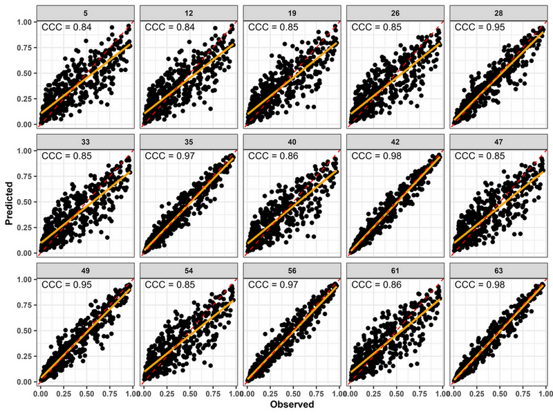

```{r setup, include=FALSE}
knitr::opts_chunk$set(
  collapse = TRUE,
  comment = "#>",
  fig.align = "center",
  message = FALSE,
  warning = FALSE
)
```

# Introduction

Distributed Lag Non-linear Models (DLNMs) require several modeling
decisions, including:

- exposure variables;
- lag duration;
- exposure spline complexity;
- lag spline complexity;
- regression engine.

Different specifications may lead to different predictive performance.

`EpiExposure` provides tools for systematically exploring model
configurations, ranking competing models, and combining predictions
through ensemble forecasting.

This section demonstrates:

- automated DLNM model search;
- predictive validation;
- model ranking;
- ensemble forecasting;
- comparison of ensemble strategies.

# Load example data

```{r, message=FALSE, warning=FALSE}

library(EpiExposure)
library(dplyr)
library(ggplot2)
library(patchwork)
```

```{r}

data("epi_data")

head(epi_data, 10L )
```

# Why model selection matters

Exposure-lag-response relationships are highly sensitive to model
specification.

For example, increasing lag flexibility may improve fit but increase
overfitting.

Likewise, adding additional predictors may improve prediction in some
pathosystems while reducing generalizability in others.

`EpiExposure` can evaluate predefined combinations of candidate DLNM
specifications using a consistent fitting and validation workflow.

# Searching candidate models

```{r, echo=TRUE, eval=FALSE}
library(future)

future::plan(
  future::multisession,
  workers = 4
)
```

The appropriate number of workers depends on the available hardware and
local computing policies. Users should avoid requesting more workers
than their system can support.

```{r, echo=TRUE, eval=FALSE}

future::plan(future::sequential ) 

```

## Run the model search

```{r, echo=TRUE, eval=FALSE}
best_models <- find_bestfit(
  data = epi_data,
  response = "y",
  group = "epi_id",
  time = "time",
  vars = c("tmean","rain","wetness"),
  max_lag = 85,
  df_var_grid = c(2,3,4),
  df_lag_grid = c(2,3,4),
  model_engine = "glmmTMB",
  family = "beta",
  keep_fits = TRUE)
```

```{r, include=FALSE}
#best_models = readRDS("best_models.rds")
best_models = readxl::read_xlsx("data/ensemble/best_models.xlsx")

```

```{r, echo=TRUE, eval=FALSE}
plot_performance(
  object = best_models,
  model_id = c(5,12,19,26,28,33,35,40,42,47,49,54,56,61,63),
  metrics = c("CCC"),
  x = "observed",
  y = "predicted",
  scale_factor = 1,
  ncol = 5,
  x_lab = "Observed ",
  y_lab = "Predicted",
  size = 1.4
) +
  ggplot2::theme(
    text = ggplot2::element_text(
      size = 10,
      face = "bold"
    )
  )
```

 

Inspect results

```{r echo=FALSE}
knitr::kable(
  utils::head(
    best_models,
    10L
  ),
  digits = 4,
  align = "c"
)
```

Depending on the selected validation settings, the resulting object can
include:

- a model identifier;
- the fitted predictor combination;
- exposure and lag spline settings;
- the modeling engine and response family;
- the Concordance Correlation Coefficient;
- the Root Mean Square Error;
- the Mean Absolute Error;
- bias-related metrics;
- the fitted model object when `keep_fits = TRUE`.

# Ranking models

## Top-performing models

The following example ranks models by decreasing CCC. This is one
possible ranking criterion, not a universal rule. Candidate models
should also be examined using error metrics, bias, convergence
diagnostics, model complexity, and the scientific plausibility of the
exposure-lag structure.

```{r}
best_models %>%
  arrange(desc(CCC)) %>%
  select(
    model_id,
    vars,
    CCC,
    RMSE,
    MAE
  ) %>%
  head(10)
```

# Visualizing model performance

```{r}
best_models %>%
  mutate(
    splines = paste(
      df_var,
      df_lag,
      sep = " × "
    )
  ) %>%
  ggplot(
    aes(
      Cb,
      CCC,
      color = splines
    )
  ) +
  geom_point(size = 3) +
  theme_bw()
```

# Understanding validation metrics

## Concordance Correlation Coefficient

CCC evaluates agreement between observed and predicted outcomes by
combining precision and accuracy.

Values closer to 1 indicate stronger concordance. However, CCC should be
interpreted together with error and bias metrics rather than used as the
only selection criterion.

## Root Mean Square Error

RMSE summarizes the magnitude of prediction errors while assigning
greater influence to larger errors because residuals are squared before
averaging.

Lower values indicate better predictive performance when models are
evaluated on the same response scale and validation data.

## Mean Absolute Error

MAE is the average absolute difference between observed and predicted
outcomes.

Lower values indicate better predictive performance. Because MAE remains
on the response scale, it is often easier to interpret directly than
RMSE.

# Inspecting specific models

Suppose the best model is:

```{r}
top_model <- best_models |>
  dplyr::arrange(
    dplyr::desc(
      CCC
    )
  ) |>
  dplyr::slice(
    1L
  )
```

# Why use ensembles?

No single model is guaranteed to be optimal.

Different DLNM structures frequently capture different aspects of the
underlying epidemiological process.

Combining predictions from multiple models often improves stability and
predictive robustness.

# Selecting ensemble candidates

The identifiers below are illustrative. Replace them with model
identifiers selected from the user's own `best_models` object.

```{r}
candidate_models <- c(
  63,
  23,
  44
)
```

Therefore, three candidate models (best ranked [63], and the two
lower-ranked models [23, 44]) were selected to be used on the ensemble
approaches, with CCC used as the performance metric for the weighted
ensemble.

# Unweighted ensemble

```{r, echo=TRUE, eval=FALSE}
ens_unweighted <- ensemble_bestfit(
  bestfit = best_models,

  ensemble_scope = "model",

  method = "unweighted",

  model_id = candidate_models)
```

## Inspect results

The ensemble summary can be extracted from the fitted ensemble object:

```{r, eval = FALSE}
ens_unweighted$ensemble_summary
```

```{r, include=FALSE}
ens_unweighted <- readxl::read_xlsx("data/ensemble/ens_unweighted.xlsx")
```

```{r, echo=FALSE}
knitr::kable(
  ens_unweighted,
  digits = 4,
  align = "c"
)
```

# Weighted ensemble

```{r, echo=TRUE, eval=FALSE}
ens_weighted <- ensemble_bestfit(
  bestfit = best_models,

  ensemble_scope = "model",

  method = "weighted",

  model_id = candidate_models,

  weight_metric = "CCC",

  weight_transform = "rank_inverse"
)
```

## Inspect results

The ensemble summary can be extracted from the fitted ensemble object:

```{r, eval = FALSE}
ens_weighted$ensemble_summary
```

```{r, include=FALSE}
ens_weighted <- readxl::read_xlsx("data/ensemble/ens_weighted.xlsx")
```

```{r, echo=FALSE}
knitr::kable(
  ens_weighted,
  digits = 4,
  align = "c"
)
```

# Stacked ensemble

```{r, echo=TRUE, eval=FALSE}
ens_stacked <- ensemble_bestfit(
  bestfit = best_models,

  ensemble_scope = "model",

  method = "stacked",

  model_id = candidate_models,

  stacking_model = "ridge",

  stack_objective = "regularized"
)
```

## Inspect results

The ensemble summary can be extracted from the fitted ensemble object:

```{r, eval = FALSE}
ens_stacked$ensemble_summary
```

```{r, include=FALSE}
ens_stacked <- readxl::read_xlsx("data/ensemble/ens_stacked.xlsx")
```

```{r, echo=FALSE}
knitr::kable(
  ens_stacked,
  digits = 4,
  align = "c"
)
```

# Comparing ensemble strategies

```{r, echo=TRUE, eval=FALSE}
ensemble_metrics <- dplyr::bind_rows(
  Unweighted = ens_unweighted$ensemble_summary,
  Weighted = ens_weighted$ensemble_summary,
  Stacked = ens_stacked$ensemble_summary,
  .id = "method"
) |>
  dplyr::select(
    method,
    CCC,
    RMSE,
    MAE
  )
```

```{r, include=FALSE}
ensemble_metrics <- readxl::read_xlsx("data/ensemble/ensemble_metrics.xlsx")
```

```{r}
ensemble_metrics
```

# Visualizing ensemble predictions

```{r, echo=TRUE, eval=FALSE}

ens_unweighted$ensemble_predictions$method = "unweighted"
ens_weighted$ensemble_predictions$method = "weighted"
ens_stacked$ensemble_predictions$method = "stacked"

ensemble_all = rbind(ens_unweighted$ensemble_predictions,ens_weighted$ensemble_predictions, ens_stacked$ensemble_predictions)
```

```{r, include=FALSE}
ensemble_all <- readxl::read_xlsx("data/ensemble/ensemble_all.xlsx")
```

```{r}
knitr::kable(utils::head(ensemble_all, 10L),
              digits = 4, align = "c" )
```

```{r}

ensemble_metrics$method = c("unweighted","weighted","stacked")

ordem_methods <- c(
  "unweighted",
  "weighted",
  "stacked"
)

ensemble_plot <- ensemble_all %>%
  filter(!is.na(method)) %>%
  mutate(
    method = as.character(method)
  ) %>%
  filter(method %in% ordem_methods) %>%
  mutate(
    method = factor(
      method,
      levels = ordem_methods
    )
  )


CCC_plot <- ensemble_metrics %>%
  mutate(
    method = factor(
      method,
      levels = ordem_methods
    )
  )


pos_CCC <- ensemble_plot %>%
  group_by(method) %>%
  summarise(
    x = min(observed, na.rm = TRUE) +
      0.05 * diff(range(observed, na.rm = TRUE)),
   
    y = max(predicted_ensemble, na.rm = TRUE) -
      0.05 * diff(range(predicted_ensemble, na.rm = TRUE)),
   
    .groups = "drop"
  ) %>%
  left_join(
    CCC_plot %>% select(method, CCC),
    by = "method"
  )


 ensemble_gg = ggplot(ensemble_plot,
            aes(observed, predicted_ensemble)) +
  geom_point()+
  geom_smooth(method = "lm",se = FALSE, color = "orange") +
  geom_abline(
    intercept = 0,
    slope = 1,
    color = "red",
    linetype = "dashed",
    linewidth = 1) +
  geom_text(
    data = pos_CCC,
    aes(
      x = 0.02,
      y = 0.97,
      label = sprintf("CCC = %.2f", CCC)
    ),
    inherit.aes = FALSE,
    hjust = 0,
    vjust = 1,
    size = 4) +
  facet_wrap(
    ~method,
    ncol = 1) +
  theme_bw() +
    scale_x_continuous(
    limits = c(0, 1),
    breaks = seq(0, 1, 0.20),
    expand = expansion(mult = 0.03)
  ) +
 
  scale_y_continuous(
    limits = c(0, 1),
    breaks = seq(0, 1, 0.20),
    expand = expansion(mult = 0.03)
  ) +
  labs(
    x = "Observed",
    y = "Predicted") +
  theme(text = element_text(size = 10,face = "bold"),legend.position = "none")
 
 ensemble_gg
```

```{r}
best_models_plot <- best_models %>%
   mutate(
    splines = paste(df_lag, df_var, sep = " x ")
  )


best_plot <- best_models_plot %>%
  ggplot(aes(
    Cb, CCC,
    color = as.factor(splines),
    shape = as.factor(vars)
  )) +
 
  geom_point(size = 4) +
 
  scale_color_viridis_d() +
 
  labs(
    x = "Cb",
    y = "CCC",
    color = "Splines",
    shape = "Predictors"
  ) +
 
  guides(
    color = guide_legend(
      position = "top",
      nrow = 1,
      byrow = TRUE,
      title.position = "left",
      theme = theme(
        legend.key.height = unit(0.25, "cm"),
        legend.key.width = unit(0.45, "cm"),
        legend.spacing.y = unit(0, "cm"),
        legend.margin = margin(
          t = -3,
          r = 0,
          b = -3,
          l = 0
        )
      )
    ),
   
    shape = guide_legend(
      position = "right"
    )
  ) +
 
  theme_bw() +
 
  theme(
    text = element_text(
      size = 10,
      face = "bold"
    )
  )
```

```{r}
final_plot <- ensemble_gg + best_plot +
  plot_layout(ncol = 2) +
  plot_annotation(
    tag_levels = "a",
    tag_prefix = "(",
    tag_suffix = ")"
  ) &
  theme(
    plot.tag = element_text(
      size = 12,
      face = "bold"
    ),
    plot.tag.position = c(0.02, 0.94)
  )

final_plot

```

# Choosing a model-level ensemble strategy

Each ensemble method has advantages.

**Unweighted ensemble**

- gives equal contribution to the selected models;
- is simple and transparent;
- avoids estimating additional model weights;
- can be affected by weak or redundant candidate models.

**Weighted ensemble**

- assigns different contributions to candidate models;
- can emphasize models with stronger validation performance;
- depends on the selected metric and weight transformation;
- does not guarantee improvement over the best individual model.

**Stacked ensemble**

- estimates combination coefficients from model predictions;
- can account for complementary predictive information;
- requires careful separation between weight estimation and final
  evaluation;
- can overfit when the validation sample is limited or when candidate
  predictions are highly similar.

Therefore, no ensemble method is universally superior.

An unweighted ensemble is useful as a transparent reference because
every candidate contributes equally.

A weighted ensemble is appropriate when the selected validation metric
provides a defensible basis for assigning model contributions.

A stacked ensemble can be useful when candidate models contain
complementary predictive information and the stacking weights are
estimated without using the same observations reserved for final
evaluation.

Regardless of the method, compare the ensemble against:

- the strongest individual candidate;
- a simple baseline model;
- alternative ensemble strategies;
- results on validation data not reused for weight estimation.

The previous sections focused on model-level ensembles, which combine out-of-fold predictions and evaluate their predictive performance. 

`EpiExposure` can also construct lag-contribution ensembles. Instead of combining predicted outcomes, these ensembles combine the lag-specific ECI decompositions obtained from selected full-data model refits.

# Lag-contribution ensembles

## Why construct a lag ensemble?

Model-level ensembles combine predictions from multiple candidate models.
However, models may also differ in how they distribute the contribution of an
exposure across the fitted lag interval.

A lag ensemble combines the lag-specific epidemiological contribution indices
obtained from the selected models. For lag \(l\), the ensemble contribution is
defined as:

\[
ECI_{\mathrm{ensemble},l}
=
\sum_m \alpha_m ECI_{m,l},
\]

where \(ECI_{m,l}\) is the lag-specific weighted ECI from model \(m\), and
\(\alpha_m\) is the model weight derived from out-of-fold model performance.

The model weights therefore come from cross-validation, whereas the
lag-specific ECI values are calculated from the selected models refitted to the
complete dataset.

::: {.tutorial-note}
**Lag ensembles require retained full-data fits or precomputed lag data.**
For automatic lag decomposition, `best_models` must be the complete object
returned by `find_bestfit()` and must contain the retained fitted models in
`attr(best_models, "fits")`. An Excel or CSV export of the ranking table does
not preserve the attributes, fitted models, or basis metadata required for this
calculation.
:::

The fitted models are not used to recalculate the cross-validation metrics.
The model ranking and ensemble weights remain based on the out-of-fold
predictions produced by `find_bestfit()`. The retained full-data fits are used
only to obtain the final lag-specific decompositions for the selected models.

## Constructing unweighted and weighted lag ensembles

The following example selects the three highest-ranked models and constructs
two lag ensembles:

- `"unweighted"` gives equal weight to each selected model;
- `"weighted"` derives model weights from the selected performance metric.

To keep the example computationally efficient, the lag ensemble is demonstrated
using one complete epidemic history. Users may instead supply all available
epidemic histories, provided that each history contains the complete
`max_lag + 1` observations required by the fitted models. The computational
cost will increase with the number of epidemics, exposures, selected models,
and lags. The results shown here are therefore specific to Epidemic 1.

```{r}
epi_data1 = epi_data |> 
  filter(epi_id == 1)
```


```{r fit-lag-ensembles, eval = FALSE}
lag_ensemble <- ensemble_bestfit(
  bestfit = best_models,
  data = epi_data1,
  group = "epi_id",
  var = c(
    "tmean",
    "rain",
    "wetness"
  ),
  ensemble_scope = "lag",
  method = c(
    "unweighted",
    "weighted"
  ),
  top_n = 3,
  weight_metric = NULL,
  weight_transform = "softmax",
  lag_group_cols = c(
    "epi_id",
    "var",
    "lag"
  ),
  lg_strategy = "requested_available",
  rl_weights = TRUE,
  compute_ecilag_args = list(
    uncertainty = FALSE
  ),
  verbose = TRUE
)

```

When `weight_metric = NULL`, `ensemble_bestfit()` uses the ranking metric stored
by `find_bestfit()`. The direction of that metric is handled automatically:
metrics such as CCC are maximized, whereas metrics such as RMSE are minimized.

The argument:

```r
lg_strategy = "requested_available"
```

uses each requested exposure when that exposure is available in the selected
model. Because candidate models may contain different combinations of
exposures, not every model necessarily contributes to every exposure-specific
lag ensemble.

With:

```r
rl_weights = TRUE
```

the model weights are renormalized among the models available for each
exposure-lag unit. This ensures that the available model weights sum to one
within each lag-specific ensemble calculation.

## Inspecting selected models and weights

The selected candidate models can be inspected directly:

```{r, eval = FALSE}
lag_ensemble$selected_models
```

```{r, echo=FALSE}
selected_models = readxl::read_xlsx("data/ensemble/selected_models.xlsx")
```


```{r inspect-lag-selected-models, echo=FALSE}
knitr::kable(
  selected_models,
  digits = 4,
  align = "c"
)
```

The model weights used by each ensemble method are stored separately:

```{r, eval = FALSE}
lag_ensemble$model_weights
```

```{r, echo=FALSE}
model_weights = readxl::read_xlsx("data/ensemble/model_weights.xlsx")
```

```{r inspect-lag-model-weights, echo=FALSE}
knitr::kable(
  model_weights,
  digits = 4,
  align = "c"
)
```

For the unweighted ensemble, the selected models receive equal lag weights.
For the weighted ensemble, the weights are derived from the selected
cross-validation performance metric.

These weights describe the relative influence of the selected models in the
lag ensemble. They are not lag-specific DLNM coefficients.

## Inspecting ensemble lag contributions

The combined lag-specific contributions are returned in:

```{r, eval = FALSE}
lag_ensemble$ensemble_by_lag
```

Inspect the first rows:

```{r, echo=FALSE}
ensemble_by_lag = readxl::read_xlsx("data/ensemble/ensemble_by_lag.xlsx")
```

```{r inspect-lag-ensemble, echo=FALSE}
knitr::kable(
  utils::head(
    ensemble_by_lag,
    12L
  ),
  digits = 4,
  align = "c"
)
```

The principal output columns are:

- `var`: exposure variable;
- `lag`: retrospective lag, where lag 0 is the most recent exposure;
- `method`: ensemble method;
- `ECI_weighted_ens`: signed ensemble ECI contribution at that lag;
- `ECI_percent_ens`: absolute percentage contribution of that lag within the
  corresponding exposure and ensemble method;
- `n_models`: number of models contributing to that lag unit;
- `raw_model_weight_sum`: total original model-weight mass available for that
  lag unit;
- `weights_renormalized`: whether weights were renormalized among the available
  models;
- `models_used`: selected models contributing to the lag unit.

The signed value `ECI_weighted_ens` preserves the direction of the ensemble
contribution. In contrast, `ECI_percent_ens` is based on the absolute
contribution magnitude and describes how the total lag contribution is
distributed across the fitted lag interval.

## Visualizing signed lag contributions

```{r, eval = FALSE}
ensemble_by_lag = lag_ensemble$ensemble_by_lag
```


```{r plot-lag-ensemble-signed, fig.width=10, fig.height=7}
lag_ensemble_signed_plot <- ggplot(
  ensemble_by_lag,
  aes(
    x = lag,
    y = ECI_weighted_ens,
    color = method
  )
) +
  geom_hline(
    yintercept = 0,
    color = "grey50",
    linetype = "dashed",
    linewidth = 0.5
  ) +
  geom_line(
    linewidth = 1
  ) +
  facet_wrap(
    vars(var),
    ncol = 1,
    scales = "free_y",
    labeller = as_labeller(
      c(
        tmean = "Mean temperature",
        rain = "Rainfall",
        wetness = "Leaf wetness"
      )
    )
  ) +
  scale_x_reverse(
    breaks = seq(
      0,
      85,
      by = 15
    )
  ) +
  scale_color_manual(
    values = c(
      unweighted = "#4C72B0",
      weighted = "#C44E52"
    ),
    labels = c(
      unweighted = "Unweighted",
      weighted = "Weighted"
    )
  ) +
  theme_bw() +
  labs(
    x = "Retrospective lag",
    y = "Ensemble weighted ECI",
    color = "Ensemble method"
  ) +
  theme(
    text = element_text(
      size = 10,
      face = "bold"
    ),
    strip.background = element_rect(
      fill = "white",
      color = "black"
    ),
    strip.text = element_text(
      face = "bold"
    ),
    legend.position = "top"
  )
```

```{r}
lag_ensemble_signed_plot
```

The lag axis is displayed retrospectively. Lag 0 corresponds to the most recent
exposure observation, whereas increasing lag values represent progressively
older exposure conditions.

Positive and negative values describe the direction of the combined
lag-specific contribution. The weighted and unweighted curves may differ when
the selected models receive substantially different performance-based weights.

## Visualizing relative lag contributions

The percentage contribution provides a complementary interpretation based on
the absolute contribution magnitude:

```{r plot-lag-ensemble-percent, fig.width=10, fig.height=7}
lag_ensemble_percent_plot <- ggplot(
  ensemble_by_lag,
  aes(
    x = lag,
    y = ECI_percent_ens,
    color = method
  )
) +
  geom_line(
    linewidth = 1
  ) +
  facet_wrap(
    vars(var),
    ncol = 1,
    scales = "free_y",
    labeller = as_labeller(
      c(
        tmean = "Mean temperature",
        rain = "Rainfall",
        wetness = "Leaf wetness"
      )
    )
  ) +
  scale_x_reverse(
    breaks = seq(
      0,
      85,
      by = 15
    )
  ) +
  scale_color_manual(
    values = c(
      unweighted = "#4C72B0",
      weighted = "#C44E52"
    ),
    labels = c(
      unweighted = "Unweighted",
      weighted = "Weighted"
    )
  ) +
  theme_bw() +
  labs(
    x = "Retrospective lag",
    y = "Absolute lag contribution (%)",
    color = "Ensemble method"
  ) +
  theme(
    text = element_text(
      size = 10,
      face = "bold"
    ),
    strip.background = element_rect(
      fill = "white",
      color = "black"
    ),
    strip.text = element_text(
      face = "bold"
    ),
    legend.position = "top"
  )
```

```{r}
lag_ensemble_percent_plot
```

`ECI_percent_ens` is calculated from the absolute lag contributions within each
exposure and ensemble method. Consequently, the percentages describe where the
ensemble contribution is concentrated across lags, but they do not preserve the
positive or negative direction of that contribution.

The signed and percentage plots should therefore be interpreted together:

- `ECI_weighted_ens` describes the direction and magnitude of the combined
  contribution;
- `ECI_percent_ens` describes the relative concentration of absolute
  contribution across lags.

## Using strict exposure availability

The previous example used:

```r
lg_strategy = "requested_available"
```

which allows different selected models to contribute to different exposures
when their fitted variable sets differ.

For a stricter comparison, the user can require every selected model to contain
all requested exposures:

```{r strict-lag-ensemble, eval=FALSE}
lag_ensemble_strict <- ensemble_bestfit(
  bestfit = best_models,
  data = epi_data1,
  group = "epi_id",
  var = c(
    "tmean",
    "rain",
    "wetness"
  ),
  ensemble_scope = "lag",
  method = c(
    "unweighted",
    "weighted"
  ),
  top_n = 3,
  weight_transform = "softmax",
  lag_group_cols = c(
    "epi_id",
    "var",
    "lag"
  ),
  lg_strategy = "strict",
  rl_weights = TRUE,
  compute_ecilag_args = list(
    uncertainty = FALSE
  )
)
```

This strict mode stops when a selected model does not contain one of the
requested exposures or when a lag unit is not available from every selected
model. It is useful when the analyst wants the same model set to support every
exposure-specific lag ensemble.

::: {.tutorial-note}
**Lag-ensemble uncertainty is not generated in EpiExposure v1.** The selected
models are fitted separately, and independently sampled coefficient or
posterior draws do not define a valid joint draw distribution across models.
For this reason, `ensemble_bestfit()` combines deterministic lag-specific ECI
decompositions and does not pair arbitrary draw indices across fitted models.
:::

Lag ensembles should be interpreted as model-performance-weighted summaries of
lag-specific ECI contributions. They do not replace external validation, do not
represent raw DLNM coefficients, and should not be interpreted as causal
attribution across lags.

## Avoiding optimistic ensemble evaluation

Ensemble weights should be estimated from out-of-sample or
cross-validated predictions whenever possible. Estimating weights and
reporting performance on the same fitted predictions can produce
optimistic results.

The final evaluation should use observations that were not reused to
select candidate models or estimate ensemble weights. If a completely
independent test set is unavailable, nested or repeated cross-validation
may provide a more defensible assessment.

# Summary

This section introduced the `EpiExposure` model-selection and ensemble
framework.

The workflow includes:

- defining a candidate model space;
- fitting candidate DLNM specifications;
- evaluating predictive performance;
- ranking models using multiple criteria;
- retaining selected fitted models;
- combining predictions through unweighted, weighted, or stacked
  ensembles;
- comparing ensemble predictions with individual models and simple
  baselines.

Model selection and ensemble construction do not remove model
uncertainty. Their value depends on the candidate model space,
validation design, selection rules, and independence of the final
performance assessment.
